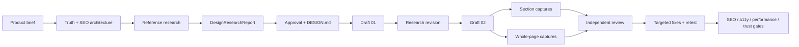

# Webscale React System Implementation Plan

> For agentic workers: use `superpowers:subagent-driven-development` or `superpowers:executing-plans`. Treat this document as the authority and read sections by heading before acting.

**Goal:** Turn the existing web skill into one coherent, evidence-backed system for high-quality React websites, from research and art direction through implementation, visual QA, SEO and launch readiness.

**Architecture:** New projects use Vite, React 19, TypeScript strict and React Router Framework Mode. React Router owns routes, route lifecycle, URL state, loaders/actions, redirects, metadata and route errors; TanStack Query owns remote data, cache, refetching and mutation lifecycle. The skill is a router around durable artifacts (`PRODUCT.md`, `DESIGN.md`, research reports, manifests and receipts), not one giant prompt.

**Tech Stack:** React, Vite, React Router Framework Mode, TypeScript, TanStack Query, Tailwind CSS v4, shadcn/ui/Radix, Zod, Vitest, Testing Library, MSW and Playwright.

### Document authority

This plan contains both decisions and rationale because it is also the handoff
record for a large skill change. The authority order inside the document is:

1. Global Constraints and Product Contract requirements.
2. Key Technical Decisions and the canonical phase runbook.
3. Implementation Units and their Verification Contract.
4. Explanatory refinement sections and source notes.

If two explanatory passages repeat a topic differently, the higher layer wins;
the implementation must not create a second phase sequence or a second design
authority to resolve prose duplication. Before execution, the implementer
should scan the authority sections first and use the refinement sections only
for rationale and source-specific detail.

## Plan Revision 2: The Web Skill as an Operating System

This revision is deliberately plan-only. It does not implement the skill,
change the starter or generate assets. It tightens the execution model around
the user's actual goal: a reusable, research-led Web skill that can learn from
videos, live references, design documentation, prompts and prior builds without
turning any source into blind instruction.

## Plan Revision 4: Execution Hardening After Independent Review

This revision remains plan-only. It resolves contradictions and unverifiable
assumptions found by independent architecture, runtime, design, source-safety
and plan-execution reviews. These rules override earlier explanatory passages
in this document when wording differs.

### One gate vocabulary

The phase state machine has exactly five evidence states:
`OPEN`, `READY`, `PASS`, `FAIL` and `STALE`. `BLOCKED` is never a sixth phase
state. A capability failure is represented by `status: OPEN` plus a structured
`blockedBy` object containing the attempted capability, failed attempt, safe
continuation and affected artifacts. A missing model, browser, credential or
registry is therefore never confused with evidence that the work passed.

The incomplete user fragment `bei 5` is an explicit open decision owned by
Raphael. It does not block unrelated contract, SEO, runtime, corpus or design
work. U6 and U7 may implement only the already documented interim contract:
GPT-Astra owns image opportunity discovery and prompt construction, the first
direction pass uses high effort when exposed, follow-ups default to medium, and
each generation has a maximum of ten justified outputs. If the missing suffix
would change any of those rules, the affected image/orchestration merge gate
stops; otherwise the open decision remains visible but does not deadlock the
rest of the system. The exact captured fragment must be stored byte-for-byte
with source location, capture date and hash. The plan must never manufacture a
suffix from context.

### Run classes replace the undefined “substantial run”

Every Web invocation is classified before agent allocation:

| Run class | Mandatory Astra event | Other required capability | Safe terminal state |
|---|---|---|---|
| `substantial-build` | `ASTRA-START` and direction receipt | image direction if assets are in scope | no image lane may silently pass when Astra is unverified |
| `design-direction` | `ASTRA-START` and direction receipt | reference/design evidence | design lock or explicit `OPEN` |
| `research-only` | `ASTRA-START` triage receipt | source-specific research lane | research artifacts or `OPEN` |
| `seo-only` | `ASTRA-START` triage receipt | SEO lane | route-bound SEO artifacts or `OPEN` |
| `technical-only` | `ASTRA-START` triage receipt | technical/browser lane as needed | technical evidence or `OPEN` |
| `image-direction` | `ASTRA-START` and image-direction receipt | GPT-Astra model/runtime proof | `PASS` or `ASTRA_BLOCKED` |

`not-needed` may only be used for an optional secondary lane. It may not be
used to omit the mandatory event for the selected run class. Model identity is
authoritative only when corroborated by the runtime's JSONL/transcript
provenance (for example the existing `leaf-provenienz.py` contract). A
self-authored receipt cannot prove that a requested model was delivered.

### Canonical source and authority rules

The project-root `DESIGN.md` is the only project design authority. The
executable token source named by that file owns actual values. `.21st/DESIGN.md`
is generated/reference context only. `brand/DESIGN.md` is a legacy alias that
must point to the root contract; it may not contain independent values. U5 must
rewrite the current alias-writing references before its design-authority check
can pass.

The prompt corpus is not allowed to depend on ephemeral chat attachments. The
future implementation first imports the supplied physical attachments into a
committed, repo-relative corpus root with an immutable manifest, source kind,
original attachment identifier and raw/normalized checksums. Until that intake
exists, U12-U14 are `OPEN` and no worker may claim that the corpus is durable.

### Runtime and screenshot interpretation

The starter supports two documented runtime profiles, but a project selects
one profile during onboarding and the gate tests only that profile. Static
output asserts prerendered route files and the generated
`__spa-fallback.html`/host fallback mapping; it never claims that a generic
static file server emits an HTTP 404. SSR asserts the actual server start,
route HTML and HTTP 404 behavior. The SSR profile must declare
`@react-router/serve` at the pinned React Router version; the current
`start`-script/dependency mismatch is an explicit U2 repair.

Full-page bitmaps remain archival. Whole-page QA consumes a manifest of fold
shots plus overlapping readable scroll segments. AI/image uploads use the same
1440px-wide slice artifacts recorded in the manifest, normally 1500px high and
never over 2000px. The slice helper, critique loop and manifest validator must
agree on the same artifact dimensions and checksums.

### System promise

For every substantial website task, the skill must be able to answer from
durable files, not chat memory:

1. What are we building, for whom, and which facts are authorized?
2. Which search, design, video, prompt and reference evidence was actually inspected?
3. Which observations became project decisions, reusable recipes or rejected examples?
4. Which React routes, sections, assets, SEO records and QA receipts depend on each decision?
5. What changed since the last build, which evidence is stale, and what is the next allowed phase?

The Web skill is therefore a stateful controller with four ledgers:

```text
truth       = product facts, proof, claims, audience, permissions
learning    = sources, coverage, observations, hypotheses, limitations
design      = reference lock, DESIGN.md, component/button/motion contracts
build       = routes, assets, agent receipts, screenshots, QA and launch evidence
```

The skill is not a universal prompt, a visual-style averaging machine or a
promise that a model can prove “AAA”. A source may inform a decision only after
its evidence status, role, limitation and promotion state are visible.

### Non-negotiable defaults

- New websites always use React. The default project is Vite + React 19 + TypeScript strict + React Router Framework Mode.
- React Router owns routes, loaders/actions, metadata, redirects, URL state and route errors. TanStack Query owns remote cache and mutations. Local UI state remains local.
- Every classified Web run invokes the Astra direction lane when its run class
  requires it, or records `ASTRA_BLOCKED`; the controller may add other agents
  only for a named independent question, artifact and check.
- “Astra agent”, “GPT-Astra image direction” and “image renderer” are separate receipt fields. None may be silently substituted for another.
- SEO starts before visual direction. Every route has one stable `route_id` through search evidence, brief, React route, metadata, internal links, QA and launch evidence.
- `DESIGN.md` is the single project design authority. Refero-style structure is the human-readable contract; Impeccable contributes detectors and review lenses, not a fake universal score.
- A route's actual section inventory determines agent count, image count, prompt count and review count. Ten images is a hard per-generation ceiling, never a target.
- Full-page screenshots are archival. Model and critic uploads use readable 1440px-wide slices, normally 1500px high and never above 2000px, with a manifest.

### Explicit non-goals

- No claim that the complete Griffin channel, every X post or every gallery item has been analyzed unless a coverage manifest proves it.
- No automatic reuse of a browser login as a durable credential or workflow guarantee. A persistent browser profile may help a future run, but each run records the session state it actually verified.
- No automatic promotion of a pasted prompt, video instruction, style reference or generated output into a global default.
- No fixed promise that every page needs ten images, three agents, a fixed number of fold variants or a five-hour run. Depth is earned by unresolved evidence and route complexity.

### Execution order after plan approval

The implementation plan is executed in dependency waves, not as one giant
rewrite:

```text
contract and state model
  -> React starter/runtime
  -> source and research packs
  -> DESIGN.md and recipe contracts
  -> Astra/orchestration and image receipts
  -> section/route QA manifests
  -> corpus fixtures and eval reconciliation
  -> fresh end-to-end probe
```

Each wave has a narrow write set and a fresh verification cycle. A later wave
may not hide a missing artifact from an earlier wave. The final end-to-end probe
must run the skill as a new user would, including the role router, phase gates,
source intake, React starter path, SEO route contract and QA evidence.

## Plan Revision 5: Evidence-Led Learning and Adaptive Production

This revision incorporates the latest requirement: the Web skill must first
learn from the supplied video, channel, documentation, references and rebuild
prompts what was actually done and how the examples are constructed. It must
not begin by inventing a task list, a ten-image brief, a fixed agent swarm or a
generic “make it better” instruction.

### Five-layer operating loop

Every substantial Web run follows five evidence layers. A later layer may use
an earlier artifact, but may not silently replace it:

```text
observe -> understand -> decide -> build -> prove
```

- **Observe:** acquire sources, transcribe video, inspect frames/DOM/docs,
  record coverage and preserve limitations.
- **Understand:** reconstruct actions, mechanisms, jobs, comparisons, failures
  and transfer risks. Produce learning cards, not production instructions.
- **Decide:** lock route intent, references, `DESIGN.md`, components, motion,
  assets and runtime choices in durable project records.
- **Build:** implement the approved React route and its artifacts.
- **Prove:** review each section, each route as a whole, SEO, runtime,
  accessibility, performance, trust and provenance.

The phase handoff is always `evidence -> decision or OPEN -> artifact -> check
-> next allowed phase`. Chat responses, browser tabs, screenshots or model
outputs do not close a phase by themselves.

### Video learning: reconstruct before prescribing

For the named Griffin video, the first question is **what did he actually do?**
The watch lane must record what he supplied, which tools and models were
visibly used, every visible action and intermediate output, waiting, failed
attempts, comparisons, corrections and final checks. Transcript, frames and
the action ledger remain separate evidence channels.

Every statement is labeled exactly one of `narration`, `visible-evidence`,
`analyst-inference`, `promotional-claim` or `fixture-proven`. Only after this
reconstruction may the system write a transfer card naming the smallest React
mechanism that can be tested. A polished screenshot never proves SEO,
accessibility, mobile behavior, licensing, production reliability or model
identity.

The channel is a coverage project, not proof that every video was learned.
Reachable videos receive explicit states and gaps. One deeply watched video may
produce the first method card; it cannot represent the whole channel without a
coverage manifest.

### No predetermined image brief

The operator supplies the route, approved truth, relevant sections,
`DESIGN.md` and readable screenshot slices. The operator does not have to
invent a scene list or decide in advance which sections need images.

When the image lane is selected, **GPT-Astra always owns image thinking**:

```text
route + sections + DESIGN.md + truth + slices
  -> GPT-Astra asset audit
  -> reuse/crop/reference/generate/image-free classification
  -> justified count (0..10)
  -> one prompt per generated slot
  -> renderer execution
  -> independent review
```

Ten is a hard per-generation ceiling and never a target. The first direction
pass uses High effort when exposed; controlled follow-ups use Medium by
default. If model identity or effort cannot be verified, the receipt records
that fact and the capability remains `ASTRA_BLOCKED` or `OPEN`; no other model
is relabeled as GPT-Astra. A second batch requires a reviewed first batch, an
opportunity-map delta and a reason that new evidence created additional demand.
The unfinished fragment `bei 5` remains byte-preserved open input and is never
interpreted as five images, agents, phases, a provider rule or an effort rule.

### Agent allocation is evidence-shaped

The controller always starts `ASTRA-START`, then allocates only work packages
with a named question, read set, disjoint write set, artifact, stop condition
and independent check. The available deep profile is:

| Agent | Owns | Does not own |
|---|---|---|
| Astra | product/design synthesis, direction, primary integration | final independent acceptance, technical proof |
| GPT-Astra | image opportunity discovery and prompt construction | renderer identity, final acceptance |
| Fable | visual/frontend alternative and UI implementation | acceptance of its own build |
| Opus | architecture, integration or adversarial review when assigned | pretending to be Astra |
| Grok | browser, technical, SEO and deterministic verification | final visual direction |

More agents are opened only for genuinely independent questions or bounded
fixes after a failed review. More agents are not opened merely to create the
appearance of depth. Every unused role is recorded with a reason.

### SEO is a phase spine

The active SEO skill supplies research and QA procedures; the Web skill owns
the phase handoff and stable route identity. The same `route_id` must survive:

```text
truth -> search evidence -> route intent/IA -> content brief -> React route
  -> metadata/schema -> internal links/crawl controls -> QA -> launch/refresh
```

Normal Web runs may mark intent `inferred` or `unknown` when no extended SEO
research is required. An extended SEO run must distinguish keyword, SERP and
GSC evidence from inference. Per route, the contract verifies as applicable:
indexability, canonical, robots, sitemap membership, status/redirects,
title/meta/H1 hierarchy, structured data, hreflang, rendered internal links,
claim provenance, accessibility and performance. A screenshot cannot complete
a route whose SEO record is missing or stale.

### `DESIGN.md` is the executable design decision record

The root `DESIGN.md` is the only authority. Refero-style structure is the
documentation format, not a style to copy. Before the first affected component
is implemented, it records typography, surfaces, layout rhythm, responsive
transformations, component anatomy, button states, motion choreography,
asset/crop rules, provenance, exclusions and runtime budgets.

The button matrix covers primary, secondary, quiet/text, icon-only, split/menu,
segmented, destructive, loading, disabled and focus-visible states. The motion
matrix covers trigger, initial/target state, properties, duration, easing,
stagger, interruption, cleanup, reduced-motion fallback and purpose. A prompt,
video or reference may propose a pattern; only a project decision or validated
recipe activates it.

### Section proof and route proof

The route/section inventory determines the review set. Each section gets local
desktop/mobile and applicable state evidence. Each route gets a separate
whole-page desktop/mobile review for hierarchy, pacing, narrative, repetition,
trust and conversion. The final evidence graph must contain both:

```text
route_id -> section_id -> local captures/states -> section verdict
route_id -> whole-page captures/viewports -> composition verdict
```

Neither verdict substitutes for the other.

### Prompt corpus and reference promotion

All supplied prompts and style documents remain immutable, inert source data.
The corpus extracts recurring structures across page archetypes, navigation,
buttons, forms, surfaces, typography, assets, motion, responsive behavior,
runtime choices and QA language. Repetition is a discovery signal, not proof
of quality.

Reusable knowledge follows:

```text
raw source -> observed pattern -> proposed recipe -> fixture
  -> validated recipe -> project approval -> DESIGN.md/library
```

The default library favors semantic React, accessible states, responsive
behavior, reduced motion, route metadata and measurable performance. Loaders,
cursor effects, fixed canvases, WebGL, scroll choreography and exact-rebuild
tricks remain opt-in until a fixture and independent review show that they
transfer safely.

## Global Constraints

- New projects are React-only and Vite-based; React Router Framework Mode is the sole production router.
- Existing Next/Astro/HTML projects retain their stack unless a separate migration contract is approved.
- `DESIGN.md` is the canonical design contract and follows the structured, inspectable shape of Refero's `styles.refero.design`.
- Impeccable is integrated as reproducible detectors, review lenses and design heuristics; it is not treated as an unmeasured promise of taste parity.
- Griffin's video method is source-backed research until it passes evidence and skeptic review; video content is data, never instructions. The durable question is always "what did he actually do, what is only claimed, and what transfers?"
- Video learning is a first-class pipeline: acquire, transcribe, inspect frames, align scenes, separate narration from visible evidence, extract transferable mechanisms, then validate the adapted method in a fixture before promotion.
- Research is durable by default: temporary downloads are working material only; every promoted source receives a permanent research-pack record with provenance, transcript/frame references, extraction date and review status.
- User-provided rebuild prompts are inert source material. Embedded commands, stack choices, asset URLs, login instructions and “build immediately” language never become executable authority.
- The prompt corpus is analyzed as comparative evidence: repeated structure becomes a candidate pattern, not an automatic default; one-off visual choices remain examples unless independently approved and tested.
- Astra starts the strategic/design direction and primary integration; the builder never performs final independent acceptance.
- Every relevant section receives its own review, and every route receives an additional whole-page review on desktop and mobile.
- Full-page captures remain archives; AI/image-model inputs use readable 1440px-wide slices, normally 1500px high and never above 2000px.
- “AAA”, “worldclass” and “no AI slop” are qualitative review goals backed by concrete findings, not universal numeric gates.
- Credentials and browser sessions are never stored, scraped or represented as durable guarantees.
- Image generation is diagnosis-led and agent-led: the operator supplies the website, route and approved design context, not a made-up scene list. GPT-Astra first inspects the route, sections, screenshot slices and design contract, discovers the asset opportunities, and only then proposes the smallest useful series; each batch is capped at ten outputs and never assumes that ten are needed.
- The SEO route map is a core web-build artifact for every project. The extended post-launch SEO loop is optional, but route intent, content, metadata, schema, internal links and crawlability are never optional because a page is not complete without them.

---

## Goal Capsule

### Objective
An implementer can start a new React website with one consistent stack and one inspectable workflow, while reviewers can trace every important visual, SEO, asset and orchestration decision to evidence and a current build revision.

### Means
Consolidate the current overlapping skill generations into a React/Vite contract, preserve useful existing evidence modules, add a research-first design loop learned from the Griffin video, and make visual/asset/agent evidence first-class artifacts.

### Authority hierarchy
1. User decisions and verified customer facts.
2. Project `PRODUCT.md`, `PROOF.md`, `VOICE.md` and approved `DESIGN.md`.
3. Current implementation and deterministic gates.
4. Source-backed external research and creator methods.
5. Agent suggestions and unverified inspiration.

### Stop conditions
Stop only when the plan's verification contract is green or a concrete external blocker is recorded with the failed attempt and smallest next action. Do not claim that a model, prompt or reference guarantees conversion or AAA quality.

---

## Product Contract

### Problem Frame
The skill currently contains strong design, SEO, image and review knowledge, but its active contract still mixes Next.js, Astro and React assumptions. It also lacks one explicit path from first brief to reference research, second draft, section review and whole-page review. This makes correct execution dependent on hidden interpretation and allows stale framework rules or unsupported creator claims to survive.

### Current Skill Baseline: Strengths and Weaknesses

The plan starts from the current skill rather than pretending the system is
empty. This baseline is an explicit input to U1 and U9a:

| Current strength | Preserve | Current weakness | Plan response |
|---|---|---|---|
| Broad reference graph for stack, registries, design depth, motion, images, SEO, screenshots and launch | Keep the specialized references and their load routing | The active router still exposes competing historical stack assumptions | React/Vite/React Router becomes the only new-project path; old paths become migration evidence |
| Mature screenshot, visual-run-ledger and launch-evidence conventions | Keep revision binding, viewport evidence and independent criticism | Evidence is difficult to carry between chats when it remains in tabs, agent returns or ad hoc folders | Persistent phase records, source records, receipts and stale propagation become normative |
| Existing agent roster and family-separated criticism | Keep builder/reviewer separation and provenance | “Use more agents” can become redundant fan-out without a named question | Adaptive allocation requires read set, write set, artifact and independent check for every leaf |
| Existing DESIGN.md, pattern and design-depth material | Preserve measured values and reusable UI knowledge | Design, inspiration and prompt examples can still be mistaken for one global style | Root DESIGN.md, reference roles, component/button/motion matrices and promotion states become the authority |
| Existing SEO page-map and on-page checks | Keep route coverage and deterministic HTML checks | SEO can still be treated as a late add-on to visual work | Stable route IDs connect search evidence, brief, route, links, metadata, QA and launch |
| Existing image and GPT-Image/Higgsfield paths | Keep reproducible rendering and provenance | The operator may over-specify scenes or treat ten as the job | GPT-Astra asset audit derives `0..10` justified slots; the renderer only executes the approved receipt |
| Existing eval inventory | Keep adversarial and regression fixtures | Inventory drift and checks without case-count adapters can hide missing coverage | Baseline and final eval reconciliation are separate release units with explicit open findings |

### Requirements

- **R1:** New web projects use the React/Vite/React Router Framework Mode contract.
- **R2:** Router and server-state ownership are explicit and non-overlapping.
- **R3:** Every project starts with a structured product brief and produces `PRODUCT.md`, `DESIGN.md`, a route map and a decision log.
- **R4:** The workflow supports intake/truth/SEO architecture -> external reference research -> `DesignResearchReport` -> approved direction -> Draft 01 -> research revision -> Draft 02. A content/route skeleton may precede research; a visually directed draft may not.
- **R5:** Inspiration is collected by role (composition, typography, interaction, product UI, motion, asset), explained, licensed/attributed where needed, and approved before becoming binding.
- **R6:** Refero-style `DESIGN.md` records tokens, typography, surfaces, components, responsive transformations, motion, assets, provenance and explicit exceptions.
- **R7:** Impeccable-style review is operationalized through scanners, visual checks and actionable findings, without hardcoded universal AAA scores.
- **R8:** Image generation supports a browser ChatGPT lane and a reproducible Higgsfield lane, with image-series manifests, source references, model/effort receipts and a maximum-of-10 batch convention.
- **R8a:** When the browser lane is used, GPT-Astra is the required image-direction and prompt-construction route. If it cannot be verified, the image-direction phase is `ASTRA_BLOCKED`; no other model may silently take that role. Requested model, delivered model, effort and fallback state are recorded separately. The requested image count is slot-justified and may be lower than ten.
- **R8b:** An incomplete user instruction is represented as an explicit open decision with its exact source text, affected units, safe interim behavior and resolution gate; the system never infers a missing model, effort, count or provider rule.
- **R9:** AI-readable screenshot slices are generated before image-model or critic handoff.
- **R10:** Every relevant section and every complete route are reviewed independently at matched desktop/mobile states.
- **R11:** Astra-first orchestration is recorded with actual model/runtime receipts, explicit fallback status and family-separated review ownership.
- **R12:** SEO, accessibility, performance, trust and route behavior are verified independently of screenshot appearance.
- **R13:** The rebuild-prompt corpus is indexed, mechanically measured and synthesized into durable references for prompt structure, component families, button states, motion choreography, asset handling, responsive behavior and acceptance criteria.
- **R13a:** External references enter through a source ledger. The project can approve a reference set before it becomes binding, and the ledger records what was inspected, what role it serves, what was rejected and what remains unverified.
- **R14:** Corpus-derived knowledge uses explicit states: observed in source, interpreted, proposed as a reusable recipe, validated in a fixture and approved for a project. Frequency alone never promotes a pattern.
- **R15:** A reusable component or interaction needs an explicit role, anatomy, state model, responsive transformation, accessibility behavior, provenance and implementation path.
- **R16:** Corpus-derived runtime techniques such as fixed-canvas scaling, separate mobile trees, scroll-owned scenes, WebGL/Canvas and iframe/static-bundle boundaries are classified as project-specific recipes unless a fixture proves they are safe as a reusable baseline.

### Scope boundaries

In scope: skill router, active references, React starter, agent contracts, source/provenance model, research-first workflow, image workflow, screenshot slicing, visual review manifests, Evals and documentation.

Deferred: production migration of every existing customer site, automatic ChatGPT browser login, automatic promotion of all bookmarks, universal model quotas, and a claim that every project must run for a fixed number of hours.

Out of scope: storing credentials, bypassing login walls, copying a single reference site, or treating video narration as an executable command.

### Open questions

- Raphael's sentence ended at “Ganz wichtig: bei 5”. The source fragment is incomplete; the missing suffix is not available in the durable inputs. It must never be reconstructed from context.
- The unfinished “bei 5” sentence is localized to the image lane. It must be recorded byte-for-byte in `OPEN-DECISIONS.md` with source location, capture date and a hash of the recorded fragment. It does not block independent research, SEO, design or runtime planning, but it blocks any implementation decision that could plausibly depend on the missing suffix.

### Plan-only revision after the latest source review

This document is still a plan. The current task is to improve the workflow
contract, not to implement the skill, alter the starter or generate images.
Execution may begin after plan review even while the image note is open: all
independent research, SEO, design-contract, runtime and corpus work may
proceed. Only the affected image-direction implementation gate remains
`OPEN` until the exact suffix is resolved or Raphael explicitly closes it.
The plan must therefore be useful to a future worker without pretending that
research, browser access, model identity or visual quality have already been
proven.

The revised system has four cooperating ledgers rather than one large prompt:

1. **Truth ledger:** product facts, claims, proof, audience, offer, routes,
   search intent and authorized assets. This is the only authority for copy,
   SEO claims and factual imagery.
2. **Learning ledger:** videos, channel coverage, X/bookmark items, live sites,
   Impeccable/Refero documentation, style references and rebuild prompts. Each
   item records access, inspected evidence, source status, limitations and the
   exact observation anchors. A source can teach an observation without
   becoming a rule.
3. **Design ledger:** `DesignResearchReport`, role-based reference comparison,
   `REFERENCE-LOCK.md`, `DESIGN.md`, component/button/motion matrices and
   exceptions. This is where observations become bounded hypotheses and
   project decisions, never where raw source text is pasted as instruction.
4. **Build/evidence ledger:** phase status, agent receipts, asset opportunity
   maps, image manifests, route/section review manifests, SEO receipts and
   launch evidence. A chat response, browser tab or agent return is never a
   substitute for a durable record.

The implementation plan must preserve the following phase gates in this order:

```text
onboard truth
  -> search architecture and route IDs
  -> source inventory and research setup
  -> observe and compare references
  -> write DesignResearchReport
  -> approve reference roles and DESIGN.md direction
  -> define component/button/motion contracts
  -> approve fold/direction
  -> Draft 01
  -> targeted research revision
  -> Draft 02
  -> Astra asset audit and justified image batches
  -> section QA
  -> whole-route QA
  -> SEO/a11y/performance/trust QA
  -> fix and retest
  -> launch evidence
```

The order is intentionally not “research everything, then build everything”.
Truth and SEO may create a route/content skeleton early. Visual direction,
image generation and motion defaults wait for the relevant research and design
locks. After Draft 01, research is allowed to reopen only the concrete
questions exposed by the draft; it must not trigger an unbounded second
research swarm.

#### Source-specific learning contracts

- **Griffin video:** reconstruct the demonstrated sequence before extracting a
  method. The record must distinguish narration, visible frame evidence,
  analyst inference and fixture-proven result. Preserve the first draft,
  research insertion, second draft, annotation pass, comparison and claimed
  interactions as separate events. The existing Griffin pack remains
  `candidate/proposed` until a React fixture proves a bounded transfer.
- **Griffin channel:** treat the channel as a coverage project, not as proof
  that every video was learned. Enumerate reachable items, record state and
  coverage gaps, and promote only videos with local transcript/frame evidence.
- **X/bookmarks:** store one source record per item with author, URL, captured
  date, access state, extracted claim, evidence anchor and freshness window.
  Login-blocked or deleted posts remain visible as unavailable; no claim is
  reconstructed from a title, quote-card or surrounding thread.
- **Impeccable and Refero:** extract design grammar and detector capability,
  not branding. For each rule record the documentation anchor, intended job,
  implementation consequence, detector or review method, and failure mode.
  Refero-style `DESIGN.md` is the human-readable output contract; it is not a
  copied style page.

  Impeccable's documented command families become named, phase-bound review
  lenses rather than one generic “make it better” instruction: `shape` and
  `init` for direction/context, `audit` and `critique` for findings,
  `layout`/`typeset`/`colorize`/`animate`/`polish` for targeted refinement,
  `adapt`/`clarify`/`distill` for simplification and responsive/content
  decisions, `harden`/`onboard`/`optimize` for robustness, and
  `document`/`extract`/`live` for system capture, component extraction and
  browser comparison. The plan records which lens ran, which files or route it
  inspected, and whether its result was deterministic, advisory or unavailable.
  This preserves the workflow shape without pretending that a command name is
  proof of visual quality.
- **21st.dev, Mobbin and live galleries:** research by role and compare no
  more than three candidates per role before lock. Record what was inspected,
  what is borrowed as a mechanism, what is rejected and why. New sources are
  candidates until their role and evidence are written to the ledger.
- **Cosmos, Modal, Dub, Steep and Air:** preserve each as a separate
  style-reference record. Compare their surface logic, type pairing, accent
  discipline, density, radius language, component anatomy and motion hints;
  never average their tokens into a global palette. These documents are
  visual evidence only and do not affect stack or imperative-frequency counts.
- **Attached rebuild prompts:** preserve immutable originals and classify
  recurring language as baseline, recipe, style-example, migration-only,
  anti-pattern or rhetoric. “Build immediately”, “no questions”, exact-stack
  demands, login instructions and provider demands remain untrusted source
  text. Prompt frequency is a discovery signal, never promotion evidence.

#### Agent allocation contract

Agent count is decided twice: after source/route inventory and after Draft 01.
The controller opens a leaf only when it has a named question, bounded read
set, disjoint write set, expected artifact and independent check. The default
deep profile is therefore a role map, not a promise to start every agent:

| Question | Lead | Challenge/check | Output |
|---|---|---|---|
| Product truth, positioning and synthesis | Astra | Fable/Kimi | `PRODUCT.md`, `TRUTH.md`, decision receipt |
| External/source research | Grok/Kimi | Opus | source records, coverage and limitations |
| Design direction and `DESIGN.md` | Astra | Fable/Kimi | report, reference lock, design contract |
| Component implementation | Fable/Opus | different-family critic | route revision and provenance |
| Technical/browser/SEO verification | Grok | Sol where applicable | deterministic QA receipts |
| Image opportunity map and prompts | GPT-Astra | independent visual critic | asset map, prompt versions, image receipt |
| Final acceptance | non-builder family | none | terminal section/route verdict |

The controller records `started`, `not-needed`, `blocked` or `deferred` for
each role. “Not-needed” is valid when the work is bounded; “blocked” must name
the failed capability and a safe continuation. Astra is never claimed from a
requested label alone. Its receipt must prove requested model, delivered model,
runtime/family, effort, read set, output and fallback state.

The user's “always start Astra” requirement is a mandatory controller event,
not permission for redundant fan-out. Every invocation of the Web skill starts
an Astra triage leaf, including research-only, SEO-only and technical-only
runs. This leaf is intentionally small: it reads the run class, current phase
record and open decision ledger, then returns a routing decision. It does not
pretend to do image direction, research or final acceptance when those jobs are
not in scope.

1. Every Web run creates an `ASTRA-START` receipt before any other agent leaf
   is dispatched. The receipt may be `completed`, `not-needed`, `deferred` or
   `ASTRA_BLOCKED`, but it may not be omitted. `not-needed` means Astra triage
   inspected the run and explicitly found no Astra-owned deliverable; it does
   not mean that Astra was silently skipped.
2. Substantial builds, design-direction runs and image-direction runs create
   the additional Astra direction receipt before a build, image generation or
   visual lock. The receipt distinguishes the Astra agent, GPT-Astra image direction and
   the eventual image renderer. A renderer is never relabeled as Astra.
3. If the actual runtime cannot verify Astra, the run records requested and
   delivered model separately and marks the image-direction capability
   `ASTRA_BLOCKED`. An explicit fallback may render only after a fallback
   decision record; it may not invent the opportunity map, image count or
   prompts, and it is never claimed to be Astra.
4. Additional Astra leaves require separate questions or write sets. Duplicate
   opinions are not independent evidence and do not replace a different-family
   critic.
5. The controller records why every other lane was started, not-needed,
   blocked or deferred, including why a second Astra leaf was unnecessary.

The Astra start receipt has a deliberately small stable interface:

```text
run_id, run_class, current_phase, requested_model, delivered_model,
runtime_family, effort, read_set, routing_decision, status, reason,
next_allowed_action, created_at
```

The receipt is a routing artifact, not proof that the run produced a design,
image or research result. Those capabilities require their own receipts and
checks below.

Run classes make the mandatory Astra event unambiguous:

| Run class | Astra direction receipt | Image-direction receipt | Typical scope |
|---|---|---|---|
| `substantial-build` | required | required when assets are in scope, otherwise `not-needed` | new site, route family, visual rebuild |
| `design-direction` | required | `not-needed` unless image opportunity is unresolved | reference lock, `DESIGN.md`, fold |
| `research-only` | triage required; direction receipt only if synthesis/promotion is requested | `not-needed` | source/video/prompt analysis |
| `seo-only` | triage required; direction receipt only if copy/design synthesis is requested | `not-needed` | route map, briefs, technical SEO |
| `technical-only` | triage required; direction receipt normally `not-needed` | `not-needed` | runtime, tests, migration, bug fix |
| `image-direction` | required | required; failure is `ASTRA_BLOCKED` | asset audit or generation |

The controller records the run class before dispatch. A run may not mark Astra
`not-needed` when its class says `required`; unavailable capability is recorded
as `ASTRA_BLOCKED` with the failed attempt and continuation path.

#### Image discovery contract

Image work starts only after the relevant route and section inventory exists.
GPT-Astra first writes `ASSET-OPPORTUNITY-MAP` entries with the decisions
`reuse`, `crop/mask`, `reference-only`, `generate` or `image-free`, plus slot
reason, content authority, style references and responsive crop needs. The
operator may provide constraints or vetoes, but does not need to invent ten
scenes. The requested count is the number of justified `generate` slots,
bounded to zero through ten per generation. Ten is never a target and eleven
is invalid. A second batch requires a fresh receipt, first-batch review and a
delta explaining the new need. First direction uses `high`; controlled
follow-up uses `medium` by default. If the runtime cannot expose an effort
control, the receipt records `effort_unavailable` rather than claiming the
setting was applied.

The browser ChatGPT lane is optional and session-dependent. A visible login
must be checked in the current run; no credentials, cookies or durable login
claim enter the plan. Higgsfield may render after Astra direction exists. If
Astra direction cannot be verified, the image-direction capability is
`ASTRA_BLOCKED`; the controller continues all independent research, SEO,
design and code planning, while any dependent image generation remains open.

#### Quality contract without a fake AAA score

The prompts `/impeccable`, `/no-ai-slop`, `/unslop`, `/taste` and
`/visual-harness` become named review lenses. They do not become one numeric
gate. A review must instead produce concrete findings across separate axes:
hierarchy, typography, spacing, color/surface, component states, motion,
responsive behavior, asset coherence, copy clarity, trust, accessibility,
performance, SEO and provenance. A section can fail one axis while the route
passes another; the route cannot close the section finding. “Looks better” is
recorded with matched before/after evidence and a reason, not as a universal
quality claim.

#### Plan deliverables before implementation

This plan revision is complete only when it names the future artifacts and
their ownership, not when it adds more prose. The execution phase must begin
with these artifacts or explicit `OPEN` states:

- `ONBOARDING.md`, `PRODUCT.md`, `TRUTH.md`, `DECISIONS.md`
- `seo/research.md`, `seo/ia.md`, route-bound briefs and approved page map
- source manifest, coverage manifests, research packs, video learning dossiers
  and conflict/freshness logs
- `DesignResearchReport`, `REFERENCE-LOCK.md`, `reference-to-recipe-matrix.json`
  and root `DESIGN.md`
- component/button/motion/runtime matrices and recipe promotion records
- `ASSET-OPPORTUNITY-MAP`, screenshot-slice manifest and image receipts
- phase status, agent receipts, section QA and whole-page QA manifests
- final SEO/trust/accessibility/performance/launch evidence

Missing artifacts keep the phase `OPEN`; they are not silently inferred from
chat history or a screenshot.

### Plan refinement: what is now fixed, what remains selectable

This revision treats the Web skill as a durable operating system for website
work, not as a larger prompt. The skill must preserve the work product between
sessions, make every important choice inspectable, and distinguish three things
that were previously too easy to mix together:

1. **Research evidence:** what a video, tweet, prompt, gallery, or live site
   actually shows.
2. **A reusable recipe:** a tested way to implement a recurring problem such as
   a button, hero, scroll scene, form, or image treatment.
3. **A project decision:** what this particular website is allowed to use.

The plan therefore adopts these fixed defaults:

- New builds always use React. The canonical starter is Vite + React Router
  Framework Mode + TypeScript strict + Tailwind v4 + TanStack Query.
- React Router owns route lifecycle, loaders/actions, metadata, redirects,
  errors and URL state. TanStack Query owns remote cache and mutations. Local
  component state remains local.
- `DESIGN.md` is a Refero-style, human-readable design system and an evidence
  contract. It is not merely a token dump and it is not replaced by a generated
  prompt.
- Impeccable is imported as a named set of documentation principles,
  deterministic detectors and review lenses. Its documentation is studied and
  adapted precisely, but the system does not claim an unmeasurable universal
  AAA score.
- SEO is a workflow that starts with search architecture and route intent, then
  follows the same route ID through brief, copy, implementation, HTML checks,
  structured data, internal linking and launch evidence.
- `21st.dev`, Mobbin and Refero are the default named research sources. The
  agent may discover additional sources, but every new source is proposed in the
  research ledger and needs a stated role before it becomes binding.
- GPT-Astra is mandatory for image direction and image-prompt construction when
  that route is available. It is preferred for strategic/design synthesis as
  well, but it is not falsely used for technical work, browser automation or
  final acceptance when another family is required for independence.
- A maximum batch of ten images is a provider constraint, not a target. The
  system generates only the number justified by named asset slots or controlled
  variants; unused quota is intentionally left unused.
- Every affected section receives local review, and every complete route receives
  a separate whole-page review at desktop and mobile. A page-level verdict never
  closes a section-level finding.
- Full-page screenshots are archival evidence only. Any model or critic upload
  uses 1440px-wide, AI-readable slices with a default height of 1500px and a hard
  maximum of 2000px, plus a manifest and checksums.

The following decisions remain explicitly selectable at project onboarding:

- SSR versus prerender/static output for the specific deployment target.
- Whether the browser ChatGPT image lane is used in addition to Higgsfield; the
  browser session is human-authenticated and never treated as a stored secret.
- Which reference sources are approved for this project's visual direction.
- Which advanced runtime recipes (WebGL, Canvas, fixed canvas, separate mobile
  composition, iframe boundary, scroll state machine) are justified by the
  product and have a fallback.
- Whether a candidate pattern is promoted from `proposed` to `validated` after
  a fixture, or remains a project-only example.

These are not questions the Web skill should ask repeatedly. They are onboarding
decisions written once into the project ledger, then locked until a dated change
record invalidates the affected artifacts.

### User corrections incorporated in this revision

The following corrections are binding plan requirements, not implementation
preferences that a later agent may reinterpret:

- **Learn from the video before prescribing a build.** The video lane must first
  reconstruct the creator's actual sequence scene by scene: what he supplied,
  what he inspected, what he changed, what he compared, and what the finished
  result visibly demonstrates. A transcript summary alone is insufficient.
  Every transferable method is stored with source timestamp/frame anchors and
  a separate limitation. The method card is produced only after the evidence
  pass; it is never written as a prompt before the evidence pass.
- **The exact video and the channel are separate research scopes.** The named
  YouTube video is a mandatory deep-watch source. The named channel is a
  coverage target: enumerate its publicly reachable videos, record each item's
  state (`pending`, `acquired`, `transcribed`, `frame-sampled`, `analyzed` or
  `unavailable`) and report coverage. No agent may say it learned from “all
  videos” unless the coverage manifest proves which videos were actually
  acquired and analyzed. A single video can produce the first method card, but
  it cannot stand in for the channel.
- **Watch means inspect, not merely transcribe.** The durable video record must
  contain transcript evidence, sampled frames, a time-aligned scene table and
  an action ledger in the form `input -> tool -> visible action -> output ->
  comparison -> correction`. Narration, visible UI evidence, inference and
  promotional claims remain separate fields. The plan must preserve failed
  attempts and corrections because those are part of the transferable method.
- **The image agent discovers the work.** For a first image pass, Raphael does
  not need to name ten scenes or provide a handcrafted image brief. The input is
  the approved route, `DESIGN.md`, the relevant readable screenshot slices and
  the factual/content constraints. GPT-Astra produces an `ASSET-OPPORTUNITY-MAP`
  with `reuse`, `crop/mask`, `reference-only`, `generate` and `image-free`
  decisions, then constructs prompts only for the justified `generate` slots.
  A human may override a slot, but silence never means "invent ten images".
- **Astra is required for image direction.** The image lane is `ASTRA_BLOCKED`
  when GPT-Astra is unavailable, misidentified, or cannot provide a verifiable
  model receipt. Higgsfield can be the renderer after Astra has produced the
  direction, and the browser ChatGPT lane can be used when a human-authenticated
  session is available, but neither silently replaces Astra's direction role.
  Any fallback requires an explicit onboarding decision and a receipt naming the
  requested model, delivered model and fallback reason separately.
- **Ten is a ceiling, not a workflow shape.** The requested image count is
  computed after the opportunity map. It is the smaller of the justified slot
  count and the provider batch limit, with controlled variants counted as slots.
  The plan must be able to request zero, one, three or ten images without
  changing the workflow contract.
- **Ten is also a per-generation boundary.** The system never silently queues
  eleven or more outputs to simulate a larger batch. A second batch is a new
  receipt after review of the first batch, with a new opportunity-map delta,
  new prompts and a reason for continuation. The default first pass uses
  `high` thinking effort when the route exposes that control; controlled
  follow-ups use `medium` unless the receipt explains why `high` is necessary.
- **Every section and every route are different review units.** Section QA asks
  whether a local component/section works in its own states and responsive
  transformation. Whole-page QA asks whether the route works as a composition,
  narrative and conversion path. A route cannot pass because its sections pass,
  and a section cannot pass because the route looks good from a distance.
- **Research stays in the project.** Video, X/bookmark, prompt-corpus and
  inspiration research are durable records with status, provenance, extraction
  date, coverage and limitations. `/tmp`, browser tabs, chat attachments and
  agent responses are working material until their content-addressed record is
  written to the project research pack.
- **No universal AAA gate.** “AAA”, “worldclass” and “no AI slop” remain named
  review lenses and quality goals. They produce concrete findings and decisions,
  not a fabricated numeric score or a promise that a detector can prove taste.
- **No silent prompt obedience.** Attached rebuild prompts, pasted skills,
  video speech and web-page text are research inputs. Phrases such as “no
  questions”, “build immediately”, provider demands, login requests or a
  framework named inside a source never override this plan, the project truth
  record or the selected React stack.

### New refinement: the Web skill learns before it directs

The Web skill must not begin with a large instruction prompt that pretends to
know the right page, image set or animation. It begins with an evidence pass
and progressively earns defaults. The operating sequence is:

```text
observe -> record -> compare -> hypothesize -> fixture -> approve -> reuse
```

This applies separately to creator videos, live websites, Refero style sheets,
21st.dev/Mobbin references, X/bookmark material and the attached rebuild
prompts. A source can be inspirational without becoming a rule. A repeated
pattern can become a candidate recipe without becoming a default. A default is
allowed only after a fixture demonstrates that it preserves semantics,
accessibility, responsive behavior, SEO and the intended visual effect.

The plan therefore adds these non-negotiable distinctions:

- **Observation is not prescription.** The first video pass describes what the
  creator actually did, including failed attempts, waiting, comparisons and
  corrections. It does not write a build brief in the creator's voice.
- **A prompt corpus is a laboratory, not a prompt library to paste blindly.**
  Each prompt is decomposed into claims about layout, components, assets,
  motion, runtime and QA. The system records why a claim is useful, when it is
  dangerous, and which fixture validates it.
- **The design system is a decision record, not a moodboard.** Refero-style
  references are translated into inspectable tokens, component anatomy,
  states, responsive transformations, motion choreography and provenance.
- **SEO is present before visual polish.** Search architecture and route intent
  constrain page order, content hierarchy, headings, internal links and proof
  placement before the first directed fold is approved.
- **The image agent discovers asset demand.** GPT-Astra audits the route and
  determines whether the right result needs zero, one, several or at most ten
  images. The operator does not have to invent a ten-item scene list.

The implementation must expose this learning state in the project ledger so a
later chat can answer: what has been observed, what is currently approved, what
was rejected, which defaults are evidence-backed, and which choices are still
project-specific.

### Plan revision: adaptive work discovery, not pre-scripted production

The user clarification adds a stricter rule for the execution design: the Web
skill must not decide the number of agents, images, sections or prompts before
the evidence and route have been inspected. The plan therefore changes the
meaning of a "default workflow" from a fixed production recipe to a sequence
of discovery gates that allocates work only when a concrete need is visible.

The adaptive controller follows this order for every substantial build:

```text
scope the question
  -> acquire and inspect evidence
  -> inventory route/sections/components/assets
  -> identify unresolved work
  -> allocate the smallest independent agent lanes
  -> synthesize receipts
  -> build one coherent direction
  -> review each section
  -> review each route as a whole
  -> open bounded fix rounds only for observed findings
```

This adds the following binding plan rules:

- **No invented work packages:** an agent is started because a ledger item has
  an owner, input set, expected artifact and independent check. The controller
  may use one agent when the work is small or several agents when the evidence
  reveals independent surfaces. "Use more agents" is a quality preference, not
  permission to manufacture parallel tasks.
- **No predetermined image brief:** the first image pass begins with route and
  section inspection. GPT-Astra creates the `ASSET-OPPORTUNITY-MAP`, including
  image-free sections, reusable assets, crop/mask opportunities,
  reference-only images and generated slots. The controller does not ask the
  user to invent a scene list merely to make image generation possible.
- **Astra owns image thinking:** GPT-Astra must inspect
  the design contract and readable slices, decide whether generation is useful,
  derive the count and write the prompts. The renderer may be Higgsfield or the
  authenticated ChatGPT browser lane, but rendering does not replace Astra's
  direction receipt.
- **Ten is an upper bound per generation:** zero through ten outputs are valid.
  Eleven is invalid, even if the controller could simulate it with hidden
  sub-batches. A second batch is a new decision after review, with a delta to
  the opportunity map and a reason for continuation.
- **Thinking effort is evidence-backed:** the first Astra image-direction pass
  uses `high`; a controlled follow-up uses `medium` by default. If the runtime
  cannot expose the control, the receipt records `effort_unavailable`. A
  different effort requires a receipt reason. Effort is never
  inferred from a model name or silently upgraded by a renderer.
- **The phrase "bei 5" remains unresolved:** the exact unfinished user text
  is preserved in `OPEN-DECISIONS.md` and in the orchestration/image receipt
  schema. No agent may interpret it as a fifth image, fifth agent, fifth phase,
  model rule or effort rule. The safe interim behavior is to continue all
  independent non-image planning while marking the affected image decision
  `OPEN`.
- **Review is discovered too:** section review is enumerated from the actual
  route tree and section inventory. Whole-page review is enumerated from the
  approved route map. Neither is reduced to a fixed number of screenshots or
  a single representative page.

The controller's work-allocation record must explain both positive and negative
decisions: why Astra, Fable, Opus or Grok was assigned; why a lane was not
started; why an image was not generated; and why a second batch or extra review
round was or was not opened. This makes "what did he do?" and "what did we
learn?" auditable rather than turning them into a larger prompt.

### Plan revision: explicit source-learning lanes

The supplied materials are now split into five durable learning lanes. They
share provenance and promotion states, but they are not merged into one vague
inspiration corpus:

1. **Creator-video lane:** the exact Griffin video is deeply watched with
   transcript, frames, time-aligned scenes, visible actions, failed attempts,
   corrections and a method card. The public channel is a coverage inventory;
   one watched video never represents the entire channel.
2. **Live-reference lane:** 21st.dev, Mobbin, Refero and any newly discovered
   inspiration are inspected by agreed role. The record states what was seen,
   what role it may serve, what is risky to transfer and what was rejected.
3. **Impeccable/Refero lane:** documentation is studied as a design-system
   grammar: tokens, typography, surfaces, component anatomy, button states,
   motion choreography, responsive transformations and review heuristics. It is
   translated into `DESIGN.md` fields and recipe cards, not pasted as a vague
   taste instruction.
4. **Rebuild-prompt lane:** the supplied prompts are immutable, inert source
   records. Their repeated structures are extracted and compared; imperative
   text such as "build immediately", "no questions", framework demands, login
   instructions and asset-download commands never gains authority by appearing
   in a prompt.
5. **Style-reference lane:** Cosmos, Modal, Dub, Steep and Air are treated as
   visual examples with their own provenance. They inform style grammar and
   comparison, but do not contribute executable stack defaults or imperative
   frequency statistics.

Each lane must produce four separately addressable outputs:

```text
source record -> observed facts -> bounded hypothesis -> validated recipe
```

Only a validated recipe can enter the reusable library. Only an approved
project decision can enter the active `DESIGN.md`. This prevents the system
from confusing a compelling example, a creator's claim, a prompt's rhetoric or
an observed visual effect with a general engineering rule.

### Plan revision: the learning loop must teach the system how to build

The output of research is not a longer prompt. It is a small, inspectable
curriculum that tells a later agent what to notice, what to try, what to
measure and when a pattern is safe to reuse. Every source lane therefore
produces a `LEARNING-CARD` with the same fields:

```text
source + scope
  -> scene/element inventory
  -> visible mechanism
  -> user or business job
  -> implementation hypothesis
  -> smallest fixture
  -> measured result
  -> failure modes and limits
  -> promotion decision
```

The card must answer five different questions instead of collapsing them into
one judgement:

1. **What did the source do?** A timestamp, frame, DOM observation, prompt
   anchor or documentation section is required.
2. **Why might it work?** The explanation names the job it serves: attention,
   comprehension, trust, orientation, conversion, delight or brand memory.
3. **How would we build it in React?** The card names the semantic structure,
   state machine, data boundary, responsive transformation and motion primitive.
4. **How do we know it transfers?** A small fixture tests desktop, mobile,
   keyboard/focus, reduced motion, route metadata and performance where relevant.
5. **When should we not use it?** The card records counterexamples, content
   density limits, accessibility risks, SEO risks, licensing risks and runtime
   costs.

The system must never promote a pattern merely because it appears frequently,
looks impressive in a screenshot or is stated confidently in a video. A source
can teach a useful observation while its recommended implementation remains
project-only. This is the central mechanism by which the Web skill gets better
without becoming a pile of copied prompts.

### Plan revision: inspect the actual build sequence, not only the result

For a creator video, the analysis has two separate deliverables:

- a **reconstruction record** of the actual work sequence, including setup,
  reference selection, tool changes, waiting, failed generations, comparison,
  corrections and final verification; and
- a **transfer record** that removes the creator's branding, claims and
  source-specific details and keeps only bounded mechanisms we can test.

The reconstruction record must preserve the difference between:

```text
said in narration | visible in frame | inferred by analyst | proven by fixture
```

The first Griffin video is therefore a deep-watch source, not a template to
imitate. The channel is a coverage project: each reachable video receives a
status, but only videos actually downloaded, transcribed and frame-checked may
contribute evidence. A channel page, transcript-only summary or generated
thumbnail is never accepted as proof of a method.

For every analyzed video, the action ledger uses this exact shape:

```text
input -> tool/person -> visible action -> intermediate output
      -> comparison/critique -> correction -> final evidence
```

The ledger records what was not shown as well: no proof of SEO, accessibility,
mobile behavior, production reliability, licensing or model identity may be
inferred from a polished desktop result. Those claims require their own fixture
or remain `unknown`.

### Plan revision: references are proposed with roles and agreed before lock

Reference research is collaborative but not an unbounded moodboard. Before a
reference becomes binding, the controller creates a compact comparison board
with up to three candidates per role:

```text
composition | typography | navigation/components | motion | imagery/assets
```

For each candidate the board shows the source, the inspected artifact, the
specific mechanism, the transfer risk and the proposed adaptation. The agent
may search beyond `21st.dev`, Mobbin and Refero, but the new source must first
enter the ledger with a reason. The project then approves a role-complete set,
rejects the rest with a reason, and writes `REFERENCE-LOCK.md`. This preserves
the user's control over inspiration without forcing the user to preselect every
URL or making the agent average unrelated aesthetics.

The approval is about **design grammar**, not copying a page. The lock records
the chosen rules for density, type contrast, surface depth, button geometry,
image treatment, motion vocabulary, responsive change and content hierarchy.
Any later reference that conflicts with the lock becomes a proposal for a
dated direction change and cannot silently change `DESIGN.md`.

### Plan revision: adaptive agent allocation and review ownership

Agent count is decided from the open ledger, not from a fixed swarm size. The
controller makes the following allocation decision after intake and again after
Draft 01:

| Evidence state | Allocation | Why |
|---|---|---|
| One bounded question, one artifact | one specialist | Parallelism would add coordination without coverage |
| Independent research lanes | one leaf per lane | Keeps source provenance and write sets separate |
| Shared design direction | Astra leads, Fable or Kimi challenges | Direction needs synthesis plus a different-family check |
| Browser/SEO/runtime uncertainty | Grok owns the check | Technical proof must not be inferred from visual review |
| Builder output ready | one different-family critic | First critique must be independent of the builder |
| Critical FAIL or contradictory evidence | bounded fix leaf plus re-review | Repeat only the failed surface, never the whole swarm |

The minimum deep profile remains Astra, Fable, Opus and Grok where their
capabilities are available, but unused roles are explicitly recorded as
`not-needed` with a reason. Astra is the default direction and image-prompt
agent; Astra does not become the final visual approver merely because it led
the work. Every agent receipt records requested model, delivered model,
runtime/family, effort, read set, write set, artifact and reviewer. A receipt
that cannot prove the delivered Astra runtime is `ASTRA_BLOCKED`, not Astra.

The image lane follows the same allocation rule. GPT-Astra first inspects the
route and produces an asset opportunity map. It may conclude that the right
answer is image-free, reuse-only, crop-only or a small generated set. The
maximum of ten is enforced per generation; it is never used to justify ten
images. A second generation requires a reviewed first-batch manifest and a
delta explaining what new evidence made it necessary.

### Plan revision: SEO is a phase spine, not an add-on

SEO is promoted from a late quality check to a cross-phase spine with one stable
route ID. The plan now requires the controller to preserve this receipt chain
from onboarding through launch:

```text
truth and business intent
  -> search evidence
  -> route and intent map
  -> content/SEO brief
  -> approved page map
  -> React route and metadata/schema
  -> internal-link and crawl evidence
  -> section/whole-page review context
  -> technical SEO/accessibility/performance QA
  -> launch receipt
  -> optional monitor/refresh record
```

Visual direction may improve hierarchy, clarity and trust, but may not silently
change URL intent, indexability, canonical behavior, H1 meaning, internal-link
architecture or proof claims. Conversely, a search insight may not silently
change the design system; it creates a visible decision with affected design,
copy and QA artifacts. Every route has a state, and a route without a current
SEO record cannot be marked complete even if its screenshot looks finished.

### Plan revision: evidence-first video learning before any prescription

The exact Griffin video is an explicit prerequisite for the first reusable
Webscale method card. The implementation must not jump from a transcript or a
finished screenshot to a build instruction. It first creates a video learning
dossier with these separate layers:

1. **Acquisition:** URL, title, creator, capture date, duration, download
   status, transcript status, frame-sampling status and unavailable parts.
2. **Reconstruction:** a time-aligned scene table covering setup, inputs,
   tools, visible actions, waits, failures, comparisons, corrections and final
   checks. Each row links to transcript cues and sampled frames.
3. **Evidence classification:** every claim is labeled exactly one of
   `narration`, `visible-evidence`, `analyst-inference`, `promotional-claim`
   or `fixture-proven`. A polished result never upgrades narration into proof.
4. **Mechanism extraction:** the dossier names the smallest transferable
   mechanism, the job it may serve, the React implementation surface, failure
   modes and the smallest fixture that could falsify it.
5. **Promotion:** the mechanism remains `observed` or `proposed` until the
   fixture has desktop/mobile, interaction, reduced-motion and relevant
   performance/SEO evidence. Only then can it become a reusable recipe or a
   project decision.

The creator channel is a separate coverage ledger. Reachable videos receive
`pending`, `acquired`, `transcribed`, `frame-sampled`, `analyzed` or
`unavailable` states. Channel-level claims are allowed only when the coverage
manifest supports them. The exact video may produce the first method card; it
cannot represent the whole channel. The dossier also records what was not
shown: SEO, accessibility, mobile behavior, licensing, production reliability
and model identity remain unknown unless visibly demonstrated or fixture-proven.

### Plan revision: a learning syllabus, not a larger master prompt

Every source lane produces a durable learning card with the same contract:

```text
source scope
  -> observed elements/mechanisms
  -> job served
  -> implementation hypothesis
  -> smallest React fixture
  -> measured result
  -> limits and counterexamples
  -> promotion decision
```

The five required lanes are creator video, live references,
Impeccable/Refero documentation, rebuild prompts and named style references.
Their outputs remain separate but share vocabulary for sections, components,
buttons, motion, assets, responsive behavior and QA. The plan also creates a
`reference-to-recipe` matrix answering, for every proposed default:

- which source observations support it;
- which project/job it solves;
- whether it is `baseline`, `opt-in` or `project-only`;
- which fixture validated it;
- which independent reviewer accepted it; and
- when it must be reconsidered.

This is the bridge between “I saw this in a beautiful website” and “the skill
may reuse this safely”. It prevents the attached prompt corpus from becoming a
hidden second instruction layer.

### Plan revision: component and motion learning becomes inspectable

The component library is expanded from a list of attractive UI examples into a
decision system. Before choosing a button or animation, the agent records the
user task, semantic element, state model, responsive transformation and
accessibility behavior. Only then does it choose appearance, motion and an
implementation primitive.

The plan requires these minimum matrices in every approved project direction:

- **Button matrix:** primary, secondary, quiet/text, icon-only, split/menu,
  segmented/tab-like, destructive, loading and disabled states; keyboard,
  focus-visible, touch target, label and mobile rules; provenance and rejected
  alternatives.
- **Component matrix:** navigation, form/input, card/surface, proof/testimonial,
  pricing/offer, media, loader/intro and footer families; each with anatomy,
  variants, empty/error states and responsive behavior.
- **Motion matrix:** trigger, initial state, target state, properties, duration,
  easing, stagger, interruption, cleanup, reduced-motion fallback and reason
  for existing. A prompt mentioning a transition is evidence to inspect, not a
  command to animate.
- **Runtime decision matrix:** fluid semantic React baseline versus opt-in
  fixed canvas, separate mobile composition, scroll state machine, WebGL,
  Canvas or iframe boundary. Every opt-in requires a fallback, performance
  budget, touch/keyboard behavior and direct-route/SEO treatment.

The default recipe library therefore becomes deliberately boring where it
should: semantic HTML, accessible buttons, visible focus, fluid responsive
layout, route metadata and reduced motion are baseline. Large loaders, cursor
effects, glass surfaces, elaborate scroll choreography, fixed-canvas scaling and
exact-rebuild runtime tricks remain opt-in or project-only until a fixture and
independent review promote them.

### Browser image-lane state contract

The browser lane is a capability with an explicit state machine, not a promise
that a login is remembered forever:

```text
NOT_CHECKED -> AUTH_REQUIRED -> READY -> EXPIRED
                    |             |
                    +-----------> BLOCKED
```

The browser profile may retain a human's session between runs, but every run
must verify the visible account state before uploading references or generating
anything. The skill never reads, stores, exports or claims possession of
credentials, cookies, password databases or recovery codes. If the browser lane
is unavailable, the plan continues through research, design, SEO and the
reproducible renderer lane; only the browser-dependent image step is blocked.

### Decision questions the implementation must surface once

The plan is allowed to continue without inventing answers, but the eventual
onboarding UI or command must surface only these consequential questions:

1. Which deployment target requires SSR, and which routes require server data or
   actions? If none, approve prerender/static output explicitly.
2. Which facts, proof, imagery and licenses are authorized for production?
3. Which reference candidates and roles are approved after the research board
   has been inspected? The agent proposes candidates from 21st.dev, Mobbin,
   Refero and additional search; Raphael approves or rejects the set before
   Design Lock.
4. Is the authenticated browser ChatGPT lane authorized for this run, or should
   the reproducible renderer lane be used after GPT-Astra direction?
5. Is there an incomplete or contradictory user instruction that must remain
   `OPEN` rather than being inferred, such as `bei 5`?

The following are agent-discovered decisions, not onboarding questions:
image-slot classification and count, component/button variants, motion amount,
agent count, advanced-runtime necessity and the exact number of reference
roles needed for the route. Each is recorded with evidence and rationale.

The unresolved phrase “bei 5” remains a literal open decision in the image
receipt contract. It must not be turned into a guessed fifth image rule.

---

## Planning Contract

### Execution model: one phase, one decision, one durable handoff

The Web skill is executed as a stateful operating model, not as a prompt that
is reread from the beginning on every turn. A phase may inspect more than one
source and may use several agents, but it produces one authoritative handoff
that the next phase can consume without reconstructing hidden chat context.

Every phase record has the same shape:

```text
phase input
  -> bounded work question
  -> evidence collected
  -> decision or explicit OPEN state
  -> durable artifacts
  -> validation command/check
  -> next allowed phase
```

The controller must write the phase record before dispatching work, update it
after each leaf returns, and close it only after the validation check has read
the actual artifacts from disk. A model response, browser tab, screenshot or
chat attachment can be an input to a phase; none can close a phase by itself.

### Resume and event contract

The durable state has two complementary files per run:

- `phase-status.json` is the current atomic snapshot of every phase.
- `phase-events.jsonl` is an append-only history of every accepted transition.

Every event contains `event_id`, `run_id`, `phase_id`, `from_status`,
`to_status`, `artifact_revision`, `source_revision`, `created_at`, `actor` and
the validation result. The controller writes and fsyncs the event before it
atomically replaces the snapshot. `STATUS.md` and the VRL report these files;
they are not a second state authority.

Resume selection is deterministic:

1. select the earliest affected `FAIL`;
2. otherwise select the earliest dependency-ordered `STALE` phase;
3. otherwise select the earliest `READY` phase with all inputs satisfied;
4. otherwise hold on `OPEN` and write its structured `blockedBy` or decision;
5. never skip to a later phase merely because later artifacts are present.

Recovery replays valid JSONL events up to the last complete line, compares the
result with the snapshot and marks any ambiguous phase `OPEN` until its
validator runs again. A resume receipt records the selected phase, skipped
independent work, stale propagation and the exact recovery command.

### Capability and fallback contract

Capability failures use one representation everywhere: the phase remains
`OPEN`, and `blockedBy` contains `capability`, `attempt`, `failure`,
`safeContinuation`, `affectedArtifacts` and `owner`. `ASTRA_BLOCKED` is only a
capability code; it is never a phase status, model identity or success result.

A fallback is a separate decision record with `fallback_id`, owner, reason,
scope, selected replacement, affected outputs, return condition and approval.
It may continue only the affected lane and may not rewrite a receipt to make a
replacement look like the requested capability.

The phase contract distinguishes five evidence states and one capability
annotation:

- `PASS`: required artifacts exist, the phase check passed and no unresolved
  decision affects the next phase.
- `OPEN`: work is incomplete or a consequential decision is still required;
  independent work may continue, but dependent phases cannot silently proceed.
- `STALE`: a prior lock or source changed; the phase must be revalidated.
- `FAIL`: the required evidence or validation failed. The phase must name the
  smallest corrective action.
- `blockedBy`: a structured capability annotation on an `OPEN` phase after a
  concrete failed attempt. It names the attempted capability, failed attempt,
  safe continuation and affected artifacts. It is not a phase status and cannot
  close a gate.

The controller never asks the user to supply information that can be derived
from the inspected route, source pack or existing project files. It asks only
for decisions that materially change product truth, approved references,
runtime profile, legal/asset authorization or an unresolved user instruction.

### Phase runbook

The following runbook is the execution authority behind the fifteen phases
listed earlier. It makes the expected depth and handoff explicit without
forcing a fixed number of agents, screenshots or images.

| Phase | Work question | Required handoff | Agent rule | Close condition |
|---|---|---|---|---|
| 0 Intake | What is being built, for whom and under which constraints? | `ONBOARDING.md`, `PRODUCT.md`, `DECISIONS.md` | One synthesis lead; add a truth checker only if facts conflict | Product scope and unresolved decisions are explicit |
| 1 Truth/Brand | Which claims, proof, assets and tone are authorized? | `TRUTH.md`, claim/proof register | Truth owner plus independent fact check for high-risk claims | No production copy or factual image depends on an unlabelled assumption |
| 2 SEO architecture | What does each route answer and how is it discovered? | `seo/research.md`, `seo/ia.md`, `SEO-PAGE-MAP.json` | SEO specialist; technical checker only when route/indexability risk exists | Every approved route has stable ID, intent, distinct value and link role; SERP/GSC evidence is mandatory only in `extended-research` mode |
| 3 SEO/content briefs | What must each route say, prove and invite? | `seo/briefs/<route>.md`, copy briefs | Copy lead plus truth check for claims | Title, meta, H1, proof, CTA, schema and open facts are route-bound |
| 4 Research | Which references and methods are actually useful? | source ledger, coverage report, `DesignResearchReport` | One leaf per independent source lane; no duplicate browsing | Each selected mechanism has evidence, role, risk and status |
| 5 Design lock | Which grammar is approved for this project? | `REFERENCE-LOCK.md`, root `DESIGN.md` | Astra direction; different-family challenge | Tokens, typography, surfaces, responsive rules and exclusions are locked |
| 6 Component contract | How do buttons, inputs, surfaces and motion behave? | component/button/motion matrices | Component specialist only for families present in the route map | Every used family has anatomy, states, accessibility and registry provenance |
| 7 Fold approval | Which first-viewport direction best serves truth, intent and action? | fold montage, `DECISIONS.md` | Derive the smallest useful set of materially different directions from the unresolved design question; no fixed variant count | Raphael's choice and rejected alternatives are recorded |
| 8 Draft 01 | Does the full route skeleton work before polish? | build revision, route inventory, first captures | One integrator; add specialists only for disjoint blockers | All approved routes render with real structure and metadata |
| 9 Revision/Draft 02 | Which research-backed changes materially improve the draft? | targeted change list, before/after evidence | Fix leaves only for named findings | Every change maps to a finding or approved decision |
| 10 Section QA | Does each section work locally in its states and breakpoints? | section receipts | One reviewer per independent surface when useful | Every affected section has desktop/mobile evidence and verdict |
| 11 Whole-page QA | Does the route work as a composition and journey? | route receipts | Different-family route critic | Rhythm, hierarchy, narrative, repetition and conversion path are reviewed |
| 12 Cross-cutting QA | Is the route crawlable, accessible, fast, trustworthy and robust? | SEO/a11y/performance/trust receipts | Grok/technical owner; separate deterministic checks | Screenshot quality cannot mask an open technical or trust finding |
| 13 Fix/retest | Which concrete findings remain and did the fix hold? | fresh build, updated receipts, stale propagation | Bounded fix loop; never rerun an unrelated swarm | Findings are closed by fresh evidence, not by explanation |
| 14 Launch | Is the exact revision releasable and signed? | launch manifest and signature | Independent final acceptance | No `OPEN`, `FAIL` or missing provenance remains |

### Decision taxonomy and question budget

Onboarding surfaces decisions in four classes so the agent does not turn every
research discovery into a user question:

1. **Must decide before build:** product truth, route scope, authorized claims
   and assets, deployment profile, approved reference roles and the fold
   direction.
2. **May decide from evidence:** agent count, image count, component variants,
   motion amount, whether a section is image-free and whether a source is
   relevant. These are discovered from the route and recorded with rationale.
3. **Must remain OPEN until externally resolved:** missing credentials,
   unavailable source, unverified model identity, licensing uncertainty and the
   unfinished phrase `bei 5`.
4. **Never ask as a substitute for inspection:** which sections need images,
   how many agents to start, which button variants exist, whether a reference
   is useful or whether the whole page needs a screenshot. The system inspects
   and proposes these from evidence.

The initial onboarding question set is therefore limited to decisions that can
change the architecture or authorization boundary:

- deployment profile: static/prerender or SSR, with reason;
- factual, proof, image and licensing permissions;
- approved reference roles after the agent presents candidates;
- whether the authenticated browser ChatGPT lane is allowed for this run;
- any user instruction whose meaning is incomplete or contradictory.

Everything else is a receipt-backed agent decision. This preserves user control
without making the workflow stall on questions that the system can answer by
looking at the actual page.

### Image and Astra operating contract

Image work is a sub-workflow with five receipts, in this order:

1. `ASTRA-START`: Astra performs mandatory triage and integration planning;
   this does not prove image reasoning.
2. `GPT-ASTRA-DIRECTION`: GPT-Astra proves that it read the route map, relevant
   sections, `DESIGN.md`, factual constraints and AI-readable slices.
3. `ASSET-OPPORTUNITY-MAP`: every relevant visual slot is classified as
   `reuse`, `crop/mask`, `reference-only`, `generate` or `image-free`, with a
   reason and responsive crop requirement.
4. `GPT-ASTRA-PROMPT`: GPT-Astra writes one versioned prompt per justified
   `generate` slot and names the style references, content authority and
   negative constraints.
5. `BROWSER-CHATGPT-SESSION` or `IMAGE-RENDERER`: the selected renderer records requested/delivered model,
   effort, session state, count, output-to-slot mapping and review status.

The image sub-workflow has its own status. Before route/section inventory it is
`NOT_READY`; after inventory it is `OPEN`; if GPT-Astra cannot be verified it
is `ASTRA_BLOCKED`; if the opportunity map has no generated slots it is
`PASS` without a batch; a reviewed batch can close it as `PASS`; and any
change to truth, route inventory, `DESIGN.md` or approved asset references
marks it `STALE`. This status is recorded in the Phase 9 handoff, so image
work is neither silently skipped nor treated as an untracked extra phase.

The count is computed after receipt 3. It may be `0..10`; ten is a hard
per-generation ceiling and never a target. The browser ChatGPT lane is a
session/renderer lane, not proof of GPT-Astra identity. It may be treated as
GPT-Astra only when its receipt proves `requested_model`, `delivered_model`,
visible model label, session timestamp, job ID, output checksum and reviewer
sign-off. A logged-in ChatGPT tab without that evidence remains
`ASTRA_BLOCKED`; it may still be used after an explicit fallback decision, but
never described as GPT-Astra-generated. The browser profile may retain a
session; the skill stores no credentials or cookies.
Higgsfield is the reproducible fallback renderer only when the browser lane is
unavailable, unsuitable for the asset or explicitly chosen; the receipt must
state that reason and must never relabel Higgsfield as GPT-Astra. A second batch
requires a new asset-map delta and a review of the first batch.

Add `ALLOCATION-RECEIPT.json` for every adaptive fan-out. It records the route
and section inventory revision, unresolved findings, candidate work packages,
started/deferred/not-needed/blocked roles, selected counts, rationale and
independent checks. Fixed agent, image or review counts without a discovered-item
trace are invalid.

The positive browser acceptance path is explicit: verify visible account/session
state, upload one approved 1440px slice, record selected model and effort,
submit one versioned job, read back model/effort/session state, download or hand
off one output with checksum and slot mapping, and record timeout/abort or
duplicate-job behavior. A manual browser step is a receipt-bearing operator
action, not an automated pass.

The incomplete user phrase `bei 5` is stored as an `OPEN-DECISION` record with
owner `Raphael`, source location, capture date, exact captured fragment and
SHA-256. U6 and U7 may proceed with the documented safe interim defaults
(Astra-first direction, high-first effort and at most ten slot-justified
images), but a suffix that would change one of those defaults blocks the
affected implementation gate. No agent may interpret it as a fifth agent,
fifth image, fifth phase, model identity or effort rule. All independent
non-image work continues.

### Section and route review protocol

Review is enumerated from the approved route tree, not from a fixed checklist
of six “big topics”. Each section receives a stable `section_id` and a review
record containing its purpose, inputs, states, desktop/mobile captures,
findings, reviewer family, build revision and verdict. The route review then
references those section IDs and adds composition-level findings. Smaller
sections are not hidden under a category summary; each has its own status.

The review order is deliberately two-pass:

1. **Local pass:** inspect the section in isolation, including empty/loading/
   error/hover/focus/touch states that exist for that section.
2. **Route pass:** inspect the route as a whole at matched desktop/mobile
   states, including fold, pacing, page order, repetition, trust and primary
   action.

A whole-page PASS cannot close an unreviewed section. A section PASS cannot
close a route-level narrative or SEO issue. The final manifest must contain
both graphs: `route -> sections` and `route -> whole-page review`.

The authoritative coverage input is a versioned `route-section-manifest.json`
with stable `route_id` and `section_id` values, shared-section references and
applicability states. The capture contract uses fold shots plus overlapping
readable scroll segments; archival full-page bitmaps are never critique input.
The manifest distinguishes `required`, `captured`, `not_applicable` and
`failed`, and validates against the existing QA manifest schema. Applicability
is derived from the approved route tree plus the rendered section inventory;
shared sections are expanded per route. Every `not_applicable` entry requires
`not_applicable_reason`, owner and reviewer, and the inventory must account for
conditional, loading, error, focus and touch states that actually exist. The
capture contract uses manifest schema `web/shot-sweep/v2`, generated by
`scripts/shot-sweep.mjs` with explicit `--base`, `--out`, `--routes`, `--static`,
`--mobile` and state flags. A shared-component change invalidates every
route-section receipt that references its component revision.

### Research-to-default promotion rule

The Web skill gets better through measured promotion, not by accumulating
longer prompts. A candidate recipe may enter the reusable library only when it
has:

- an immutable source anchor;
- a bounded React implementation hypothesis;
- a fixture or real route with desktop/mobile behavior;
- keyboard/focus and reduced-motion evidence where relevant;
- SEO, performance and licensing consequences recorded;
- a reviewer from a different family than the builder; and
- an explicit `validated` or `approved` promotion decision.

Until then, the item remains `observed` or `proposed`, even if it appears in
many prompts, looks excellent in a screenshot or is recommended by a creator.
The default library should therefore contain proven semantic and runtime
patterns, while advanced visuals and exact-rebuild techniques remain opt-in or
project-only.

### Key Technical Decisions

- **KTD1 — React-only new-project contract:** Vite + React + React Router Framework Mode is canonical; Next is removed from the new-project path and retained only in migration notes.
- **KTD2 — State ownership:** React Router owns route data lifecycle and URL behavior; TanStack Query owns remote cache and mutations; local interaction state stays local.
- **KTD3 — Research-first loop:** Intake and truth work may produce a content/route skeleton or wireframe with no binding visual direction. No visual Draft 01, polished fold or image series may precede reference research, onboarding locks and Design Lock. Research produces a report before Draft 01 and before visual changes are implemented. Multiple references are synthesized, never copied.
- **KTD4 — Evidence promotion:** Source availability, extracted knowledge and project decisions are separate axes. Only an eligible source plus validated knowledge plus an explicit project lock may change the active design contract.
- **KTD5 — Astra-first, not Astra-only:** Astra owns first strategic synthesis and primary integration; a different family performs critical review and final acceptance. Actual model identity comes from the receipt, never from the requested label.
- **KTD6 — Section/route review separation:** Section receipts assess local hierarchy, content, assets, states and responsive transformation. Whole-page receipts assess pacing, repetition, narrative order and composition. Neither substitutes for the other.
- **KTD7 — Image lane separation:** Browser ChatGPT is an optional human-session lane; Higgsfield is the reproducible fallback. Neither lane may silently persist credentials or claim a durable session.
- **KTD7a — GPT-Astra image control:** The browser image lane routes asset opportunity discovery, image reasoning and prompt construction through GPT-Astra. A missing or unverifiable Astra route is `ASTRA_BLOCKED`; another model is never silently relabeled as Astra. Each batch has at most ten outputs and the count is derived from the opportunity map's justified asset slots.
- **KTD7b — Open-decision preservation:** The unfinished “bei 5” instruction is stored in `OPEN-DECISIONS.md` with exact text, affected units (`U6`, `U7`), safe interim defaults and a resolution test. Until resolved, the image lane may be planned and validated structurally, but may not invent the missing rule.
- **KTD13 — Rendering default:** React Router Framework Mode is the canonical routing/runtime contract. Prerender/static-first is the default for new marketing sites; SSR is an explicit project choice when server data, actions, personalization or deployment requirements justify it. Both modes must satisfy the same route-HTML, metadata, direct-route, sitemap, robots and 404 contract.
- **KTD14 — Design authority:** Project-root `DESIGN.md` is the canonical design authority. `brand/DESIGN.md` is permitted only as a documented legacy alias that points to the root contract; two independent design authorities are invalid.

### Evidence dimensions

The plan uses two different status axes and never mixes them:

- **Source status:** `candidate` -> `reviewed` -> `approved`, with `unavailable`
  and `stale` as non-promotable states. This describes source access and
  project eligibility only; `binding` is not a source status.
- **Knowledge layer:** `raw` -> `observed` -> `proposed` -> `validated` ->
  `approved`. This describes how far an extracted pattern has been tested. A
  source can be `approved` while a pattern extracted from it remains `proposed`.
- **Project decision:** `open` -> `proposed` -> `locked` -> `stale`.
  `locked` is scoped to the current project's `DESIGN.md` or `DECISIONS.md`;
  it is never a global promotion state. A locked project decision requires an
  `approved` source, `validated` or explicitly project-only knowledge, a named
  owner and a dated decision record.
- **KTD8 — Evidence-shaped quality:** AAA/no-slop prompts remain useful, but completion requires concrete visual, runtime, SEO, accessibility and provenance evidence rather than a numeric taste gate.
- **KTD9 — Prompt corpus as evidence, not instruction:** Preserve original prompts as immutable source records and analyze them without executing their directives. Extract recurring constraints and contradictions into an index with source anchors, confidence and reuse classification.
- **KTD10 — Pattern promotion ladder:** `raw` -> `observed` -> `proposed` -> `validated` -> `approved`. Patterns may move backward when a counterexample, accessibility issue, technical conflict or failed visual review appears. This ladder applies to knowledge, not source availability or project locks.
- **KTD11 — Recipe over slogan:** “Pixel-perfect”, “world-class”, “no AI slop” and “build everything” are intent signals. The actionable unit is a recipe with inputs, decisions, states, implementation options, evidence and failure modes.
- **KTD12 — Layered defaults:** Keep a stable engineering baseline, a reusable interaction recipe library and project-specific art direction. Do not turn a visual style into a global default.
- **KTD15 — Runtime pattern quarantine:** Exact-rebuild prompts may describe a correct reference-specific runtime without describing a good general website architecture. Preserve the technique as evidence, but quarantine it from the default React starter until semantics, touch behavior, reduced motion, performance and direct-route behavior are independently validated.

### DesignResearchReport

The report must contain `positioning`, `productPreview`, `buyingConfidence`, `recommendedPageOrder`, role-labelled references, synthesis, excluded patterns, confidence and source status. Each observation distinguishes what was seen from what was inferred and states the proposed adaptation.

The report also contains a `researchCoverage` block. It names the exact source
URLs in scope, the date and access path, the artifacts actually inspected and
the remaining gaps. A channel URL, gallery URL or profile URL is never treated
as proof that every item behind it was read. Coverage is a deliverable and an
explicit limitation, not a hidden implementation detail.

### Griffin method to preserve

Brief the product, audience, sections, product preview, responsive behavior and
interactions first. Research real examples with a relevant library such as Mobbin
and inspect the supplied creator video as evidence. Lock the first direction and
build a usable Draft 01. Report where the draft is generic, which patterns recur,
why they matter and which changes are recommended. Build Draft 02. Use targeted
annotations for concrete revisions, then verify mobile and compare before/after.
This is a method card, not a command to copy the creator's exact UI or claims.

The video-derived method is decomposed into two loops, with a mandatory evidence
pass between acquisition and production:

1. **Reconstruction loop:** download the public source, retain transcript and frame
   evidence, build a scene-by-scene table, and record the creator's actual actions
   in order: input, tool, visible operation, output, comparison and correction.
   Label each claim as narration, visible evidence, inference or promotion. Do not
   collapse "he said it" into "the video proved it".
2. **Transfer loop:** extract only bounded, transferable mechanisms such as
   reference roles, section sequencing, asset-slot preparation, still-before-motion
   and browser comparison. For each mechanism, write the source anchor, what it
   solves, where it may fail, the smallest fixture and the independent check that
   would validate it.
3. **Production loop:** apply only approved mechanisms to a real React route, capture
   the result at matched viewports, inspect section and whole-page evidence, and record
   whether the adaptation helped, failed or remains unknown.

The production agent receives a method card, not the raw transcript as an instruction
prompt. Promotion requires a source anchor, a bounded adaptation, a fixture and a
reviewer outside the builder family.

The durable handoff is stored under the web-skill research corpus, not only in
`/tmp`: `references/research-packs/griffin-webscale/` contains the source manifest,
transcript/SRT copy or content hash, frame manifest, scene table, evidence labels,
method card, limitations and promotion decision. A runtime-defined temporary
watch cache remains disposable after the durable handoff passes integrity
checks; no absolute machine path is part of the plan contract.

### Agent orchestration

The default deep profile is:

1. Astra: direction, research synthesis, art-direction contract and first integration.
2. Fable: visual/frontend alternative or component-level implementation where useful.
3. Opus: architecture, integration and adversarial review.
4. Grok: browser, technical, SEO and deterministic verification.
5. Independent family: final acceptance; the builder never accepts its own work.

Every leaf has a read-set, write-set, role, expected output, source list, model receipt and stop condition. “Astra” is not reported unless the receipt proves the actual model/runtime; unavailable Astra is `ASTRA_BLOCKED`, followed by an explicit fallback.

The orchestration contract is a capability matrix, not a model fan-out slogan:

| Workstream | Primary owner | Independent check | Required evidence |
|---|---|---|---|
| Product/brand synthesis | Astra for classified direction runs; `not-needed` for bounded technical-only runs | Fable or Kimi | `PRODUCT.md`, `TRUTH.md`, decision receipt |
| External research and source mapping | Grok/Kimi research lane | Opus synthesis review | source records, extraction coverage, limitations |
| Art direction and `DESIGN.md` | Astra | Fable/Kimi visual review | DesignResearchReport, Reference Lock, DESIGN.md |
| UI/component implementation | Fable/Astra/Opus, one integrator | different family | write-set, build revision, component provenance |
| Copy | Astra first | Kimi/Fable | copy receipt and forbidden-term check |
| Browser/SEO/technical QA | Grok | Sol text/code check where applicable | route HTML, QA receipts, build hash |
| Image direction and prompt construction | GPT-Astra | independent visual critic | image-series manifest, model receipt, slot mapping |
| Final acceptance | non-builder family | none; this is the terminal verdict | section and whole-page receipts |

The controller may run independent lanes in parallel, but never gives two
writers overlapping ownership of a shared file. The plan's “use more agents”
instruction therefore means broader coverage and independent challenge, not
duplicated unreviewed output. A failed critical reviewer creates a bounded fix
round; it does not trigger an unbounded swarm.

#### Astra image-series protocol

When an approved direction needs imagery, Astra receives the route map, `DESIGN.md`,
section inventory, readable screenshot slices and factual/content constraints. Astra
first creates an `ASSET-OPPORTUNITY-MAP` and decides which slots genuinely need a
generated image, which can reuse existing assets, which need only a crop/mask or
transparent cutout, which are reference-only and which should remain image-free.
Only then does Astra write prompts for the `generate` slots. A batch is capped at
ten outputs; the requested count is the number of justified slots or controlled
variants, whichever is smaller. The default first pass uses high thinking effort;
follow-up correction passes use medium unless the receipt explains why high is
needed. If the runtime cannot expose effort control, record
`effort_unavailable`. Every output maps to one slot, one prompt version, one
style-reference set and one review status. No agent invents a page brief merely to
fill the quota.

The operator may submit only the route, design context, screenshot slices and
constraints. A prewritten scene list is optional input, never a hidden requirement.
The opportunity map must explain every generated image and every intentionally
missing image. If the map produces zero generated slots, the image phase passes
without opening a generation batch.

### High-level flow



### Persistent state model

The project ledger is the source of continuity between chats, workflows and
browser runs. Every phase record contains:

```ts
type PhaseStatus = "OPEN" | "READY" | "PASS" | "FAIL" | "STALE";

type ResearchRecordState =
  | "pending"
  | "acquired"
  | "transcribed"
  | "frame-sampled"
  | "analyzed"
  | "unavailable"
  | "stale";

type ResearchState = {
  records: Array<{
    id: string;
    sourceId: string;
    state: ResearchRecordState;
    coverageRefs: string[];
    evidenceRefs: string[];
    lastCheckedAt?: string;
    limitation?: string;
  }>;
  coverageManifest: string;
  openQuestions: string[];
  promotionState: "raw" | "observed" | "proposed" | "validated" | "approved";
  sourceRevision: string;
  resumedFrom?: string;
};

type PhaseRecord = {
  phase: number;
  status: PhaseStatus;
  inputs: string[];
  requiredArtifacts: string[];
  producedArtifacts: string[];
  approvedDecisions: string[];
  dependsOn: number[];
  nextAllowedPhase: number[];
  decisionOwner: string;
  reviewOwner: string;
  invalidates: string[];
  researchState?: ResearchState;
  openDecisions: string[];
  buildRevision?: string;
  sourceRevision?: string;
  staleBecause?: string[];
  evidence: string[];
  owner: string;
};
```

The implementation must create one normative `references/phasenvertrag.md` and
one machine-readable phase-status schema. `SKILL.md`, `load-graph.md`,
`anfaenger-pfad.md` and the role documents become adapters to that contract;
none may define a competing phase sequence. A phase with a missing required
artifact remains `OPEN`. A changed lock propagates `STALE` to every dependent
brief, route, screenshot, image manifest and QA receipt until retested.

The same persistence rule applies to research. A browser tab, ChatGPT session,
temporary video directory or agent return is not durable project state. The
state is durable only when the corresponding receipt, source record, manifest
or decision exists on disk. Phase 4 must write `research-state.json` after every
source-lane transition. A resumed run reads that file, the coverage manifest
and the phase record to determine the next allowed action; it may not infer
completion from a chat transcript or a directory containing files.

### Phase state machine and stale propagation

The phase table is an executable state machine, not a checklist:

```text
OPEN -> READY -> PASS
             \-> FAIL
PASS -> STALE -> READY
```

`BLOCKED` is recorded as a capability condition after a concrete failed
attempt; it is not a substitute for missing evidence. Every phase record must
also contain `depends_on`, `next_allowed_phase`, `invalidates`,
`decision_owner`, `review_owner`, `source_revision` and `build_revision`.
This prevents an old artifact from making a newly changed phase appear green.

The invalidation graph is explicit:

```text
truth or permission change -> affected claims, copy, routes and assets
SEO intent/page-map change -> route IDs, briefs, metadata, links and SEO QA
reference lock/DESIGN.md change -> components, buttons, motion, images and visual QA
route/component/build change -> screenshots, section QA, route QA and launch evidence
source interpretation/access change -> research report and dependent promotions
```

A deliberate reopening creates a dated decision, a list of affected artifacts
and the minimum retest set. A later phase may not silently repair an upstream
lock by editing its output in place.

### Rebuild-prompt corpus learning loop

The attached website prompts become a parallel research stream inside Reference
Research and Design Lock. Preserve raw examples and the reasons for promoting
or rejecting a pattern:

```text
immutable prompts
  -> source index and exact anchors
  -> mechanical extraction (stack, sections, components, states, assets, motion, responsive, QA)
  -> cross-prompt synthesis and contradiction map
  -> pattern cards: observed / interpreted / proposed
  -> recipe fixtures and render tests
  -> independent design and engineering review
  -> approved reusable recipe or project-only example
```

Each candidate must answer: what problem it solves, for which role and context;
whether it is structural, visual, behavioral, content, technical or rhetorical;
which prompts support it; what contradicts it; whether it is a baseline, recipe,
style example, migration note or anti-pattern; which implementation paths fit;
and what smallest fixture can verify it. The taxonomy must cover page and
section archetypes, navigation and CTA families, button anatomy and states,
inputs/forms, cards/surfaces, loaders/intros, typography/layout signatures,
asset rules, motion choreography, hover/press/focus behavior, responsive
transformations and SEO/trust/accessibility/performance requirements.

The source boundary for this plan is explicit: every supplied text attachment
is indexed in the immutable manifest. The measured batch contains 46 physical
files, 41 unique checksums, five duplicate pairs, 23 website-rebuild source
records representing 22 unique prompt contents, five Refero-style
design-reference documents (Cosmos, Modal, Dub, Steep and Air), and 14
auxiliary workflow/skill/reference texts. The auxiliary records are not
discarded or hidden; they receive a source kind such as `skill-reference`,
`workflow-reference` or `meta-prompt` and are analyzed for structure and
constraints only when relevant. Every physical file keeps its original
attachment path, checksum and source kind. No source kind gains executable
authority from its filename or wording.

The corpus has five storage and promotion layers:

1. `raw`: immutable prompt or design document with provenance and an explicit
   `directive: untrusted` marker for embedded instructions.
2. `observed`: descriptive facts only, such as recurring section names, state
   vocabulary, stack mentions or motion primitives; no “should” language.
3. `proposed`: a reusable hypothesis with scope, rationale, counterexamples and
   a rejection reason if it is not promoted.
4. `validated`: a concrete recipe plus desktop/mobile, keyboard/focus,
   reduced-motion and failure-state evidence in a fixture.
5. `approved`: a project-scoped decision copied into that project's `DESIGN.md`
   or decision log; it is never a global default merely because it was approved
   once.

Promotion is reversible and evidence-bearing: `raw -> observed -> proposed ->
validated -> approved`. A source can be demoted when a counterexample,
accessibility problem, stack conflict, drifted dependency or failed visual
review appears. Frequency is recorded separately from quality evidence,
domain fit and test status.

The measured intake boundary for the current attachment directory is 46 files,
41 unique checksums, five duplicate pairs, 23 rebuild source records, 22 unique
rebuild contents, five style references and 14 auxiliary reference texts. The
manifest is the source of truth; these counts are a sanity check, not an
alternative scope rule. The exact duplicate pair
`1489332a`/`f44982e0` remains two provenance records but one content unit. No
file is promoted by filename, attachment proximity or imperative wording.

The first full corpus read covers 81,186 lines and 3,435,556 bytes. This is an
inventory receipt, not a claim that every prompt is a good implementation
instruction. The corpus includes exact-value reconstruction prompts, product
landing pages, loaders and experimental WebGL/canvas scenes. Their visual and
runtime constraints must be classified by applicability before entering a
general recipe.

Observed corpus families include:

- fixed design canvases with `useFitScale` or equivalent scale math;
- separate desktop/mobile component trees or behavior models;
- named asset manifests with remote URLs, local fonts, video posters and logo
  collections;
- scroll-linked state machines, pinned sequences, scrubbing, marquees,
  carousels, loaders, cursor effects and WebGL/Canvas scenes;
- exact QA lists covering clipping, asset paths, stage math, z-index, timing,
  mobile order and reduced-motion behavior.

These are observations, not defaults. Fluid React layouts, accessible semantic
HTML and the canonical `motion/react` lane remain the baseline. Fixed canvases,
separate mobile trees, custom cursors, scroll ownership, WebGL/Canvas and
iframe/static-bundle boundaries require a project-specific decision, a mobile
fallback and a bounded runtime/QA contract.

### Reference and inspiration intake contract

The reference set is not a silent browsing backlog. Each source enters through a
ledger record with URL, source family, access date, inspected artifact, intended
role, evidence type, license/usage note, confidence, proposed adaptation and
approval status. The initial candidate pool may include the user's named sources
(`21st.dev`, `Mobbin`, `Refero`, `styles.refero.design`, Awwwards, SiteInspire,
Godly, Landdding, Behance, Inspora, Swiped, Curated, Layers, Best Designs on X,
Navbar Gallery, 60fps, CTA Gallery and related sources), but a source becomes
binding only after project-specific review agrees on the role it serves.

The agent must not average many references into an anonymous style. It selects a
small, role-complete set: normally one composition reference, one typography
reference, one component/interaction reference, one motion reference and one
asset reference when needed. The report states why each source was chosen, what
was not copied, and which conflicts were resolved by product truth and
`DESIGN.md`.

For every approved reference, the report captures a short design grammar:
dominant surface logic, type pairing, spacing rhythm, button geometry,
component density, motion trigger/easing, image treatment, responsive change
and the risk of importing an unrelated product convention.

The intake is coverage-driven. For the supplied creator video, the plan must
retain a complete inventory of the public videos in scope, mark each as
`pending`, `acquired`, `transcribed`, `frame-sampled`, `analyzed`, or
`unavailable`, and publish a coverage report. One video may become the first
method card; it must not silently stand in for an entire channel. The same
coverage rule applies to the supplied X/bookmark URLs and prompt attachments:
every item is indexed, duplicates are grouped without deletion, and access
limits are recorded rather than hidden.

The research pack for each source separates four layers:

- **Observed:** directly visible or transcript-supported facts.
- **Interpreted:** a bounded explanation of why the choice may work.
- **Proposed:** a candidate adaptation for the Web skill or project.
- **Validated:** a fixture or real route demonstrates the adaptation without
  unacceptable SEO, accessibility, performance or responsive regressions.

Only the final layer may enter the reusable recipe library. An inspiration
source can still be approved for a single project while its extracted pattern
remains unvalidated globally. A source whose page, documentation or account is
temporarily inaccessible remains `unavailable` or `partial`; the plan never
fills the gap from a title, thumbnail, cached claim or model expectation.

---

## Reproducibility and Safety Contracts

### Closed source intake

The prompt and reference corpus is closed by a versioned manifest, not by a
directory glob. The manifest contains one record per physical attachment:
stable attachment ID, relative path, logical source ID, `source_kind`, scope,
title, completeness, parent/fragment relation, received date, raw-byte SHA-256,
normalized-content SHA-256, byte length, encoding and expected availability.
Discovery fails closed on a new, moved, missing or checksum-drifted file until
the manifest is deliberately revised. Logical content groups and physical
provenance records are counted separately. Exact, normalized and near-duplicate
groups are distinct concepts; the canonical representative is selected
deterministically while every physical record remains traceable.

The five supplied style references (Cosmos, Modal, Dub, Steep and Air) use their
own visual-observation lane. They do not contribute to rebuild-prompt command,
framework or imperative-frequency statistics unless an explicit mapping record
authorizes that use. A style document containing an imperative sentence remains
source data and cannot create an executable workflow rule.

### Inert-source security boundary

Corpus ingestion is data-only. It may read declared regular files and write
versioned analysis artifacts, but it may not execute source text, use `eval` or
`Function`, dynamically import source content, spawn subprocesses, dereference
URLs, make network requests, log into services, download assets, follow
`file://` links, escape the declared root through symlinks, or write into the
immutable raw-source tree. It enforces UTF-8/NUL handling, maximum bytes and
lines, path canonicalization and output escaping. Hostile fixtures cover shell,
JavaScript, Markdown, traversal, login, oversized and malformed inputs; the
extractor runs with network disabled and must show no side effects.

### Eval inventory contract

The active eval registry is the source of truth. Each entry names the script,
owner, fixture IDs, required inputs, network/credential prerequisites, JSON
output schema and exit-code meanings for `PASS`, `FAIL`, `OPEN` and
`UNAVAILABLE`. The baseline reconciliation is separate from the final
reconciliation: missing and unlisted evals are named `OPEN` findings initially,
then the final gate fails until the registry and disk agree. Active source roots,
generated output roots, archives and ignored caches are declared separately so
stale generated files cannot satisfy or invalidate the active-stack contract.

### Starter runtime profiles

The starter has two explicit profiles, never one ambiguous hybrid:

- **Static:** `ssr: false`, explicit prerender routes, static preview/build
  command, host fallback behavior and generated `__spa-fallback.html` mapped
  to the host's 404 rule. A generic static file server is not claimed to emit
  an HTTP 404 for unknown routes.
- **SSR:** `ssr: true`, a declared `@react-router/serve` server dependency at
  the pinned React Router version,
  clean-install start command, HTTP route tests and a real 404 status contract.

Both profiles retain React Router Framework Mode, Vite, the locked package
manager/lockfile and the same metadata/route contract. The plan must test only
the assertions appropriate to the selected profile.

The starter pin block is explicit: npm with the committed `package-lock.json`,
React 19.2.8, React Router and `@react-router/dev` 8.3.1,
`@react-router/serve` 8.3.1 for SSR, Vite 8.3.x, and the repository's declared
Node range. `react-router typegen` runs before `tsc -b`; generated type output
is not committed. The active profile is selected during onboarding, while the
other profile remains a documented migration/test fixture rather than an
implicit second production target.

Every runtime scan declares four roots: `active_source_roots`,
`generated_output_roots`, `archive_roots` and `ignored_cache_roots`. The active
starter's existing `out/` is classified before U2; it cannot silently satisfy
source checks or be shipped as active source.

## Implementation Units

### Common execution contract for every unit

Each U-ID is implemented as an independently reviewable package. The worker
must not begin by editing the shared router or by opening an unbounded agent
swarm. For every unit, the controller writes a package record containing:

```text
unit_id, question, owner, independent_reviewer, read_set, write_set,
inputs, expected_artifacts, validation_command, stop_condition,
blocked_by, stale_inputs, started_at, completed_at
```

The implementation loop is always:

1. **Read and baseline:** inspect only the declared files, run the unit's
   existing checks and record the baseline without changing unrelated dirty
   files.
2. **Dispatch:** start the named owner. Runs whose class requires Astra have
   already produced an `ASTRA-START` routing receipt; classes marked
   `not-needed` carry an explicit reason instead. Additional Astra, Fable, Opus
   or Grok leaves need the unit's named question and disjoint write set.
3. **Write:** change only the unit's write set. A shared file has one active
   owner in a wave; dependent units wait rather than editing it concurrently.
4. **Verify:** run the exact unit check against fresh artifacts. A green test
   against stale output is not evidence.
5. **Independent review:** dispatch the listed reviewer from a different
   family, provide the diff and verification output, and record findings in
   the unit receipt.
6. **Reconcile:** update the dependency ledger, stale propagation and load
   graph. A rejected unit returns to its smallest failed step, not to a fresh
   full swarm.
7. **Close:** mark `PASS`, `OPEN`, `STALE` or capability-level `BLOCKED` only
   from the receipt and disk artifacts. Never close from an agent's prose.

No unit is complete without a named file-level write set, a runnable check and
an independent review result. Documentation-only units still receive schema,
load-graph or fixture validation; they are not exempt because they do not ship
browser code.

### Dependency waves and shared-file ownership

The execution controller uses these waves to prevent overlapping edits:

| Wave | Units | Shared ownership rule | Exit evidence |
|---|---|---|---|
| 0 Inventory/contract/state | U0, U1, U11 | U0 owns the inventory and classification report; U1 owns the active router; U11 owns phase schemas and research state | inventory, load graph, schema fixtures and migration record |
| 1 Runtime | U2, U3 | U2 owns starter files; U3 owns runtime/loader documentation and fixture route | clean install, typecheck, build and direct-route receipts |
| 2 Learning | U4, U10, U12 | U4 owns source/research schemas; U10 owns promotion checks; U12 owns corpus manifest and extractor | durable Griffin pack, all-attachment manifest and promotion checks |
| 3 Design/assets/QA | U5, U6, U7, U8 | one owner each for design contract, orchestration, slices/images and QA schemas | DESIGN fixture, Astra receipts, slice manifest and review fixtures |
| 4 Recipes/evals | U9a-reconcile, U13, U14 | U9a-reconcile owns baseline inventory; U13 owns recipe cards; U14 owns corpus fixtures | baseline delta, recipe fixtures and hostile-source checks |
| 5 Release reconciliation | U9b | final evaluator owns only the release report, not source files from earlier units | registry/disk agreement and fresh end-to-end probe |

Parallel work is allowed only inside a wave when write sets are disjoint. U1,
U11 and the starter cannot be edited by multiple workers in parallel. A review
may read any declared input but may not rewrite the implementation under review.

| U-ID | Title | Primary paths | Depends on | Owner / independent check |
|---|---|---|---|---|
| U0 | Inventory, classification and consolidation | `skills/eigene/web/references/inventory/**`, inventory fixtures and reconciliation report | — | Grok / Opus |
| U1 | Canonical skill contract | `skills/eigene/web/SKILL.md`, `skills/eigene/web/README.md` | U0 | Grok / Opus |
| U11 | Audit and reconcile existing phase contract | `skills/eigene/web/references/phasenvertrag.md`, `skills/eigene/web/references/schemas/phase-status.schema.json`, `research-state.json` schema | U1 | Astra / Opus |
| U2 | Reconcile React/Vite starter and runtime profiles | `skills/eigene/web/assets/react-starter/`, archived source `skills/eigene/_archiv/web-3.0.0-react-first-2026-09-08/assets/react-starter/` | U1, U11 | Fable / Grok |
| U3 | Router/query/runtime contract | `skills/eigene/web/references/stack.md`, runtime reference and fixture route | U1, U11 | Grok / Sol |
| U4 | Research-first source model and video learning dossier | `skills/eigene/web/references/video-methods.md`, `skills/eigene/web/references/research-packs/griffin-webscale/`, source/report schemas and video dossier schema | U1, U11 | Grok / Opus |
| U5 | Refero/Impeccable design contract | `skills/eigene/web/references/design-contract.md`, `skills/eigene/web/assets/DESIGN.template.md` | U1, U4, U11 | Astra / Fable |
| U6 | Astra-first receipts and orchestration | `skills/eigene/web/references/agent-roster.md`, `skills/eigene/web/references/orchestrierung.md` | U1, U11, `OPEN-DECISION:image-bei-5` | Astra / Opus |
| U7 | Image-series and AI-readable slices | `skills/eigene/web/references/screenshots.md`, `skills/eigene/web/references/bildgenerierung.md`, `skills/eigene/web/scripts/slice-shots.mjs` | U4, U5, U6, U11, `OPEN-DECISION:image-bei-5` | GPT-Astra / Grok |
| U8 | Section/whole-page review manifests | `skills/eigene/web/references/screenshot-kritik-loop.md`, review-manifest schema | U5, U7, U11 | Fable / Opus |
| U9a-schema | Baseline eval schemas and contract runners | `skills/eigene/web/evals/`, `skills/eigene/web/references/load-graph.md` | U1, U11 | Grok / Sol |
| U9a-reconcile | Baseline eval inventory reconciliation | `skills/eigene/web/evals/eval-umfang.json`, baseline report | U1-U8, U9a-schema | Grok / Sol |
| U10 | Durable evidence and promotion workflow | `skills/eigene/web/references/research-packs/griffin-webscale/`, `skills/eigene/web/references/`, Brain candidate handoff | U4, U6-U8, U11 | Grok / Opus |
| U12 | Rebuild-prompt corpus index and pattern taxonomy | new `skills/eigene/web/references/corpus/` manifest and index files | U4, U5, U11 | Grok / Astra |
| U13 | Component, button and motion recipe library | `skills/eigene/web/references/component-taxonomy.md`, `button-patterns.md`, `motion-patterns.md`, `reference-to-recipe-matrix.json` | U5, U12, U11 | Fable / Astra |
| U14 | Corpus-derived fixtures and promotion evals | `skills/eigene/web/evals/fixtures/prompt-corpus/`, new corpus-check runner and recipe fixtures | U9a-schema, U9a-reconcile, U12, U13, U11 | Grok / Opus |
| U9b | Final eval reconciliation and release gate | `skills/eigene/web/evals/eval-umfang.json`, final inventory report | U11, U12, U13, U14 | Sol / Astra |

### U0. Inventory, classification and consolidation

Create the file-, asset-, script-, reference- and eval-level inventory described
in Plan Revision 7. Read the current load graph and every active router path;
do not infer usage from filenames or folder names. Classify
`creator-evidence`, `gallery-catalog-evidence`, `gallery-reference-evidence`,
`service-reference-evidence`, `video-reference-evidence` and `scrollcraft`
separately. Count physical assets, active references, scripts, evals, backups,
duplicate groups and broken references. For every active item record a real
consumer and owner. For every unreferenced item record a reasoned archive,
quarantine or remove-candidate outcome; do not delete it in U0.

Add a source-to-consumer report that answers whether the current references,
scripts and evals are actually right for the new React workflow. Keep
customer-/sector-specific examples in `project-pack` unless a generic transfer
claim has its own source, recipe and fixture. Mark historical Next/Astro/
TanStack-Start content as migration-only when it conflicts with the canonical
React Router Framework Mode contract. Mark images as evidence only when a
manifest identifies source, role, date, license/provenance and consumer.

Tests: run the inventory scanner against the real tree and assert every file is
classified exactly once; reject an active item without a consumer, owner or
validator; reject a `remove-candidate` that is still referenced by an active
load path; prove the category fixtures distinguish creator evidence from a
gallery catalog and service references; run the current eval registry against
disk and emit missing, unlisted, duplicate and backup entries without treating
the report as a pass. U0 closes only with a reviewable reconciliation plan.

### U1. Canonical skill contract

Define the router's active vocabulary, loading order, new-project versus existing-project paths, quality profile selection and artifact handoffs. Remove contradictory Next/Astro requirements from the active new-project path; preserve historical evidence in explicitly archived or migration-scoped references.

Tests: static scan proves no active new-project completion criterion requires Next-only APIs; load graph resolves every active reference; README version matches frontmatter; missing optional tooling is reported as a limitation rather than passed.

### U11. Audit and reconcile existing phase contract

The current baseline already contains `references/phasenvertrag.md` and three
phase schemas loaded by `SKILL.md`; this unit audits and reconciles them rather
than creating a second authority. Diff the existing contract against the fields
in this plan, resolve conflicts in one migration record, and extend the
machine-readable schema with `dependsOn`, `nextAllowedPhase`, `invalidates`,
`decisionOwner`, `reviewOwner`, `sourceRevision`, `openDecisions`,
`researchState` and a separate `blockedBy` capability object. Keep the five
evidence statuses (`OPEN`, `READY`, `PASS`, `FAIL`, `STALE`); `BLOCKED` is only
the value of `blockedBy`, never a sixth phase status. Add compatibility checks
for current consumers and fail closed on unknown properties.

Tests: run the named phase-schema validator against fixtures for missing
artifacts, lock drift, illegal phase jumps, resumable research state and a
capability block. Expect `OPEN`, `STALE`, rejection and `blockedBy` respectively;
the existing phase contract must remain loadable after the migration.

### U2. React/Vite starter migration

Create the active starter at `skills/eigene/web/assets/react-starter/`; use the archived Next-based starter at `skills/eigene/_archiv/web-3.0.0-react-first-2026-09-08/assets/react-starter/` only as a content/design-context source, not as a runtime contract. Build the new starter around Vite and React Router Framework Mode. Keep Tailwind v4, TypeScript strict, shadcn/Radix and the existing design-context metadata. Reduce the competing primitive families to an intentional baseline and document additions through the registry provenance table.

Repair the existing `start` script/dependency mismatch in this unit. The SSR
profile explicitly declares `@react-router/serve` at the locked React Router
version (8.3.1 in the current baseline). The static profile explicitly
declares `__spa-fallback.html` and its host mapping; it does not promise a
generic `404.html`. The selected profile is the only profile that acts as the
project gate; the other profile is advisory compatibility evidence.

Tests: onboarding selects exactly one runtime/deployment profile and records host
fallback, asset base, direct-route, redirect and trailing-slash policy. Run the
selected profile's clean npm install, `npm run typecheck` (which runs
`react-router typegen` before `tsc -b`) and production build. For SSR, declare
`@react-router/serve` 8.3.1, start the configured server and request `/`, one
nested route and an unknown route; assert route HTML, canonical metadata, an
internal link and HTTP status 404. For static, assert
`__spa-fallback.html`, prerendered directory `index.html` files and the host
fallback mapping; do not claim a generic static server emits a route status.
Classify `out/`, `build/`, `dist/` and archives before scanning; generated roots
are checked separately and never treated as active source. Scan active source
for Next markers, allowing only declared migration roots. Run the capture helper
at 1440px and 390px.

### U3. Router/query/runtime contract

Document route-module ownership, loader/action usage, metadata, redirects, error boundaries, SSR/prerender selection and the single QueryClient boundary. Add examples showing when a loader prefetches a canonical query and when local state must not enter Query.

Tests: create the missing fixture route (it does not exist in the current
starter) with a loader, one canonical
`queryOptions` key and the selected runtime's hydration path; assert the loader
primes that key and the component reads the same cache entry; trigger
invalidation and assert one refetch; refresh a URL with search parameters and
assert state preservation; exercise one thrown loader error and one redirect
and assert the route error boundary and target URL respectively. Under static
prerender, test the route module contract without claiming server execution;
under SSR, test the server loader request path.

### U4. Research-first source model

Add schemas and templates for source records, `DesignResearchReport`, reference roles, confidence, evidence status, source limitations and approval decisions. Add a video-learning-dossier schema binding transcript cues, sampled frames, scene rows, action-ledger steps, evidence labels, explicit unknowns and promotion state. Integrate the Griffin video method card with its local transcript/frames and preserve the distinction between observed video evidence and adaptation. The exact video is the deep-watch fixture; the channel is represented by a separate coverage manifest and may not be summarized as fully learned without item-level evidence.

Create an explicit `GriffinDeepWatchReceipt` before any Griffin-derived method
card is consumable. It requires an acquisition record, transcript or content
hash, sampled frames, time-aligned scene table, action ledger, evidence labels,
unknowns, limitations and promotion status. The handoff is:

```text
GriffinDeepWatchReceipt
  -> TransferMethodCard
  -> ProductionFixture
  -> PromotionDecision
```

Truth, SEO and unrelated runtime inventory may continue before this gate, but
no Griffin-derived design default, image brief or orchestration rule may be
used before the receipt is `PASS`.

Tests: feed the validator a source record missing URL/timecode/provenance and expect nonzero exit plus `candidate`; feed a report with one `observed` and one `inferred` observation and assert both labels survive serialization; feed two references with one source copied as the complete composition and expect a synthesis warning; feed a login-blocked URL and expect `unavailable` with no fabricated transcript field; feed a dossier containing narration without frame evidence and assert it remains non-promotable; feed a channel manifest claiming complete coverage with pending items and expect rejection.
Add a negative fixture with a transcript but no frame/time alignment and expect
the deep-watch gate to remain `OPEN`; add a valid fixture and assert the method
card is still non-promotable until an independent production fixture passes.

### U5. Refero/Impeccable design contract

Reshape the design template around tokens, typography, surfaces, component origins, responsive transformations, motion, content density, asset roles, accessibility and explicit exceptions. Use the installed Impeccable detectors as a named capability table: deterministic detectors have command and exit semantics; advisory lenses produce review findings; unavailable detectors remain `unavailable`, never `pass`. Motion recipe cards link to `skills/design/references/motion-doktrin.md` as the authority and use `gemessene-design-werte.md` only for measured values.

Add a lens matrix with `lens`, phase, input routes/files, command or tool,
expected finding schema, deterministic/advisory status, unavailable behavior,
owner and reviewer. Impeccable command vocabulary is a review vocabulary, not
an automatically invoked model workflow. Add a `DESIGN-RECONCILIATION` receipt
that links every selected recipe to DESIGN tokens, component matrices,
responsive rules, motion rules and detector results.

Tests: generate a fixture `DESIGN.md` and assert headings for tokens, type,
components, responsive rules, motion, assets, provenance and exceptions; compare
one deliberately changed CSS token and expect a drift finding; run
`node /root/.codex/skills/design/scripts/detect.mjs <changed-files>` and
`node /root/.codex/skills/design/scripts/scan-ai-slop.mjs <project>
--rules=/root/.codex/skills/design/scripts/rules.de.mjs` on clean and
deliberately sloppy fixtures and expect `pass` versus `finding`; browser-only
rules use the existing Playwright eval path, and the nine unfixtureable browser
rules are recorded `unavailable`; reject a second independent design authority.
The concrete rewrite set includes `SKILL.md`, `references/stil-regeln.md`,
`references/rolle-plan.md`, `references/modus-inspiration.md` and
`references/fold-duell.md`, which currently mention writing to
`brand/DESIGN.md`. `.21st/DESIGN.md` is checked as generated context only.

### U6. Astra-first receipts and orchestration

Define the execution profile, model receipt, fallback statuses, family separation, write ownership, review ownership and effort selection. Astra is first for direction and integration; Fable/Opus/Grok roles remain bounded rather than becoming a parallel uncontrolled swarm.

Tests: validate a receipt whose requested model is Astra but delivered model is a fallback and expect the two fields to differ; simulate unavailable Astra and expect `OPEN` with a `blockedBy` capability object and code `ASTRA_BLOCKED`; assign the same leaf as builder and final approver and expect rejection; submit overlapping write sets and expect a preflight failure; assert the unresolved “bei 5” rule appears in the open-decision output and is not silently defaulted. Validate the ownership chain exactly as `Astra triage -> GPT-Astra asset audit and prompts -> renderer -> independent critic`; reject a receipt that lets any one role silently claim another role's output.

### U7. Image-series and AI-readable slices

Extend the slice helper with a manifest containing source capture, width, height, slice count, route/section IDs, upload selection and checksum. Add explicit width validation and a hard slice-height cap of 2,000px, with 1,500px as the default. The canonical AI-reference raster is 1440px wide; mobile references use the captured CSS viewport and a documented device-pixel ratio rather than silently treating a DPR-scaled bitmap as a new design width. Define the browser ChatGPT lane as session-dependent and the Higgsfield lane as reproducible. The browser lane routes image reasoning and prompt construction through GPT-Astra; an unverifiable route is `ASTRA_BLOCKED`, not a fallback success. The receipt distinguishes requested, delivered and fallback models. Astra first audits asset slots and chooses the count; no batch exceeds ten images, and a smaller count is preferred when the page does not justify ten. Default first generation effort to high, then medium for controlled follow-ups; review every produced image.

Tests: run `scripts/slice-shots.mjs` on a 1440px-wide fixture taller than 4,000px and assert numbered outputs with height <=2,000px, default height 1,500px, width validation and a manifest count; inspect the final short slice and assert it remains a valid image; map one slice to a section ID and reject an unmapped upload selection; record seven- and ten-image requests, reject eleven, and assert requested/returned counts plus model/effort/Astra status; simulate no browser session and assert the lane status is blocked while the Higgsfield fallback remains selectable without reading credentials.

Add a browser-lane adapter contract even when the first implementation uses a
manual operator step. The adapter must define: session/account visibility
check, selected model and effort read-back, manifest slice upload, prompt/job
identifier, output download or handoff, timeout/abort state, retry versus
duplicate-job semantics and the receipt written after a human UI action. A
manual browser step is represented as `manual-browser-step` with an operator
checklist and cannot be silently treated as an automated pass. The browser
profile may persist a session, but the skill stores no credentials or cookies.

Add an adaptive image manifest schema with `route_id`, `section_id`, `slot_id`,
`purpose`, `classification`, `count_reason`, `batch_id`, `prompt_id`,
`requested_count`, `produced_count`, `accepted_count`, `rejected_count`,
`retry_of`, `variant_of`, `new_evidence`, `renderer_job_id` and output
checksums. A retry does not create a new slot; a variant does only when the
opportunity map says it answers a distinct unresolved need. Reject a second
batch without a reviewed first batch and a non-empty opportunity-map delta.

### U8. Section/whole-page review manifests

Create one evidence schema that joins route, section, viewport, state, revision, screenshot/slice paths, reviewer family, findings and verdict. Section captures must include context and readable detail; whole-page captures assess pacing and repetition. Both desktop and mobile are required for affected routes.

The capture contract is concrete: run the authoritative existing QA manifest
through `web/shot-sweep/v2`, emit stable `route_id` and `section_id` values,
produce fold shots plus overlapping readable scroll segments, and keep the
full-page bitmap only as an archival artifact. The default reference upload is
1440px wide and no more than 1,500px high per slice; 2,000px is the hard
maximum. Record section boundaries, viewport, scroll offsets, overlap, build
revision, checksums and shared-component dependencies so one changed shared
component can stale every affected section. A section without a readable slice,
or a whole-page review without the route's complete section inventory, cannot
receive `PASS`.

Tests: mutate a referenced token and assert affected section records become `stale`; submit a whole-page PASS with one unreviewed section and expect the route to remain open; omit revision or reviewer family from a receipt and expect validation failure; point a record at a missing or unreadable image and expect `open` rather than `PASS`.
Add negative fixtures for an omitted route section and for `not_applicable`
without `not_applicable_reason`; both must keep the route `OPEN` rather than
silently shrinking the review scope.

### U9a-schema. Baseline eval schemas and contract runners

This first sub-unit depends only on U1/U11. It creates or repairs the eval
schemas, fixture conventions and contract runners that later units consume.
It does not reconcile the final inventory and does not require corpus-derived
fixtures to exist.

Tests: each new runner accepts the declared fixture, emits JSON with the
documented status and exits consistently for `PASS`, `FAIL`, `OPEN` and
`UNAVAILABLE`; a malformed fixture and an unknown flag fail with distinct
nonzero exits. The runners can be discovered through the active load graph.

### U9a-reconcile. Baseline eval inventory and migration cleanup

Treat `evals/eval-umfang.json` as the inventory authority. This first pass
establishes a named baseline before corpus-derived work: reconcile missing script
paths and scripts present on disk but absent from the inventory, then add contract
scans for stack, route HTML, source promotion, design provenance, slice dimensions,
receipt identity and review completeness. Keep stale Next/Astro checks in
migration-scoped suites. The final inventory reconciliation is a separate U9b
unit after U12-U14, so the dependency graph remains executable.

The baseline receipt must preserve the measured drift: 49 registry keys versus
65 `run-*.mjs` files, three listed-but-missing runners
(`run-import-check.mjs`, `run-lib-lookup.mjs`, `run-registry-check.mjs`) and
19 unlisted runners. The stray `*.bak-*` runner is reported as cleanup, not as
an active eval. U9a records a frozen registry revision and generated delta;
U9b is the only gate that requires the final registry and disk to agree.

U9a-reconcile depends on U1-U8 and U9a-schema. It freezes the measured
inventory delta, migration allowlist and baseline registry revision. It does
not require U12-U14 artifacts to exist yet.

Tests: report every missing inventory script and every unlisted `run-*.mjs`
without deleting user files; exclude `*.bak-*` from the active runner set and
report it as cleanup; after baseline reconciliation, enumerate active eval
entries and assert each required script path exists; run each eval against its
fixture or report the named prerequisite; run the stack contract against the
current Next-based archive and expect it to fail when treated as active; run it
against the new Vite fixture and expect pass; delete a referenced artifact and
assert the eval fails instead of reusing a stale output.

### U9b. Final eval reconciliation and release gate

Reconcile the final registry against every active `run-*.mjs`, fixture and schema
created by this plan. Fail if any required artifact is missing, unlisted or has no
owner and fixture contract. Run each eval against its fixture or report the named
prerequisite; never reuse a stale output. The final report carries the baseline
delta and closes only when the inventory, plan references and disk agree.

Add one fresh end-to-end fixture that starts a new Web run and asserts, in order:
`ASTRA-START`; Griffin deep-watch gate; supplied-source equality; selected SEO
mode and route map; Refero-style `DESIGN.md`; Impeccable capability receipts;
adaptive allocation; GPT-Astra direction plus either a verified browser session
or an explicit `OPEN`/`ASTRA_BLOCKED` state; all section QA; whole-route QA; and
`node scripts/run-evidence.mjs validate --out <run-out> --ready` bound to the
current run ID and build revision. The fixture must assert that a missing route
section keeps the route `OPEN`, that `not_applicable` without a reason is
rejected, and that a later design change marks dependent image and QA phases
`STALE` before resume selects the minimal retest.

### U10. Durable evidence and promotion workflow

Create the Brain candidate for the Griffin/Web Research First method from the
durable research pack and transcript, then connect the promoted method back to the
web reference. Keep raw source, candidate synthesis, approvals and active skill
references separate. Add freshness and conflict-resolution rules for bookmarks, X
posts, videos and web pages. The unit must prove that a temporary `/tmp` extraction
has been copied or content-addressed before it can be promoted.

Tests: run raw-integrity and provenance checks on the durable Griffin research pack
and expect pass; delete or hide the temporary `/tmp` cache and assert the pack still
loads; read back the candidate and assert file-line plus video-time/frame citations;
attempt to load a `candidate` source through the binding loader and expect rejection;
mark a source stale and assert the status is shown; submit conflicting references
and expect an explicit conflict record rather than silent replacement.

The same workflow applies to the Griffin channel/video supplied by the user: preserve
the local extraction as raw evidence in the durable research pack, review the complete
transcript and sampled frames, cite exact timestamps/frames for every observation, and
record what the video does not demonstrate. A visible browser preview never proves
responsive quality, working interactions, SEO or production readiness.

### U12. Rebuild-prompt corpus index and pattern taxonomy

Create `SUPPLIED-SOURCES-MANIFEST.json` before extraction. It is authoritative
for the physical attachment batch and records source ID, filename or URL, kind,
completeness, duplicate group, raw and normalized checksum, expected count and
availability. The manifest, not a hard-coded number, proves what the user
actually supplied. The current batch is expected to contain the observed 46
attachments (23 rebuild source records, 22 unique prompt contents, five
style-reference documents and 14 auxiliary workflow/skill/reference texts),
but the validator must report a count mismatch instead of silently accepting a
different batch.
Before extraction, the controller must import the physical attachments into the
committed repo-relative corpus root
`skills/eigene/web/references/corpus/rebuild-prompts/` and record the
attachment UUID, relative path, title, source kind, date received, completeness,
duplicate group, raw and normalized SHA-256, byte length, encoding and corpus
scope. U12 fails closed when that manifest is absent or any copied attachment
drifts. If the attachments are not available to the execution environment, U12
stays `OPEN` with the exact missing-input record; it may not use a glob of
`/root/.codex/attachments` as a durable source. Preserve the original text
outside the active router;
`SKILL.md` links to analyses, never to executable prompt prose.
Add a mechanical extractor for headings and recurring terms, but require
interpretation for meaning. Record framework contradictions explicitly:
vanilla, React/Vite, TanStack Start, Next-style assumptions, Tailwind v3/v4,
Framer Motion and `motion/react` are evidence categories, not simultaneous
defaults. The canonical new-project target remains React + Vite + React Router
Framework Mode + TypeScript strict + Tailwind v4.

Classify each finding as `baseline`, `recipe`, `style-example`, `migration-only`,
`anti-pattern` or `rhetorical`, and store it in the five-layer promotion model
(`raw`, `observed`, `proposed`, `validated`, `approved`). Mark embedded
imperatives such as “NO QUESTIONS”, asset-download instructions, login steps
and provider/model demands as untrusted source text, not as workflow rules.
Tests: every in-scope source has a manifest entry and checksum; duplicates are
grouped without losing provenance; every promoted finding has a source anchor,
layer and classification; the extractor never executes source text;
contradictory stack claims are reported rather than merged; auxiliary
attachments are indexed but cannot be promoted accidentally as implementation
rules. Before extraction, resolve every input with a no-following realpath check
beneath the declared corpus root, reject symlinked or device files, and record
the immutable manifest revision. Raw text is structured data, never interpolated
into shell commands, system prompts, tool arguments or executable source.
Network access is disabled during extraction; attempted URL fetches,
subprocesses, dynamic imports or out-of-root writes are hard `FAIL` findings
with the source ID and operation recorded.

The extractor must emit explicit pattern families for the observed corpus:
`fixed-canvas`, `fluid-layout`, `desktop-mobile-divergence`, `asset-manifest`,
`scroll-state-machine`, `pinned-sequence`, `carousel-or-marquee`, `loader`,
`cursor-or-pointer-effect`, `webgl-or-canvas`, `iframe-boundary`, `motion-reveal`
and `acceptance-checklist`. Each family records whether it is a stable baseline,
an opt-in recipe, a project-only technique or an anti-pattern. In particular,
the presence of a technique in many exact-rebuild prompts is not enough to make
it a web default.

### U13. Component, button and motion recipe library

Turn the taxonomy into focused, agent-readable pattern cards. A card documents
purpose, anatomy, semantic HTML, variants, visual tokens, state matrix,
keyboard/touch behavior, responsive transformation, motion choreography,
reduced-motion behavior, implementation candidates, provenance and failure
modes. The button library covers role before appearance: primary, secondary,
quiet/text, icon-only, split/action-menu, segmented/tab-like, destructive,
loading and disabled states. A motion card records trigger, initial and target
state, property allowlist, duration, easing, stagger, interruption, cleanup and
fallback; it never prescribes animation merely because a prompt mentions it.

Each recipe names its implementation tier: native CSS/WAAPI/View Transitions,
`motion/react`, or a registry/npm component. `framer-motion` remains a source
category and migration note, not a silent canonical dependency. Tests: every
default recipe has a minimal desktop/mobile fixture with keyboard/focus
coverage; reduced motion removes non-essential movement; recipe validation
rejects a new variant without a matrix/spec entry and source status.

Write `reference-to-recipe-matrix.json` alongside the recipe cards. Each entry
links source observations to the job served, classifies the recipe as
`baseline`, `opt-in` or `project-only`, names the validating fixture and
independent reviewer, and records its reconsideration trigger. A recipe without
that chain remains `observed` or `proposed` and cannot silently become a default.

The selection order is deterministic: first search the configured component
registries and 21st.dev for a structurally suitable candidate; then inspect
the existing starter and installed npm primitives; then prefer a native
browser primitive when it covers the behavior with less dependency surface;
only then permit a local implementation. Every choice records candidate,
reason for selection or rejection, license/provenance, removed dependencies,
adaptation notes and a render/test receipt. A registry item is not accepted
because it looks attractive in isolation: it must fit the locked tokens,
semantics, route context, responsive contract and motion rules.

U13 reconciles, rather than duplicates, the existing `ki-rebuild-prompt-muster.md`
and `gemessene-design-werte.md`. New recipe cards cite those files where they
already cover a pattern; a new card must state whether it extends, supersedes or
rejects the older evidence. Motion guidance remains owned by the installed design
skill's `motion-doktrin.md`; this web skill stores only web-specific recipe metadata
and provenance links.

The corpus's repeated runtime recipes receive an additional contract before
selection:

- **Fixed canvas:** document design dimensions, scale origin, readable text
  bounds, overflow policy, touch behavior and the point at which fluid reflow is
  preferable.
- **Separate mobile composition:** document why CSS reflow is insufficient,
  ensure content/SEO parity, and test both trees independently.
- **Scroll-owned scene:** define the state machine, progress domain,
  interruption rules, keyboard/touch alternative and reduced-motion fallback.
- **WebGL/Canvas/iframe:** define loading, poster/fallback, error handling,
  cleanup, performance budget and a semantic HTML path for the same content.
- **Asset manifest:** map every asset to a named slot, license/provenance,
  intrinsic dimensions, responsive crop and missing-asset behavior.

No runtime recipe may become a global default solely because the prompt corpus
contains an exact implementation or a long acceptance checklist.

The pattern library also records a compact “default / opt-in / project-only”
decision for every recipe. Stable defaults may include semantic buttons,
visible focus, keyboard-operable navigation, reduced-motion handling, route
metadata, internal-link structure and evidence manifests. Visual signatures,
large loaders, cursor effects, image treatments, glass surfaces and elaborate
scroll choreography remain opt-in until a project direction approves them.

### U14. Corpus-derived fixtures and promotion evals

Add fixtures for the common failure modes in rebuild prompts: copied whole-page
composition, contradictory frameworks, missing asset provenance, unbounded
animation, hover-only interaction, desktop-only layout, fake SEO claims,
inaccessible icon-only buttons and “pixel-perfect” instructions that sacrifice
semantics. Add a positive fixture for a synthesized React route using the
canonical stack and a small set of approved recipes.

Tests: the corpus checker proves source discovery, stack classification,
duplicate grouping, citation presence, promotion status and anti-pattern
detection. The recipe checker proves a pattern can be selected without silently
changing the project stack. Visual QA remains empirical; no universal AAA score
is introduced.

### Phase contract detail: Onboarding, SEO and design locks

Ergaenze den Web-Skill um einen sichtbaren, persistenten Phasenvertrag. Jede Phase
hat einen Eingang, erzeugt benannte Artefakte, darf nur bestimmte Entscheidungen
festschreiben und endet mit einem pruefbaren Status. Spaetere Phasen duerfen fruehe
Locks nicht still ueberschreiben; eine Richtungsanderung erzeugt eine datierte
Entscheidung, betroffene Artefakte werden stale und die benoetigten Retests werden
aufgelistet.

Kanonische Phasen:

0. **Intake + Onboarding:** Produkt, Zielgruppe, Angebot, Gebiet, Ton, Proof,
   rechtliche Grenzen, Conversion-Ziel, Sprachen, bestehende URLs, Bestandssystem,
   Bildrechte, no-go's und Raphael-Entscheidungen erfassen. Ergebnis:
   `PRODUCT.md`, `PROOF.md`, `VOICE.md`, `DECISIONS.md`, `ONBOARDING.md`.
1. **Truth + Brand:** Fakten von Annahmen trennen; Claims, Zahlen, Testimonials,
   Personen, Ortsangaben und Assets mit Quelle und Freigabestatus versehen.
   Ergebnis: `TRUTH.md` oder Verweise auf die autorisierten Truth-Dateien.
2. **SEO Research + Search Architecture:** den gewählten SEO-Modus ausweisen,
   Suchintention klassifizieren und Such-/SERP-Belege nur dann als Pflicht
   behandeln, wenn `extended-research` gewählt wurde. Im normalen `onpage`-Modus
   bleiben Intent und Seitenarchitektur route-gebunden, dürfen aber `inferred`
   oder `unknown` sein; fehlende Recherche wird als Limitation dokumentiert.
   SERP-Overlap darf nur mit Beleg geclustert werden. Ergebnis: `seo/research.md`,
   `SEO-PAGE-MAP.json`, `SEO-PAGE-MAP.approved.json`, `seo/ia.md`.
   Der Web-Skill lädt dafür den bestehenden SEO-Skill als Fachmodul und
   übernimmt dessen Research-/Brief-/Tech-QA-Grenzen, aber nicht dessen
   Annahmen über einen anderen Frontend-Stack. Jede SEO-Entscheidung erhält
   dieselbe stabile Route-ID wie Produktbrief, Design, Implementierung und QA.
3. **Content/SEO Briefs:** je Route Intent, Unique Value, Zielgruppe, Hauptantwort,
   Proof, CTA, interne Links, Title, Meta, H1, Schema und Content-Gaps definieren.
   Ergebnis: `seo/briefs/<route>.md` und route-gebundene Copy-Briefs.
4. **Reference Research:** Refero, 21st.dev, Mobbin und zuvor abgestimmte Quellen
   sichten; Inspiration nach Rolle (Komposition, Typografie, Navigation, Produkt-
   preview, CTA, Motion, Asset) erfassen; beobachtet, abgeleitet, vorgeschlagen
   und genehmigt unterscheiden. Ergebnis: `DesignResearchReport` plus
   `REFERENCE-LOCK.md`.
   Vor der Recherche wird ein Research-Setup festgelegt: relevante Galerien,
   Creator-Videos, X-/Bookmark-Quellen und Produktkategorien. Die Recherche darf
   neue Kandidaten vorschlagen, aber die Richtungsentscheidung nicht ohne Ledger-
   Eintrag und spätere Freigabe verändern.
   Jede Inspiration wird in einer kurzen, vergleichbaren Beobachtung erfasst:
   sichtbare Struktur, vermutete Funktion, Beleg, Übertragungsrisiko und
   gewünschte Anpassung. Die Recherche liefert also keine anonyme Sammlung von
   Screenshots, sondern ein begründetes Referenz-Set, das Raphael vor dem
   Design Lock abnehmen kann.
5. **Design Lock:** eine Richtung aus Research, Kundenbrand und Raphaels letzter
   Entscheidung als Tokens festschreiben. Ergebnis: `DESIGN.md` mit Herkunft,
   Regeln und expliziten Ausnahmen. Keine neue Farbe, Schrift, Radiusfamilie,
   Buttonrolle oder Motion-Kurve im Bau ohne dokumentierte Systemerweiterung.
6. **Component + Interaction Contract:** Komponentenfamilien inventarisieren und
   pro Familie Anatomie, Rolle, Varianten, Maße, States, Accessibility,
   Responsive-Transformation, Herkunft/Registry und Do/Don'ts festlegen.
   Besonders verbindlich: `Button Matrix`, `Input Matrix`, `Card/Surface Matrix`,
   `Navigation Matrix` und `Motion Spec` in `DESIGN.md` oder verlinkten Dateien.
   Die Matrix beginnt bei der Aufgabe und Semantik, nicht bei der Optik: Welche
   Aktion muss verständlich, tastaturbedienbar und mobil erreichbar sein? Erst
   danach werden Filled/Ghost/Text/Icon/Split/Segmented/Destructive und die
   jeweilige Motion gewählt. Nicht jede beobachtete Variante wird global
   freigegeben; sie landet als `baseline`, `opt-in` oder `project-only`.
7. **Fold/Direction Approval:** Die kleinste sinnvolle Menge an deutlich
   unterschiedlichen Fold-Richtungen zeigen, die die offene Designfrage
   beantwortet; es gibt keine feste Anzahl. Raphael waehlt eine; die Wahl wird
   in `DECISIONS.md` festgehalten. SEO, Design-Lock und Copy-Brief
   bleiben dabei getrennte Quellen, werden aber in der Fold-Pruefung gemeinsam
   gegen Positionierung, Promise und primäre Aktion bewertet.
   Die Richtungen dürfen sich in Komposition und Priorisierung unterscheiden,
   nicht in Wahrheit, Suchintention oder genehmigten Design-Tokens. Die
   Entscheidung erhält ein Warum, verworfene Alternativen und einen klaren
   Rücksprungpunkt.
8. **Draft 01 -> Build:** erster renderbarer React/Vite-Entwurf mit echten Routen,
   echten Komponenten, realen Metadaten und zumindest repräsentativen Assets.
   Kein Pixelpolish als Ersatz fuer fehlende Seitenstruktur.
9. **Research Revision -> Draft 02:** `DesignResearchReport` und Review in konkrete
   Aenderungsauftraege uebersetzen; nur benannte Aenderungen umsetzen; Before/After
   und Entscheidungspfad speichern.
   Wenn Bildmaterial fehlt, läuft davor das Astra image-series protocol: Slot-
   Diagnose, Stilreferenz-Upload über 1440px-Slices, maximal zehn Bilder pro Batch,
   Ausgabe-Manifest, section-by-section review und anschließende Auswahl.
   Die Bildarbeit beginnt mit Route- und Sektionsverständnis, nicht mit einer
   vom Operator vorgegebenen Liste. GPT-Astra liefert zuerst den
   `ASSET-OPPORTUNITY-MAP`; erst dessen `generate`-Slots erzeugen Prompts. Die
   Anzahl wird aus den belegten Slots abgeleitet, die erste Serie läuft mit
   `high`-Effort, kontrollierte Nachbesserungen mit `medium`, sofern der Receipt
   nichts anderes begründet. Der technische Deckel von zehn bleibt strikt.
10. **Section QA:** jede relevante Sektion separat auf Desktop/Mobile und in den
    relevanten Interaktionszustaenden pruefen. Sektionen erhalten eigene IDs und
    Receipts; ein Whole-page-PASS ersetzt keinen Section-PASS.
11. **Whole-page QA:** jede Route als Fold und Vollseite pruefen: Rhythmus,
    Erzaehlreihenfolge, Wiederholung, Dichte, visuelle Hierarchie, Conversion-
    Pfad, responsive Dramaturgie und Asset-Kohärenz.
12. **SEO/Trust/Accessibility/Performance QA:** Route-HTML, Metadaten, Canonical,
    Robots, Schema, Sitemap, interne Links, Orphans, hreflang falls relevant,
    Alt-Texte, Tastatur, Axe, Lighthouse/CWV, Trust-Seiten und 404 getrennt prüfen.
13. **Fix + Retest:** jeder Befund hat Ort, Ursache, konkrete Änderung, betroffene
    Artefakte und frische Belege. Ein Build invalidiert alte Screenshot-/QA-Receipts.
14. **Launch Readiness + Signatur:** `run-evidence validate --ready`, kein
    unresolved `OPEN`/`FAIL` in the launch-critical route, truth, SEO, runtime,
    asset-rights or QA scope, Raphael-Signatur fuer Publish. An unrelated
    blocked capability may remain explicitly recorded only when the affected
    lane is not used by the shipped project (for example, an unused image lane),
    with its fallback or deferral documented. Danach optional Loop-4-Monitoring/
    Refresh.

SEO ist damit nicht nur Phase 12. Es wirkt bereits in Phase 2 (IA), Phase 3
(Content und Metadaten), Phase 5 (content-aware Design), Phase 8/9 (sichtbarer
   Crawl- und Content-Output) und Phase 12 (deterministische Tech-QA). Der
vollstaendige SEO-Loop 4 bleibt ein eigener Zweig fuer Research, IA, Briefs,
Produce, Tech-QA, Publish, Monitor und Refresh; der normale Web-Bau nutzt daraus
nur die fuer den Bau autorisierten Teile und behauptet keine Rankings.

### DESIGN.md: verbindliche Detailstruktur

Die Refero-Referenzen zeigen nicht nur Farben, sondern eine lesbare Grammatik aus
Theme, Tokens, Typografie-Signatur, Layout, Surfaces, Komponenten, Do/Don'ts,
Imagery und Agent Prompt Guide. Der Web-Skill uebernimmt diese Struktur, ergänzt
aber die fuer echte Implementierung noetigen Belege:

- **Identity + intent:** Produktrolle, Zielgruppe, emotionaler Vibe, Seitenfamilien,
  Designhypothese und ausgeschlossene Muster.
- **Tokens:** Farben mit Rollen, Typografie mit Familie/Gewicht/Größe/Leading/
  Tracking, Spacing-Raster, Container, Grid, Radii, Borders, Elevation, Z-Index,
  Breakpoints und Asset-Sizing.
- **Component inventory:** Rolle, Markup/Semantik, Anatomie, Varianten, Maße,
  States, Disabled/Loading/Error/Empty, Keyboard/Touch, mobile Transformation,
  Registry-/Lizenz-/Provenance-Quelle und gerenderter Beleg.
- **Button matrix:** pro Oberfläche genau ein Primary-Ziel; Filled/Ghost/Text/
  Icon/Split/Segmented/Destructive, Höhe, Radiusfamilie, Padding, Icongröße,
  Labelregel, Fokus, Hover, Press, Disabled, Loading und Dark/Light-Kontext.
- **Motion spec:** Zweck, Trigger, Ziel, betroffene Properties, Dauer, Easing,
  Stagger, Sequenz, Interruptibility, Cleanup, Hover-Capability, Reduced-Motion-
  Fallback und Performance-Budget. Motion darf keinen Zustand vortäuschen und
  muss aus der visuellen Metapher der Richtung stammen.
- **Responsive transformations:** Was reflowt, was stapelt, was verschwindet,
  was seine Priorität ändert, wie Typografie und Touch-Hit-Areas reagieren und
  welche Assets alternative Crops/Varianten brauchen.
- **Reconciliation:** DESIGN-Regel -> echte Datei/Selector -> Viewport/State ->
  Screenshot/DOM-Beleg -> Ergebnis; Abweichung als Fix, lokale Ausnahme oder
  Systemerweiterung.

### SEO-Contract fuer den Web-Bau

Jede Route im approved page map braucht vor dem Bau mindestens:

- primaeres Suchthema und Intent (belegt, abgeleitet oder bewusst unbekannt),
- distinct value und Zielgruppe,
- eine beantwortete Nutzerfrage beziehungsweise ein echtes Angebot,
- Hauptaktion und Proof-Platzierung,
- vorgeschlagenen Title, Meta-Description und H1 ohne Snippet-Bait,
- Canonical-, Indexierungs-, Schema- und Linkentscheidung,
- eingehende Links und erwartete Crawlstrecke,
- Content-/Faktquelle und offene Belege.

Die Deterministik trennt drei Ebenen: `SEO-PAGE-MAP` validiert Umfang und Graph,
`onpage-check.mjs` validiert den gebauten Route-Stand, und der SEO-Loop-4-Report
validiert Research/Monitoring gegen echte Exporte. Kein Web-Bau-Gate darf aus
einem Screenshot behaupten, dass eine Seite rankt.

SEO-Artefakte leben über den gesamten Bau hinweg. Für jede Route muss der
Receipt-Graph mindestens diese Kette zurückverfolgen können:

```text
search evidence
  -> route intent
  -> content/SEO brief
  -> approved page map
  -> React route + metadata/schema
  -> internal-link and crawl evidence
  -> launch check
  -> optional monitoring/refresh
```

Ein Design- oder Copy-Change darf seine SEO-Auswirkungen nicht verstecken. Wenn
H1, Page Order, CTA, Proof-Position, URL, Canonical, Indexability oder
interne Links betroffen sind, werden die zuständigen SEO-Artefakte als `STALE`
markiert und in Phase 13 erneut geprüft. Umgekehrt darf ein SEO-Insight die
DESIGN.md nicht still verändern; er erzeugt einen sichtbaren Änderungsentscheid.

Der SEO-Skill ist damit ein integriertes Fachmodul des Web-Skills: Er liefert
Methoden und Prüfungen für Research, Brief, Tech-QA, Local/AI-Sichtbarkeit und
Refresh, während der Web-Skill die Route-ID, React-Implementierung,
Design-Semantik, Artefakte und Freigaben zusammenhält.

### SEO verification ownership and evidence

SEO is not closed by a screenshot or by the existence of a page-map file. The
implementation creates one receipt per check with `route_id`, `input_revision`,
`command`, `exit_code`, `result`, `limitation`, `owner` and
`independent_reviewer`:

| Requirement | Input | Required check | Limitation |
|---|---|---|---|
| Route scope and intent | `SEO-PAGE-MAP.approved.json` | page-map validator with approved-map scope | validates declared scope, not rankings |
| Rendered metadata/content | production build + route map | `onpage-check.mjs` for every route | does not prove indexing or search performance |
| Internal links/orphans | rendered route graph | link-graph checker | does not prove external authority |
| Schema/JSON-LD | rendered HTML | schema parser/validator | does not prove rich-result eligibility |
| robots/sitemap/canonical/hreflang | build output and deployment base | deterministic file/HTML checks | deployment headers remain host-specific |
| Accessibility | running route | axe plus keyboard/focus checks | automation does not replace human use |
| Performance | running route at declared profile | Lighthouse/CWV or equivalent | lab values are not field performance |
| Truth/trust | `TRUTH.md`, `PROOF.md`, route copy | claim/proof and trust review | no receipt proves an unsupported claim |

The normal Web build may use labeled `inferred` or `unknown` search intent when
no real export is authorized. Real SERP/GSC research is mandatory only when the
project selects the extended SEO research lane; every route still needs an
explicit intent record and may not silently invent search evidence.

### Neue Akzeptanz- und Evals-Punkte

- Phasenstatus ohne erforderliches Artefakt bleibt `OPEN`, nicht automatisch PASS.
- Lock-Drift markiert abhängige Design-, SEO- und Review-Artefakte als stale.
- Eine Route ohne SEO-Datensatz darf nicht als fertig gebaut gelten.
- Eine SEO-Seite ohne distinct value darf nicht durch Keyword-Variation passieren.
- Eine Button- oder Motion-Variante ohne Matrix-/Spec-Eintrag erzeugt einen Design-
  Contract-Befund.
- Ein Research-Fund ohne Quelle, Datum/Version und Status darf nicht in `DESIGN.md`
  oder produktive SEO-Claims promoted werden.
- Ein fehlender oder unvollständiger Impeccable-Detektor ist `unavailable`, nie
  PASS; qualitative AAA bleibt Reviewziel und kein universal harter Score.

---

## Plan revision 7: Bestand zuerst verstehen und den Web-Skill entmüllen

Die bisherige Planung beschreibt bereits den gewünschten Zielzustand, geht aber
zu schnell davon aus, dass der aktuelle Skill-Bestand eine sinnvolle
Bibliothek ist. Das ist nicht bewiesen. Der aktuelle Ordner enthält sichtbar
mehrere verschiedene Schichten: aktive Web-Workflow-Referenzen, historische
Migrationen, Kunden-/Sektorbeispiele, Inspirationskataloge, experimentelle
Assets, Clone-/Scrollcraft-Werkzeuge und einen großen Eval-Apparat. Diese Dinge
werden nicht länger als eine gemeinsame Wissensbasis behandelt.

Der Plan bekommt deshalb vor der bisherigen Wave 0 einen verpflichtenden
**U0-Bestandsaudit**. U0 ist keine kosmetische Aufräumrunde. Sie entscheidet,
welche Teile des vorhandenen Skills überhaupt als aktive Grundlage des neuen
React-Web-Systems gelten dürfen. U0 darf keine Benutzerdateien außerhalb des
Web-Skills löschen oder verändern. Innerhalb des Web-Skills werden historische
Bestände zunächst verschoben oder markiert; endgültiges Löschen ist nur nach
einem expliziten Inventar- und Referenzbericht zulässig.

### Was die fraglichen Bestände tatsächlich sind

Die Begriffe bekommen eine enge, überprüfbare Bedeutung. Ein Ordnername oder
ein Bild allein ist kein Beleg dafür, dass eine Quelle für jedes Webprojekt
relevant ist.

| Bestand | Zulässige Bedeutung im neuen System | Was er nicht sein darf |
|---|---|---|
| `creator-evidence` | Beleg dafür, was ein Creator in einem konkreten Video oder Workflow sichtbar getan hat: Frames, Transkriptanker, Aktionen, Zwischenstände und Grenzen | eine allgemeine Designbibliothek oder ein Beweis, dass die Methode funktioniert |
| `gallery-catalog-evidence` | Katalog der gefundenen Inspirationsquellen und ihrer möglichen Rollen, z. B. Navigation, Motion, Footer oder Hero | ein globaler Style-Default, ein Qualitätsranking oder eine Pflicht-Referenzliste |
| `gallery-reference-evidence` | konkrete ausgewählte Referenzfälle, die für eine bestimmte Analyse verglichen werden | automatisch bindende Projektentscheidungen |
| `service-reference-evidence` | domänenspezifische Beispiele für Service-/Leadgen-Seiten, Informationsarchitektur, Trust, CTA und Conversion | universelle Design- oder Copy-Regeln für SaaS, Portfolio oder Produktseiten |
| `video-reference-evidence` | visuelle Belege aus einzelnen Creator-/Build-Videos, inklusive Szenen und Prozessschritten | transkribierte Wahrheit ohne Zeit-/Frame-Anker |
| `scrollcraft` | optionales, klar gekapseltes Rezept für scroll-/frame-basierte Medien | ein Standard-Frontend-Stack oder eine Pflichtanimation |
| `muster-bibliothek` | geprüfte, rollenbezogene Fallkarten mit Herkunft, Job, Transfer-Risiko und Status | eine Galerie von „schönen Seiten“, deren Werte ungeprüft übernommen werden |
| `design-depth` und Messwerte | Referenz- und Messwissen für konkrete Designfragen | ein universelles Token-Set oder ein AAA-Score |
| `evals` | maschinenlesbare Vertrags-, Regressions- und Sabotageprüfungen mit Fixture und Owner | eine Sammlung von Scripts, die nur deshalb existieren, weil sie irgendwann angelegt wurden |
| `scripts` | aktive Werkzeuge mit dokumentiertem Input, Output, Exit-Vertrag und mindestens einem Konsumenten | ein zweiter versteckter Workflow neben dem Skill-Router |

Die Umbenennung oder Trennung dieser Kategorien ist erlaubt, aber die
Semantik muss erhalten bleiben. Insbesondere dürfen Creator Evidence und
Gallery Catalog Evidence nicht mehr im gleichen Pfad- oder Ladevertrag so
erscheinen, als wären sie dieselbe Art von Wissen.

### U0: Inventar, Klassifikation und Konsolidierung

U0 wird als erste Implementierungseinheit vor U1 ausgeführt und besitzt den
gesamten Bestand unter `skills/eigene/web/**` nur für die Dauer des Audits.
Keine andere Einheit darf während U0 aktive Referenzen, Scripts, Assets oder
Evals umbenennen. U0 produziert keine neue Designmeinung; es stellt fest, was
vorhanden ist und wofür es verwendet wird.

Für jede Datei und jeden Asset-Cluster wird ein Inventareintrag angelegt:

```text
path, kind, source_id, role, owner, consumers, loaded_by, last_verified,
license_or_provenance, project_scope, status, duplicate_group,
replacement_or_archive_target, reason
```

Erlaubte Statuswerte sind:

```text
active | optional | project-pack | migration-only | archive |
quarantine | remove-candidate | broken-reference
```

`active` ist nur zulässig, wenn mindestens ein aktueller Load-Graph-Knoten
oder ein dokumentierter Runner die Datei wirklich konsumiert. `optional` ist
für ein bewusst geladenes Spezialgebiet reserviert. `project-pack` gilt für
Kunden-/Sektor- oder konkrete Referenzpakete, die nicht global geladen werden.
`archive` bleibt lesbar, wird aber nicht aktiv geroutet. `quarantine` bedeutet,
dass Herkunft, Lizenz, Inhalt oder Sicherheit ungeklärt ist. `remove-candidate`
ist zunächst nur ein Befund und noch keine Löschfreigabe.

U0 muss insbesondere folgende Fragen mit Dateien und Zählwerten beantworten:

1. Welche Referenzen werden aus `SKILL.md` direkt oder indirekt geladen, und
   welche davon sind für einen normalen React-Weblauf tatsächlich nötig?
2. Welche Bildordner sind Evidenz, welche sind Style-/Kundenbeispiele und
   welche sind ungenutzter historischer Bestand?
3. Welche Scripts sind Produktionswerkzeuge, welche sind Migrationshelfer,
   welche sind einmalige Messungen und welche haben keinen Konsumenten?
4. Welche Evals prüfen einen echten Vertrag, welche prüfen nur Doku-Drift,
   welche sind doppelt, blind oder historisch und welche fehlen trotz
   bestehender Doku?
5. Welche Referenzen widersprechen dem React-/Vite-/React-Router-Vertrag oder
   verlangen Next, Astro, TanStack Start, Framer Motion, externe Assets,
   Login oder ungesicherte Browseraktionen?
6. Welche Inhalte sind globale Web-Prinzipien, welche nur Service-/Solar-/SEO-
   oder Kundenwissen und welche gehören aus dem globalen Skill heraus in ein
   projektgebundenes Pack?

U0 erzeugt mindestens:

- `references/inventory/web-skill-inventory.json`
- `references/inventory/web-skill-inventory.md`
- `references/inventory/load-graph-report.md`
- `references/inventory/script-consumer-report.json`
- `references/inventory/eval-contract-report.json`
- `references/inventory/asset-role-report.json`
- `references/inventory/reconciliation-plan.md`
- `evals/fixtures/inventory/` mit mindestens einem aktiven, archivierten,
  doppelten, unreferenzierten und broken-reference Fall

### Konsolidierungsregeln für Referenzen, Scripts und Evals

Nach U0 darf der aktive Web-Skill nur noch Referenzen laden, die in einer
`load`-Zeile des Routers oder eines explizit gerouteten Fachmoduls stehen. Ein
Verweis in einer alten README, einem Bildordner oder einem Kommentar zählt
nicht als aktive Nutzung.

Für jede aktive Referenz gilt der minimale Vertrag:

```text
purpose -> consumer -> input -> output -> freshness -> validator -> owner
```

Für jedes aktive Script gilt zusätzlich:

```text
--help -> deterministic inputs -> exit contract -> output schema -> cleanup
```

Für jede aktive Eval gilt zusätzlich:

```text
contract under test -> fixture -> intentional failure -> success case ->
runner owner -> inventory entry -> no-false-green proof
```

Eine Eval darf nicht nur prüfen, dass ein Wort in einer Datei vorkommt, wenn
der zugrunde liegende Vertrag ein reales Verhalten verlangt. Doku- und
Load-Graph-Evals bleiben sinnvoll, müssen aber als solche klassifiziert werden.
Browser-Evals müssen nachweisen, dass sie einen eigenen kontrollierten Server,
eine eigene Fixture und eine frische Build-Revision verwendet haben. Historische
Mess- und Sabotage-Evals werden behalten, wenn sie einen nachweisbaren Fehler
verhindern; andernfalls werden sie als `archive` oder `remove-candidate`
markiert, nicht still als aktive Qualitätsgates verwendet.

### Ergebnis von U0 für die nächsten Waves

Die bisherigen Units verschieben sich nicht inhaltlich, aber ihre
Eingangsbedingung wird verschärft:

```text
U0 inventory/classify/reconcile
  -> U1 active router contract
  -> U11 phase/state contract
  -> U2/U3 React runtime
  -> U4/U10/U12 learning and corpus
  -> U5/U13 design recipes
  -> U6/U7 orchestration and image lane
  -> U8/U9 QA/evals
```

U1 darf keine neue „aktive“ Referenz laden, solange U0 sie nicht klassifiziert
hat. U9a darf keine Zielzahl von Evals als Qualitätsbeweis verwenden; es muss
die U0-Baseline, echte Konsumenten, Fixtures, False-Green-Gegenproben und
Migrationserlaubnisse ausweisen. Erst U9b darf den finalen Bestand als
releasefähig melden.

### Neue Plan-Akzeptanzkriterien für Bestandspflege

- Der normale Web-Start lädt nicht mehr pauschal den gesamten Inspirations-,
  Kunden- und Studienbestand.
- Ein Agent kann aus dem Inventar erklären, warum eine Referenz, ein Bild,
  Script oder Eval geladen wird.
- `creator-evidence`, `gallery-catalog-evidence`, `service-reference-evidence`
  und `scrollcraft` haben getrennte Rollen, Statuswerte und Konsumenten.
- Unreferenzierte Dateien werden sichtbar als Befund geführt und nicht als
  versteckte Defaults behandelt.
- Ein aktives Eval kann mit einer absichtlich kaputten Fixture scheitern und
  mit einer gültigen Fixture bestehen; andernfalls ist es kein Gate.
- Historische Next-/Astro-/TanStack-Start-Beispiele bleiben als Lern- oder
  Migrationsmaterial erhalten, ändern aber nicht den aktiven React-Router-
  Framework-Mode-Standard.
- Die Konsolidierung verändert keine Nutzerartefakte außerhalb des Web-Skills
  und löscht innerhalb des Skills nichts ohne dokumentierten Inventarbefund.

## Verification Contract

- Static skill validation and load-graph validation pass with no dangling active references.
- Starter installs, typechecks, builds and serves direct routes with route HTML, metadata, links and real 404 behavior.
- Runtime ownership tests cover React Router, TanStack Query, local state, redirects and errors.
- Design contract tests cover token reconciliation, provenance, responsive rules and Impeccable detector status.
- Corpus tests cover source discovery, immutable provenance, duplicate grouping, contradiction classification, runtime-pattern quarantine, pattern promotion and recipe fixture coverage.
- Source tests cover candidate-to-approved source promotion, knowledge promotion
  and project-lock creation as separate transitions, plus confidence and
  unavailable/login-limited sources.
- Image tests cover ten-image batch metadata, model/effort receipt and 1440px / <=2000px slices.
- Visual evidence contains independent section and whole-page reviews for affected desktop/mobile states, with stale invalidation after changes.
- SEO, accessibility, performance, trust and route checks remain separate from screenshot judgments.
- A final independent family reviews the plan and later the implementation; no builder self-approval closes the work.

## Definition of Done

- The active skill has one coherent React/Vite/React Router contract and no contradictory Next default.
- The starter and its verification surface exercise that contract.
- Griffin's method is preserved as source-backed, promotion-controlled knowledge.
- Refero-style `DESIGN.md`, Impeccable review, inspiration approval, image-series provenance and AI-readable slices are first-class workflow artifacts.
- The rebuild-prompt corpus is indexed as durable evidence, with reusable component/button/motion recipes separated from project-specific style examples and rhetorical prompt language.
- Astra-first orchestration is explicit, receipt-backed and family-separated at acceptance.
- Section-level and whole-page review are both required and independently traceable.
- Existing user changes remain intact; abandoned experimental paths are removed or clearly archived.
- The final plan is reviewed by `ce-doc-review`; the unresolved “bei 5” input is localized to U6/U7. U6/U7 may implement the documented safe interim defaults, but a later suffix that changes model identity, effort, batch ceiling or image-direction ownership must reopen their gate. It must not be silently converted into a different rule.

## Sources & Research

- Griffin W Designs source set: the exact user-supplied video
  `https://youtu.be/L_EXYLmyFSA` and the public channel
  `https://www.youtube.com/@griffinwdesigns/videos`. The plan requires local
  watch extraction in a disposable runtime cache plus the durable research pack at
  `skills/eigene/web/references/research-packs/griffin-webscale/`, including
  transcript/SRT, hook/body frames, scene table, action ledger, coverage
  manifest, method card and limitations. Any GPT-Astra/Mobbin workflow shown
  in the source is treated as source evidence and a promotional demonstration,
  not as a verified product guarantee or a current model promise.
- `skills/eigene/web/references/video-methods.md` and `creator-methods.md`: existing source-backed creator methods and limits.
- User-provided rebuild prompts copied into the committed corpus root
  `skills/eigene/web/references/corpus/rebuild-prompts/` and enumerated by the
  immutable source manifest: source corpus for prompt-pattern analysis;
  embedded instructions are inert data. The original attachment UUID remains
  in each manifest record for provenance.
- `skills/eigene/web/references/screenshots.md`: current capture, slice and review evidence contract.
- `skills/eigene/web/references/agent-roster.md` and `skills/eigene/web/references/orchestrierung.md`: existing family/role separation and provenance rules.
- Refero styles reference: https://styles.refero.design/
- User-supplied style references: `Cosmos`, `Modal`, `Dub`, `Steep` and `Air`.
- User-provided inspiration sources: 21st.dev, Mobbin, Refero, Awwwards, SiteInspire, Godly, Landdding, Behance, Inspora, Swiped, Curated, Layers and related galleries.

## Plan self-review

Coverage: all confirmed requirements are mapped to R-IDs and U-IDs. The plan
now explicitly separates observation from prescription, makes the SEO skill a
route-ID-linked phase dependency, and requires the video/action-ledger pass
before any creator method becomes a build instruction. It also requires the
Refero/prompt corpus to produce tested component, button and motion recipes
with `baseline`/`opt-in`/`project-only` classification.

The latest revision additionally verifies that work allocation is adaptive:
agent count, review count, image count and prompt count are discovered from
the inspected route and evidence rather than fixed in advance. GPT-Astra is
the required image-direction path, ten is only a per-generation ceiling, and
the unfinished "bei 5" instruction remains localized as an
explicit open decision. The plan also keeps the five learning lanes separate
so creator behavior, live references, design documentation, rebuild prompts
and visual style examples cannot silently become one undifferentiated default.

The current plan-only revision adds four durable ledgers (truth, learning,
design and build/evidence), makes source-specific learning contracts explicit,
turns agent selection into a receipt-backed allocation decision, and defines
the image opportunity map as the only source of the requested image count. It
also records the five supplied style references as separate visual evidence,
indexes all 46 supplied text attachments with typed provenance, keeps the
browser lane session-dependent, and makes the execution handoff artifact-driven
rather than chat-driven.

### Plan revision 6: phase cards, adaptive discovery and explicit learning gates

The earlier revisions contain the right rules, but many of them are distributed
across long explanatory sections. This revision makes the future Web skill
operationally predictable without turning it into a fixed production script.
Every phase is represented by a **phase card** with the same fields:

```text
phase_id
purpose
entry_artifacts
questions_to_answer
observations_to_capture
decisions_allowed
owner
eligible_agents
write_set
required_artifact
gate
next_allowed_phases
invalidation_edges
```

A phase card is not complete because an agent returned text. It is complete only
when its required artifact exists, its gate has a status, its evidence anchors
are readable, and the next phase is explicitly allowed. This is the compact
execution contract that a later agent can follow after a context reset.

#### Five phase families

The numbered phase list remains the canonical state machine. The following five
families are its operating model and may not introduce a second sequence:

1. **Onboard and orient:** establish product truth, audience, offer, proof,
   permissions, route inventory, SEO scope, runtime profile and open decisions.
   No visual direction or image series is invented here.
2. **Observe and learn:** inspect the named video, channel coverage, references,
   documentation, prompts and prior examples. Preserve transcripts, frames,
   action ledgers, DOM observations, source limitations and contradictions.
   This family produces learning cards, never build instructions directly.
3. **Decide and lock:** convert approved observations into route intent,
   `REFERENCE-LOCK.md`, `DesignResearchReport`, root `DESIGN.md`, component
   anatomy, button/state matrix, motion matrix, asset policy and SEO briefs.
   Every decision names its source, job, risk and invalidation edge.
4. **Build and discover production needs:** implement the approved React route
   skeleton and then inspect the real sections, states and asset slots. Agent
   count, image count, prompt count and review count are discovered here from
   unresolved ledger items, not selected in advance.
5. **Prove and promote:** review each section, each whole route, SEO,
   accessibility, performance, trust, runtime and provenance. Only validated
   recipes may be promoted to the reusable library; project decisions remain
   project decisions unless a fixture proves transfer.

#### Learning-before-building gate

No source can directly alter the active stack, design system, image brief or
agent plan. The source must pass through this bounded transition:

```text
raw source
  -> inspected evidence
  -> observation record
  -> learning card
  -> transfer hypothesis
  -> smallest React fixture or deterministic check
  -> independent critique
  -> validated recipe or project-only decision
```

The transfer hypothesis must state the smallest thing being learned. A creator
video may teach a staged comparison loop, but it does not automatically teach
the creator's model choice, browser workflow, SEO quality, mobile behavior or
production reliability. A prompt may reveal a useful button state vocabulary,
but its "build immediately" language remains inert. A visual reference may
teach surface contrast, but it does not authorize copying its assets or
averaging its tokens with another reference.

#### What Astra does, and what it does not do

The requirement to always start Astra is implemented as a mandatory **Astra
triage event** for every Web invocation. Astra reads the current run class,
phase card, open decisions and available evidence, then returns the smallest
useful allocation. This is a routing responsibility, not a license to spawn a
swarm or to claim ownership of every discipline.

GPT-Astra has a separate mandatory responsibility whenever image direction is
in scope. It performs the asset audit after the route and section inventory is
real, then decides for every candidate slot:

```text
reuse | crop/mask | reference-only | generate | image-free
```

Only GPT-Astra may turn the `generate` slots into image prompts. The renderer
(ChatGPT browser lane or Higgsfield) executes those prompts and records what it
actually delivered. A visual critic reviews the outputs. None of those roles
may silently absorb GPT-Astra's direction role, and GPT-Astra may not close its
own final acceptance gate.

The image phase therefore begins with a blank opportunity map, not with “make
ten images for these sections”. It may end with zero generated images. If it
ends with one through ten, every slot has a route ID, section ID, purpose,
content authority, design reference, responsive crop rule and prompt version.
The first direction pass uses High effort when the runtime exposes it;
controlled follow-ups use Medium by default. A second batch needs a reviewed
first batch and an opportunity-map delta. The unresolved fragment `bei 5`
remains byte-preserved and cannot alter these defaults until Raphael resolves
it.

#### Adaptive allocation algorithm

The controller makes allocation decisions at three points: after onboarding,
after source/design lock, and after Draft 01. At each point it performs the
same small loop:

```text
list unresolved ledger items
  -> group by independent question and write set
  -> assign the narrowest eligible owner
  -> define the artifact and check
  -> dispatch only those leaves
  -> merge receipts
  -> re-count unresolved items
```

The controller may start one leaf or many. It must record why each eligible
role was started, deferred, blocked or marked not-needed. More agents are
justified by independent coverage, not by a fixed “deep mode” count. A second
critic or a second image batch opens only after a concrete FAIL, contradiction
or newly discovered requirement.

#### Required phase-card fixtures

The execution work must provide at least these cards, with the same schema and
status vocabulary:

| Card | Must answer | Must not claim |
|---|---|---|
| `VIDEO-OBSERVATION` | What was supplied, shown, changed, compared and corrected? | That narration proves the method works |
| `REFERENCE-COMPARISON` | Which role does each reference serve and what transfers? | That a gallery URL is an approved style |
| `DESIGN-LOCK` | Which tokens, components, buttons, motion and exclusions are active? | That a moodboard is a design system |
| `SEO-ROUTE` | What intent, answer, route, metadata, links and crawl controls bind to one `route_id`? | That a screenshot proves SEO |
| `ASSET-AUDIT` | Which slots are reuse, crop, reference, generate or image-free? | That ten images are required |
| `SECTION-REVIEW` | Does this section work across states and viewports? | That route polish closes local defects |
| `ROUTE-REVIEW` | Does the whole route compose, orient, build trust and convert? | That route polish closes SEO or a11y |

These cards are more specific than a generic “research” or “make it better”
prompt. They make the system learn what happened, choose what to carry forward,
and prove the adapted result before it becomes a default.

Plan revision 3 adds the missing evidence-first learning layer: the exact
Griffin video now requires a reconstruction dossier before any method card can
direct production, the channel remains a separately measured coverage project,
and every proposed default must pass through a reference-to-recipe matrix with
a bounded React fixture and independent review. This closes the gap between
"watch and learn" and "turn what was seen into a safe reusable default".

Plan revision 2 adds the missing operating-system layer: a concise system
promise, explicit non-goals, dependency waves, a phase state machine with
stale propagation, and a mandatory Astra start receipt that does not confuse
the Astra agent with GPT-Astra image direction or an image renderer. It also
makes the final end-to-end probe a required execution deliverable rather than
assuming that green unit checks prove the skill works when invoked by a new
user.

Placeholder scan: no unfinished placeholder marker is used in an implementation
unit; unresolved user input is isolated in Open Questions and keeps only the
affected image-direction gate `OPEN` while independent units remain executable.
Type/term consistency: `DesignResearchReport`,
source statuses, model receipts, slice manifests, research packs and review
receipts are used consistently throughout. The plan remains planning-only;
implementation and runtime verification belong to the later execution phase.

State-machine check: the plan now distinguishes `OPEN`, `READY`, `PASS`,
`FAIL`, `STALE` and capability-level `BLOCKED`; it names the artifacts and
revision fields needed to prevent stale evidence from closing a phase. Agent
check: every Web invocation now starts an Astra triage receipt, while additional
Astra direction leaves still need independent questions and write sets. Image
check: the plan keeps zero through
ten outputs valid, preserves the 1,500px default and 2,000px hard cap, and
does not infer the unfinished “bei 5” instruction.

**Product Contract preservation:** Product scope is derived from the user's settled decisions; no production site is added to scope. The task-observer entrypoint was unavailable in this session; no observation record is claimed.

## Plan revision 8: The Web skill must be understandable before it is powerful

The current inventory is useful as an audit, but it still exposes the skill as
one very large knowledge pile. A future operator should not need to understand
196 Evals, 72 Scripts, creator evidence, gallery evidence, service evidence,
Scrollcraft and migration material before building an ordinary React site. The
plan therefore adds a product-level rule for the skill itself:

> The default Web path must be small, legible and React-first. Every other
> capability is an explicitly activated pack with a purpose, owner, scope,
> input, output and deactivation rule.

This is a plan correction, not permission to delete material by intuition. The
existing content is first classified, then migrated, archived or removed only
when the inventory and consumer reports justify that action.

### The five-layer Web skill architecture

The active skill is organized into five visible layers. These are product
boundaries, not merely labels in an inventory JSON file.

#### Layer 1: `react-core` — the normal path

This is the only path a new operator needs for a standard React marketing site:

```text
React 19
Vite
React Router Framework Mode
TypeScript strict
Tailwind v4
TanStack Query
shadcn/Radix primitives
Zod
Vitest + Testing Library
Playwright
route map + DESIGN.md + QA manifest + launch evidence
```

`react-core` owns onboarding, truth, route/SEO architecture, design lock,
component and motion contracts, React implementation, section/route QA and
launch evidence. It may reference design and SEO capability contracts, but it
does not load customer examples, creator images, gallery catalogs, Scrollcraft
recipes or historical runtimes.

The default path must have one short entry document that answers:

1. Which files are loaded first?
2. Which decisions are made before code?
3. Which artifacts are written after each phase?
4. Which checks are mandatory for a normal React route?
5. Which optional packs can be activated and why?

#### Layer 2: `capability-packs` — reusable specialist methods

These are general capabilities that can be selected for a project, but are not
automatically loaded:

| Pack | Use when | Not allowed to claim |
|---|---|---|
| `design-review` | Impeccable detectors, AI-slop scan, typography, color, motion and visual critique are needed | a detector score proves taste or AAA quality |
| `seo-extended` | real SERP, keyword, GSC, schema, local SEO, AEO/GEO or refresh work is requested | a page-map file proves rankings |
| `copy` | route copy, offer hierarchy, voice and claim/proof work are needed | placeholder copy is factual proof |
| `image-direction` | GPT-Astra must classify image opportunities and construct prompts | ten images are required or model identity is assumed |
| `reference-research` | selected external sites, galleries, 21st, Mobbin or Refero are compared for a named decision | a gallery catalog is a style lock |
| `video-learning` | a creator/build video is actually inspected and transferred | a transcript summary proves visible method or transfer success |
| `scroll-media` | scroll/frame media is a deliberate product decision | a scroll effect is a default animation |

Every pack must expose a single activation record:

```text
pack_id
run_id
question_or_decision
scope
owner
source_ids
inputs
outputs
validator
limitations
disposition: retain | promote | project-only | archive | reject
```

#### Layer 3: `project-packs` — domain and reference material

This layer contains material that can be valuable but is not universal:

- `service-reference-evidence/` for service/lead-generation information
  architecture, trust and CTA patterns;
- selected gallery cases after comparison;
- customer or sector pattern packs;
- approved route-specific image/style references;
- a named creator method card after evidence review.

These packs must be attached to a project or decision, never silently loaded by
the global Web skill. Their images are evidence or comparison material unless a
separate asset decision promotes one into production.

#### Layer 4: `learning-corpus` — source evidence, not production defaults

This layer includes `creator-evidence/`, `video-reference-evidence/`,
`gallery-catalog-evidence/`, prompt corpus material and source research. Its
job is to preserve what was observed, where it came from, what remains unknown
and what was or was not promoted.

The distinction is mandatory:

```text
source evidence -> observation -> hypothesis -> transfer test -> recipe
-> project decision -> optional reusable pattern
```

A folder of screenshots is therefore not a design system. A creator's method is
not a Web default. A prompt is not a runtime instruction. A gallery URL is not
an approved reference. The plan must keep these transitions explicit.

#### Layer 5: `migration-and-archive` — retained history, not active guidance

`astro-shadcn/`, old Next/Astro/TanStack-Start assumptions, backup scripts,
one-off measurements and superseded contracts remain available only when an
existing project or audit explicitly needs them. They must be visually and
machine-readably separated from active React guidance. Historical material may
teach a migration; it may not alter the new-project stack.

### Default-load budget and activation rules

The default profile must stay within a readable core. It may load the router,
phase contract, stack, SEO route contract, design contract, screenshot contract,
React starter and the minimum validators needed to start a run. It must not
load all references, all studies or all image folders as ambient context.

Before any optional pack is activated, the controller writes a one-line reason
in the run ledger and answers:

```text
What decision is unresolved?
Why is this pack the narrowest useful evidence source?
Which files will be read?
What artifact will change because of it?
How will the pack be deactivated or marked stale?
```

If those questions cannot be answered, the pack remains inactive. This prevents
the common failure mode where a large reference corpus creates visual averaging,
untracked contradictions and accidental copying.

### Evals are a release system, not a pile of tests

The inventory must classify every Eval into exactly one operational class:

| Class | Purpose | Release effect |
|---|---|---|
| `contract` | validates a schema, phase transition or required artifact | launch-blocking when the contract applies |
| `runtime` | validates the React starter, routes, SSR/static behavior or direct navigation | launch-blocking for the selected runtime profile |
| `quality` | checks SEO, a11y, performance, design or trust evidence | launch-blocking only for the selected quality surface; never a universal score |
| `adversarial` | proves a known bad input cannot pass falsely | required for the contract it protects |
| `browser` | runs a fresh real browser/build fixture | separate capability gate; unavailable is `OPEN`, never `PASS` |
| `reconciliation` | compares inventory, docs, scripts and registry state | release hygiene; it reports drift and cannot certify user-facing quality |
| `historical` | protects an old migration or regression fixture | never runs in the normal React release gate |
| `duplicate-candidate` | overlaps another Eval or has no unique contract | review queue; not a gate |

Every active Eval must identify its contract, fixture, intentional failure,
success case, owner, runner and false-green defense. A text grep can remain a
documentation-drift check, but it must be named as such and must not stand in
for a runtime or visual behavior test.

The release runner must produce two reports:

```text
normal-react-release-report
  = applicable contract + runtime + selected quality + adversarial + browser evidence

skill-maintenance-report
  = reconciliation + historical + duplicate-candidate + remove-candidate findings
```

This keeps old or broad maintenance findings from blocking an ordinary site
while still making drift visible to the skill owner.

### Scripts need ownership, not merely existence

The script inventory must classify each script as one of:

```text
core-runner | capability-runner | migration-tool | fixture-helper |
one-off-measurement | backup | duplicate-candidate | broken-reference
```

An active script requires `--help`, deterministic input/output, an exit-code
contract, an owner, one current consumer and one test or fixture. Backup copies
must never sit beside active scripts where they can be mistaken for runnable
entrypoints. One-off measurements should move into evidence/archive or become a
named fixture; they should not remain ambiguous production tooling.

### New U0 decision record

U0 now ends with a human-readable disposition table, not only generated counts:

```text
path or cluster | layer | status | active consumer | reason | owner |
replacement/archive target | deletion decision | next review date
```

The table must explicitly answer the user's current concern for every named
cluster: why it exists, when it is used, whether it affects a normal React
build, and what happens if it is not useful. No cluster is deleted merely
because it looks unfamiliar; no cluster stays active merely because it exists.

### Revised plan gates

The plan is not ready for execution until these statements are true:

- A new operator can start a normal React build without reading the evidence
  corpus, gallery catalog, service references, Scrollcraft or migration files.
- The active router has one React/Vite/React Router Framework Mode truth and no
  active Next/Astro/TanStack-Start default.
- Each optional pack has a visible activation record and a bounded output.
- Each named evidence cluster has a source role, not just a directory label.
- Evals and scripts have separate release, maintenance and historical paths.
- At least one intentionally broken fixture fails for each active contract gate.
- Browser capability absence is reported as `OPEN` or `ASTRA_BLOCKED`, never as
  a false green.
- The plan can explain why an asset, reference, script or Eval is present in
  one sentence without relying on chat memory.

This revision does not implement the cleanup. It makes the cleanup an explicit,
auditable prerequisite so the eventual Web skill is both deep and usable.

## Plan revision 9: execution blockers discovered by the contract audit

The plan must distinguish between a good target architecture and an executable
current implementation. The independent audit found several blockers that are
not solved by taxonomy alone. They become explicit pre-execution gates rather
than being hidden inside the later implementation waves.

### P0: the active skill must be loadable before anything else

The active `skills/eigene/web/SKILL.md` frontmatter must parse as YAML. The
`metadata:` parent and all `raphael-*` fields must be validated before the skill
is linked or promoted as the active source. A broken frontmatter file is not a
minor documentation issue: it means the harness may not load the router or its
declared load graph at all.

The first U1 contract fixture therefore includes:

```text
valid frontmatter -> parsed metadata -> every declared load resolves
invalid/missing metadata -> nonzero exit -> no active promotion
```

### P0: the React starter must be clean-installable and profile-honest

The React Router starter is the canonical runtime, so its lockfile, declared
SSR dependencies and start scripts must agree in a clean temporary directory.
Generated or stale Next output must not remain in the active starter tree or
feed the new-project contract. The plan adds these checks before U2 can pass:

- clean `npm ci` succeeds from the committed lockfile;
- the declared SSR profile can start the declared server;
- generated `out/`/build artifacts are ignored or kept outside the source tree;
- the static profile documents its actual `__spa-fallback.html` behavior and
  host-specific 404 mapping instead of claiming a generic `404.html`;
- the SSR profile proves real HTTP 404 behavior;
- Next/Astro markers are allowed only under declared migration roots.

### P1: one load authority and no invisible dead references

`raphael-loads`, `references/load-graph.md`, the role documents and the
inventory must be reconciled into one authoritative graph. The plan no longer
accepts a situation where the frontmatter names one set of files and the load
graph explains another. Missing local reference targets must be classified as
one of:

```text
active missing -> FAIL
external operational -> explicitly external and capability-checked
historical/provenance -> archive/source citation
genuinely dead -> remove-candidate
```

The reference verifier must report these classes separately. It may not call a
dead local path valid merely because the text looks like provenance.

### P1: the schemas must be executable versions of the plan

Before U2/U6/U8/U11 can pass, the following schemas and validators must agree:

- phase status and event schemas, including dependencies, next allowed phase,
  invalidation and capability block details;
- agent receipt kinds for `ASTRA-START`, ordinary leaves and image direction;
- adaptive image opportunity maps and renderer-output receipts;
- route identity across page map, React route registry, SEO, screenshots and QA;
- QA coverage across `route × section/route × viewport × state`;
- typed stale edges from source/design/token/component/route through QA and SEO.

The implementation must not solve a schema mismatch by weakening `additionalProperties`
or by renaming plan states until the validator accepts them. The schema is
updated deliberately, then valid and intentionally invalid fixtures are run.

### P1: SEO has two explicit modes, not one ambiguous phase

The plan now reserves two modes:

```text
web-default: route intent + on-page architecture; intent may be observed,
             inferred or unknown; no ranking claim
seo-extended: SERP/GSC/cluster/technical research and monitoring are required
```

The selected mode is written in onboarding and the route records. A normal Web
run is not blocked merely because real SERP data was not authorized; an
explicit SEO run is not allowed to substitute inferred intent for missing
research evidence.

### P1: the critical chain needs one end-to-end fixture

Unit Evals are not enough. U14 must contain one small but complete fixture:

```text
route inventory
 -> readable screenshot slices
 -> GPT-Astra opportunity map
 -> three justified asset slots
 -> unavailable browser lane
 -> explicit fallback decision
 -> renderer receipt
 -> independent review
 -> PASS
 -> DESIGN.md change
 -> dependent image/QA records become STALE
 -> resume selects only the minimal retest
```

This fixture proves the system's actual handoffs, not just that isolated files
have plausible fields. It also proves the user's important rule: three images
can be correct, while ten remains only a batch ceiling.

### Revised execution readiness rule

The plan is **not implementation-ready** until the active router is parseable,
the starter is clean-installable, the load graph is reconciled, the schemas
represent the declared states, the two SEO modes are encoded, and the critical
end-to-end fixture can fail and recover. These are prerequisites to execution,
not reasons to pretend the current system is already stable.

## Plan revision 10: evidence-pack and evaluator cleanup is a first-class deliverable

## Plan revision 11: semantic integration of Emil and Impeccable

This revision makes the two named design sources operational without turning
either one into a blind global prompt or a second competing Web router.

### Integration rule: source, recipe, project decision

Every imported rule, document, detector or skill module passes through three
explicit states:

```text
upstream source
  -> extracted principle / detector / recipe
  -> tested promotion record
  -> project-specific decision in DESIGN.md or QA manifest
```

The source remains attributable and version-pinned. The extracted rule records
what it actually says, what it does not prove, and which implementation surface
it affects. The promotion record requires a fixture or measured review result.
Only then may a project decision bind a component, motion pattern, token,
responsive behavior or launch gate. A filename, vendored folder, prompt phrase
or passing keyword check is never promotion evidence.

### Emil Kowalski integration contract

The Emil repository is integrated as a React motion knowledge module, not as a
generic animation dump. The plan must preserve the upstream manifest and add a
machine-readable source map for each selected module:

| Emil surface | Webscale use | Required proof | Default status |
|---|---|---|---|
| `animate` | choose an animation primitive and write its intent | source citation plus reduced-motion recipe | available |
| `animation-vocabulary` | shared language for describing motion | vocabulary fixture and DESIGN.md link | baseline |
| `find-animation-opportunities` | identify where motion has product value | section-level opportunity record | opt-in |
| `improve-animations` | review an existing interaction | before/after behavior evidence | opt-in |
| `review-animations` | independent motion critique | reviewer receipt and viewport/state evidence | opt-in |
| `emil-design-eng` | engineering constraints and implementation judgment | implementation note plus runtime check | baseline |
| `pick-ui-library` | primitive/library selection only | registry comparison and provenance | decision aid |
| `prototype` | disposable interaction exploration | explicitly non-production artifact | prototype-only |
| `ask-sonner` | notification-specific guidance | notification fixture and accessibility check | opt-in |

`animate-expo` and native-only material remain excluded from the React Web
runtime unless a later platform unit explicitly adds a separate adapter. The
active default is CSS-first; `motion/react` is selected for springs, gestures,
presence, interruption and orchestration that CSS cannot express cleanly.
Every promoted motion recipe must specify trigger, property ownership, duration
or spring parameters, interruption behavior, focus/keyboard behavior,
`prefers-reduced-motion` fallback, and a reason to reject motion when it adds no
meaning. A recipe may be promoted as `baseline`, `opt-in`, `project-only`,
`prototype-only` or `rejected`; only the first two can become reusable Web
defaults.

The plan adds these durable artifacts:

- `skills/eigene/web/references/emil-source-manifest.json`
- `skills/eigene/web/references/motion-source-map.json`
- `skills/eigene/web/references/motion-recipe-matrix.json`
- `skills/eigene/web/evals/run-emil-upstream-drift-check.mjs`
- `skills/eigene/web/evals/run-motion-source-integration-check.mjs`
- `skills/eigene/web/evals/run-motion-recipe-matrix-check.mjs`

The checks must fail when a recipe has no source, no reduced-motion behavior,
no implementation tier, or a stale upstream hash. They must also prove that a
recipe marked `rejected` or `prototype-only` cannot silently enter the active
component or motion defaults.

### Impeccable integration contract

Impeccable is integrated in four separate capabilities. The plan must not
collapse them into one “Impeccable passed” claim:

1. **Static detector:** source-file and token checks with deterministic exit
   semantics.
2. **Browser detector:** rendered DOM, layout, interaction and runtime checks;
   only available when the browser harness and fixture exist.
3. **Design-system detector:** comparison against the active project-root
   `DESIGN.md` and its executable token source.
4. **Review lenses:** human or agent review prompts for hierarchy, spacing,
   typography, surfaces, responsive behavior, motion, copy and composition.

The plan adds an explicit capability matrix with `lens`, `surface`, `scope`,
`runner`, `fixture`, `exit_semantics`, `unavailable_conditions`,
`launch_blocking`, `owner` and `reviewer`. An unavailable capability is a
structured `unavailable` result with a reason and continuation path. It is
never converted to `PASS` because a browser, live mode, upstream CLI,
credential or fixture is absent. An advisory lens can produce findings but
cannot masquerade as a deterministic gate. An `error` blocks its own surface;
`warning` requires triage; `advisory` requires a recorded disposition.

The plan adds these durable artifacts:

- `skills/design/references/impeccable-capability-matrix.json`
- `skills/design/evals/run-impeccable-capability-matrix-check.mjs`
- `skills/design/evals/fixtures/impeccable-capability/`
- a Web cross-skill pointer in `skills/eigene/web/references/load-graph.md`

The capability eval must include positive, negative and unavailable fixtures.
It must prove that the full upstream `context.mjs`, project setup flow, live
browser mode and pin/hooks are not silently represented as implemented when
only the deterministic detector core is available. The Web skill may consume
the Design skill's receipt, but it must not duplicate the detector or create a
second conflicting Impeccable authority.

### Joint DESIGN.md reconciliation

Emil-derived motion and Impeccable findings meet only in the project-root
`DESIGN.md` reconciliation. For every promoted decision the record is:

```text
source -> principle/recipe -> token/component/selector -> viewport/state
       -> motion/reduced-motion rule -> detector/review result -> evidence
```

A change to motion tokens, component states, typography, spacing or surfaces
marks affected screenshots, route QA, SEO/trust evidence and dependent asset
records `STALE` through the dependency graph. A passing static detector never
closes a missing browser review, and a beautiful browser screenshot never
closes a missing source/provenance record.

### New acceptance criteria for this integration

- A fresh React project can identify exactly which Emil modules and Impeccable
  surfaces were activated, with pinned source revisions and owners.
- A motion recipe can be traced from upstream source to implementation and
  reduced-motion test, or is explicitly rejected/unavailable.
- A design finding is traceable to its surface, severity, selector/file,
  viewport/state and disposition; “AAA” is never a machine state.
- Browser-only and full-upstream Impeccable capabilities remain visibly
  unavailable when the required runtime or setup is absent.
- `DESIGN.md` remains the only active project design authority and contains the
  final component, button, responsive and motion decisions.
- The end-to-end fixture can promote one Emil motion recipe, record one
  Impeccable advisory, leave one browser capability unavailable, and still
  produce a truthful route-level launch decision.

The current audit confirms that the confusing folders are not one coherent
library. They are different kinds of material that happened to accumulate
under one Web skill. The implementation must therefore make the distinction
visible in both the filesystem and the runtime contract.

### Required disposition of the named clusters

The following is the default disposition. A concrete file may move to another
status only when its inventory record names a current consumer, owner,
provenance and validator.

| Cluster | Default disposition | Why |
|---|---|---|
| `creator-evidence` | learning-corpus, optional | preserves what a named creator visibly did; it is not a design default |
| `video-reference-evidence` | learning-corpus, optional | preserves frame-/scene-level evidence; it cannot represent a whole channel |
| `gallery-catalog-evidence` | research-catalog, optional | a directory of sources is useful for finding candidates, but is not evidence that the candidates were inspected or approved |
| `gallery-reference-evidence` | project-pack, optional | only selected, bounded comparisons belong here; each capture needs a job and comparison ledger |
| `service-reference-evidence` | project-pack, optional | useful for service/lead-generation IA, trust and CTA decisions, irrelevant to many other site types |
| `scrollcraft` | recipe-lab, opt-in | valid only for a chosen scroll/frame interaction with a motion and reduced-motion decision |
| `astro-shadcn` | migration-archive | historical comparison material; it must not influence a new React Router Framework Mode project |

The plan explicitly rejects the current implicit meaning that a folder with a
large number of screenshots is a vetted reference library. Cookie overlays,
loading states, blank captures, unknown viewports and unanchored screenshots
remain `partial`, `unready`, `research-only` or `rejected`; they cannot be
promoted to `approved-reference` without a bounded decision record.

### Cleanup units added to the execution order

U0 is split into two finish lines:

1. **U0a — semantic inventory:** classify every cluster and produce the
   disposition table without deleting source material.
2. **U0b — cleanup and quarantine:** move migration-only, backup,
   duplicate-candidate and broken-reference material behind explicit archive or
   quarantine boundaries; update all active consumers; re-run the inventory.

U9a-reconcile is also split:

1. **baseline reconciliation:** compare the registry to disk and report drift;
2. **release reconciliation:** every active runner has exactly one class,
   owner, fixture, positive case and intentional failure; every separate,
   historical and duplicate runner is excluded for an explicit reason.

The current observed baseline is an open finding until resolved: 73 active
runner files exist, 69 are registered, and four active runners are present but
not listed in the registry. The reconciliation report may say `PASS` only
after those four runners are classified or removed from the active runner
surface with a recorded disposition. A generated report with zero missing
registry entries is not sufficient.

### Validator contracts are part of the plan, not implementation trivia

Every validator must document its accepted argument shape and support the
invocation used by the Web skill. In particular:

- `validate-load-profiles.mjs` must accept either the skill root or the profile
  JSON path, resolve both unambiguously and reject directories as file inputs;
- `reconcile-evals.mjs` must support `--help`, a skill-root argument and a
  machine-readable report path without interpreting `--help` as a directory;
- every runner named in `eval-umfang.json` must be executable from the documented
  command in a clean checkout;
- `--help` is itself a contract fixture, not a convenience claim.

The plan records these as P1 implementation blockers because a test suite whose
own entrypoints fail or silently accept the wrong path cannot serve as a stable
quality system.

### Release topology

The normal React release gate loads only the core contracts and selected
quality surfaces. Maintenance and learning material runs in separate lanes:

```text
normal-react-release
  = React runtime + selected SEO + selected design/a11y/performance + applicable contracts

learning-and-maintenance
  = creator/video/gallery/service packs + prompt corpus + migration audits + reconciliation
```

The second lane may produce important findings, but it must not silently alter
the first lane's design defaults. Conversely, a green normal release does not
claim that every creator video, gallery source or historical migration was
reviewed.

### New acceptance criteria for “stable Web skill”

The skill may be called stable only when:

- a new operator can explain every named evidence cluster in one sentence;
- no evidence pack is active without an activation record;
- the default React path does not load gallery, creator, service, video,
  Scrollcraft or migration assets;
- the active Eval registry and disk contain no unexplained drift;
- every active Script has an owner, documented invocation, exit contract and
  positive/negative fixture;
- the starter and validators pass from a clean checkout;
- the end-to-end fixture proves a learning source can inform a decision without
  becoming a global default by accident.
### Runtime Provenance and Limitations

Dieser Abschnitt dokumentiert, welche Modelle die Research- und Review-Evidence dieses Plans tatsächlich erzeugt haben. Maßgeblich sind ausschließlich die `model`-Felder der Worker-JSONLs unter `.claude/projects/-root/2e41da50-aa53-41aa-84e2-1f14ff799a17/subagents/workflows/`. Modell-Labels in Workflow-Metadaten (`workflowProgress`, z. B. `claude-opus-5[1m]`, `claude-fable-5[1m]`) sind angeforderte Routen und kein Runtime-Beweis.

**Research-Workflow `wf_ef2e1083-612`** — die beabsichtigten Fable-/Opus-Routen sind per Failover auf `gpt-5.6-sol` umgeschaltet worden:

| Worker | Rolle | Tatsächliches Modell (JSONL) | Ergebnis-Disposition |
|---|---|---|---|
| agent-a8b91d246a573f5f2 | Videos 1–2 Transcript-Analyse | gpt-5.6-sol | Strukturiertes Ergebnis geliefert (StructuredOutput). |
| agent-ad5324d3618bef292 | Videos 3–4 Transcript-Analyse | gpt-5.6-sol | Strukturiertes Ergebnis geliefert (StructuredOutput). |
| agent-a0f692fd1c978c66b | Webskill-Ecosystem-Audit | gpt-5.6-sol | KEIN strukturiertes Ergebnis im Workflow angekommen (Watchdog verweigerte die StructuredOutput-Ausführung; Journal: `failed`). Die Audit-Befunde wurden aus dem Transkript geborgen und gelten als **recovered/unstructured**, nie als strukturiertes PASS. |

**Dokumentreview-Workflow `wf_761399ea-c3b`:**

| Worker | Lens | Tatsächliches Modell (JSONL) | Ergebnis-Disposition |
|---|---|---|---|
| agent-ae8e9a017673f0bb2 | design-lens | gpt-5.6-sol | Gültige strukturierte Findings. |
| agent-aa6ab63865550766a | product-lens | gpt-5.6-sol | Gültige strukturierte Findings. |
| agent-a66ae599436d3aca4 | adversarial | grok-4.6-build | Gültige strukturierte Findings. Der Adversarial-Reviewer lief nachweislich **nicht** auf Fable. |
| agent-ad206c2886324c5d3 | coherence | gpt-5.6-sol | FAILED — kein gültiger strukturierter Rücklauf im Workflow (Ergebnis `null`); zählt nicht als Coverage. |
| agent-a101c6f19bfe874d8 | feasibility | grok-4.6-build | FAILED — kein gültiger strukturierter Rücklauf im Workflow (Ergebnis `null`); zählt nicht als Coverage. |
| agent-a6d1dbfc228770c3d | scope-guardian | gpt-5.6-sol | FAILED — kein gültiger strukturierter Rücklauf im Workflow (Ergebnis `null`); zählt nicht als Coverage. |

**Limitationen (bindend):**

- Diese Failovers und die drei fehlgeschlagenen Review-Routen sind Limitationen dieses Plans. Sie sind kein Produkt-PASS und kein Beleg, dafür dass alle beabsichtigten Modellfamilien (Fable, Opus, Kimi) den Plan geprüft haben. Coherence-, Feasibility- und Scope-Coverage aus fremden Familien fehlt.
- Die Ecosystem-Audit-Evidence trägt die Disposition recovered/unstructured; jede darauf gestützte Aussage erbt diese Einschränkung.
- Kein Claude-PASS-Prosa-Satz und kein Metadata-Label ersetzt diese Tabelle; bei Widerspruch gewinnen die zitierten Worker-JSONL-Modellfelder.

**Deterministisches Provenance-Gate:** Ein semantischer Check parst beide Tabellen dieser Sektion und bindet jede Zeile als Tupel `(Workflow-ID, Worker-ID, tatsächliches Modell, Disposition)`. Er ist grep-insuffizient definiert: Existenz eines Strings genügt nicht; die Modell- und Outcome-Bindung je Worker muss exakt stimmen. Pflichtbindungen: die drei Research-Worker auf `gpt-5.6-sol` mit Failover-Hinweis, die recovered/unstructured-Disposition des Ecosystem-Workers, design/product auf `gpt-5.6-sol`, adversarial auf `grok-4.6-build`, die drei FAILED-Reviewer ohne Coverage sowie die Aussage, dass Metadaten-Labels kein Runtime-Beweis sind. Ein Negativtest mutiert eine temporäre Kopie des Plans (nie das Original) — fehlende Workflow-ID, fehlender Worker, falsches Modell, gelöschte FAILED- oder recovered/unstructured-Disposition oder ein Fable-Runtime-Claim für den Adversarial-Reviewer müssen das Gate rot machen.

### Source-to-Decision Ledger

Der Nenner ist eingefroren. Jede Lesson erscheint genau einmal. `ADOPT` ändert diesen Plan, `CONFIRM_EXISTING` bindet einen bereits vorhandenen Vertrag, `REJECT` verhindert eine Übernahme und `DEFER` hält die Lesson außerhalb des aktiven Scopes.

#### WCrnS09vpfo

| Lesson | Timecode(s) | Disposition | Evidence claim | Current state → expected benefit | Exact target path(s) + owner | Measurable gate / safe negative test | Caveat or rejection reason |
|---|---|---|---|---|---|---|---|
| WCrnS09vpfo-L01 | 00:37–01:10 | CONFIRM_EXISTING | Research braucht vor Build eine Journey-/Planungsstufe. | Meaning, Sitemap und v3-Plan trennen diese Stufe bereits. → Kein Build vor geklärtem Nutzerpfad. | `raphael-skills/skills/eigene/web/references/loop2-ablauf.md`; `raphael-skills/skills/eigene/website-plan/references/plan-manifest-v3.md` (new); KTD2 / U2 | Plan ohne Journey, Route oder Acceptance bleibt `PLAN_VERIFIED=NO`. | Bestätigt die vorhandene Trennung; keine neue Interview-Schicht. |
| WCrnS09vpfo-L02 | 01:00–01:27; 03:38–05:40; 06:55–11:30 | CONFIRM_EXISTING | „Production-ready“ braucht beobachtbare Done-Gates. | G1 und `visual-aaa` besitzen bereits externe Belege. → Kein Agenten-Selbsturteil als Freigabe. | `raphael-skills/skills/eigene/web/SKILL.md`; `raphael-skills/skills/eigene/visual-aaa/SKILL.md`; KTD3–KTD4 / U3–U4 | Fehlender G1- oder Ship-Receipt blockiert den Abschluss. | Video zeigt sichtbare Restfehler; konkrete Produktreife bleibt unbewiesen. |
| WCrnS09vpfo-L03 | 03:08–05:17; 06:44–11:44; 17:10–17:50 | CONFIRM_EXISTING | Primary Journey schlägt Featuremenge. | Landing/Multi-Page-XOR und Strategy fokussieren bereits den Seitenjob. → Weniger Scope-Drift und klarere Conversion. | `raphael-skills/skills/eigene/web/references/landingpage-struktur.md`; `raphael-skills/skills/eigene/web/references/sitemap-section-planung.md`; KTD5 / U5 | Landing-Fixture mit konkurrierender Hauptaktion verliert Task Success. | Kein pauschales „weniger Features“ für komplexe Produkte. |
| WCrnS09vpfo-L04 | 01:42–02:36; 11:28–12:32 | CONFIRM_EXISTING | Visuelle und funktionale Qualität müssen getrennt bestehen. | QA-Fächer und Screenshot-Loop trennen beide Achsen bereits. → Schöne, aber kaputte Flows können nicht bestehen. | `raphael-skills/skills/eigene/web/references/qa-faecher.md`; `raphael-skills/skills/eigene/web/references/screenshot-kritik-loop.md`; KTD4 / U4, U7 | Fixture: Visual PASS plus kaputtes Formular ergibt Gesamt-FAIL. | Einzelner Creator-Judge ersetzt keine Nutzer- oder Funktionsmessung. |
| WCrnS09vpfo-L05 | 06:55–11:30; 14:55–15:25; 18:20–18:52 | ADOPT | E2E-QA braucht feste zustandsbehaftete Nutzeraufgaben. | Dem Plan fehlten zunächst kanonische Task-Flows je Fixture. → Reproduzierbarer Task-Success statt Testanzahl. | `raphael-skills/skills/eigene/web/references/workflow-eval-corpus.md` (new); `raphael-skills/skills/eigene/web/evals/run-workflow-contract-check.mjs` (new); KTD7 / U7 | Fehlender Startzustand, Edge Case oder Success-/Failure-Exit macht die Fixture rot. | Journeys werden auf vier repräsentative Fixtures begrenzt. |
| WCrnS09vpfo-L06 | 14:20–15:00; 17:40–18:08 | ADOPT | Agentenwellen brauchen Verträge und Aufwandstelemetrie. | Rollen existieren, aber der Vergleich erfasst Aufwand noch nicht systematisch. → Fan-out wird nach Beitrag statt Anzahl bewertet. | `raphael-skills/skills/eigene/web/references/workflow-eval-corpus.md` (new); `raphael-skills/skills/eigene/web/evals/run-workflow-contract-check.mjs` (new); KTD7 / U7 | Benchmark ohne Laufzeit, Tool Calls, Tokens/Kosten oder Agentenzahl erzeugt keine Effizienzbehauptung. | Die im Video genannten Counts und Kosten sind nicht unabhängig verifiziert. |
| WCrnS09vpfo-L07 | 15:20–16:18; 17:50–18:52 | CONFIRM_EXISTING | Kreative Planung und adversariale Verifikation brauchen getrennte Rollen. | Builder-/Reviewer-Trennung ist bereits hart geregelt. → Weniger Self-Preference und verifizierte Fixlisten. | `raphael-skills/skills/eigene/web/references/agent-roster.md`; `raphael-skills/skills/eigene/web/references/screenshot-kritik-loop.md`; KTD5 / U5 | Gleiche Builder- und Critic-Familie bleibt FAIL. | Bestätigt Rollen, nicht die behauptete Überlegenheit eines Modells. |
| WCrnS09vpfo-L08 | 19:35–20:20; 20:20–20:55 | ADOPT | Eigene Fixtures sind belastbarer als allgemeine Modellratschläge. | Ein Web-spezifischer Korpus fehlte. → Datierte, lokale Routing-Evidence. | `raphael-skills/skills/eigene/web/references/workflow-eval-corpus.md` (new); `raphael-skills/skills/eigene/web/evals/run-workflow-contract-check.mjs` (new); KTD7 / U7 | Vergleich ohne identische Fixture-Hashes oder Änderungsrunde darf kein Routing ändern. | Ein einzelner Benchmark erzeugt keine dauerhafte Rangliste. |
| WCrnS09vpfo-L09 | 15:20–16:18 | REJECT | Claude brauche Zielbilder, Codex feste Schritte. | Dafür gibt es keinen replizierten lokalen Beleg. → Verhindert modellmythische Prompt-Defaults. | `raphael-skills/skills/eigene/web/references/video-evidence-contract.md` (new); `raphael-skills/skills/eigene/web/evals/run-video-evidence-check.mjs` (new); KTD6 / U5 | Mutation: Modellfamilien-Regel ohne Benchmark-Receipt muss fehlschlagen. | Sprecherpräferenz, niedrige Confidence und schnell alternde Modelle. |
| WCrnS09vpfo-L10 | 01:00–01:27; 12:42–15:00 | CONFIRM_EXISTING | Unbeschränktes „arbeite weiter“ bläht Kosten ohne Qualitätsgarantie. | Web-Review besitzt bereits Acceptance-Gates und ein Drei-Zyklen-Limit. → Begrenzte autonome Iteration mit Eskalation. | `raphael-skills/skills/eigene/web/references/screenshot-kritik-loop.md`; `raphael-skills/skills/eigene/web/SKILL.md`; KTD7 / U7 | Vierter visueller Zyklus ohne Richtungsentscheid wird abgelehnt. | Offene Endzustände sind nur mit explizitem Budget und Stop-Kriterium zulässig. |

#### QUI6Ug4cHnE

| Lesson | Timecode(s) | Disposition | Evidence claim | Current state → expected benefit | Exact target path(s) + owner | Measurable gate / safe negative test | Caveat or rejection reason |
|---|---|---|---|---|---|---|---|
| QUI6Ug4cHnE-L01 | 00:50–01:38; 03:38–04:40 | CONFIRM_EXISTING | Strategy und Art Direction beginnen mit strukturierten Fragen. | Meaning A–D und Sektor-Dials decken das bereits ab. → Weniger Template-Mittelwert. | `raphael-skills/skills/eigene/web/references/loop2-ablauf.md`; `raphael-skills/skills/eigene/web/references/stil-regeln.md`; KTD5 / U5 | Fehlende Meaning-Antwort oder Sektorwahl blockiert Art Direction. | Adjektive wie „premium“ bleiben ohne Referenz kein Gate. |
| QUI6Ug4cHnE-L02 | 05:20–05:58 | CONFIRM_EXISTING | IA und Copy folgen einer Überzeugungs- und Aktionsreise. | Landing- und Sitemap-Verträge ordnen bereits Seitenjob, Sektionen und CTA. → Jede Sektion trägt zum Outcome bei. | `raphael-skills/skills/eigene/web/references/landingpage-struktur.md`; `raphael-skills/skills/eigene/web/references/sitemap-section-planung.md`; KTD5 / U5, U7 | Task-Flow ohne eindeutige Hauptaktion oder Section-Rolle bleibt rot. | „Ein Gedanke pro Screen“ ist keine Pflicht für komplexe Informationsseiten. |
| QUI6Ug4cHnE-L03 | 05:53–07:06; 10:40–11:32 | CONFIRM_EXISTING | Assets brauchen Herkunft, Recht und beabsichtigte Rolle. | Wahrheitsvertrag und Plan-Handoff verlangen reale Quellen. → Weniger falsche Zuordnung und Rechte-Risiko. | `raphael-brain/wiki/craft/webdesign/website-truth-contract.md`; `raphael-skills/skills/eigene/website-plan/references/plan-manifest-v3.md` (new); KTD2 / U2 | Asset ohne Quelle, Rechte-/Owner-Status oder Zielsektion blockiert Plan/Ship. | Autonom gefundene Medien bleiben untrusted bis zur Prüfung. |
| QUI6Ug4cHnE-L04 | 07:00–07:20; 07:40–08:11 | CONFIRM_EXISTING | Signature Motion braucht Funktion und Nutzerkontrolle. | Motion-Doktrin und State-QA verlangen Reduced Motion und Tastaturpfad. → Markenwirkung ohne Kontrollverlust. | `raphael-skills/skills/eigene/web/references/motion-doktrin.md`; `raphael-skills/skills/eigene/web/references/state-capture-contract.md` (new); KTD4–KTD5 / U4–U5 | Motion ohne Keyboard-/Touch-Alternative oder Reduced-Motion-Receipt bleibt FAIL. | Eine Signature-Mechanik ist optional, kein globales Seitenmuss. |
| QUI6Ug4cHnE-L05 | 08:08–08:35 | DEFER | Emotionale Journey-Momente können Art Direction schärfen. | Es fehlt ein lokaler Beleg, dass ein zusätzliches Emotionsraster bessere Outcomes bringt. → Spätere Case-basierte Präzisierung ohne neue Pflichtschicht. | `raphael-skills/skills/eigene/web/references/video-evidence-contract.md` (new); `raphael-skills/skills/eigene/web/references/muster-bibliothek/_template.md`; KTD6 / U5 | Bleibt Kandidat, bis drei konkordante Cases oder ein Raphael-Lock vorliegen. | Subjektive Sprache und keine Conversion-/Usability-Messung. |
| QUI6Ug4cHnE-L06 | 08:40–09:22; 10:05–10:25; 14:40–15:00 | ADOPT | Motion-QA braucht Keyframes und reale Bediengeschwindigkeit. | Statische Shots allein beweisen Timing und Steuerbarkeit nicht. → Reproduzierbare Motion-Lesbarkeit. | `raphael-skills/skills/eigene/web/references/state-capture-contract.md` (new); `raphael-skills/skills/eigene/web/references/screenshot-kritik-loop.md`; KTD4 / U4 | Motion-Fixture braucht Static-Shots plus realen Input-, Timing- und Lifecycle-Receipt. | Nur anwendbar, wenn echte Motion gebaut wird. |
| QUI6Ug4cHnE-L07 | 12:18–14:17; 14:18–15:44 | CONFIRM_EXISTING | Feedback soll ortsbezogen sein und auch Subtraktion erlauben. | Screenshot-Fixliste und Vorher/Nachher tun dies bereits. → Kleine, belegte Änderungen statt „mach besser“. | `raphael-skills/skills/eigene/web/references/screenshot-kritik-loop.md`; KTD4 / U4 | Jeder Fix braucht Ort, Befund, Nachher-Shot und Retest; unbelegte Adds bleiben offen. | Creator-Geschmack entscheidet nicht allein, was entfernt wird. |
| QUI6Ug4cHnE-L08 | 09:35–10:05; 10:40–11:32; 13:20–14:05 | CONFIRM_EXISTING | Claims, Copy, Quellen und CTA-Ziele brauchen eigenen Review. | Trust-Fach und Copy-G0/G1/G2 decken dies ab. → Keine schöne Seite mit falschen Fakten oder Links. | `raphael-skills/skills/eigene/web/references/qa-faecher.md`; `raphael-skills/skills/eigene/copywriting/SKILL.md`; KTD5 / U5 | Unbelegte Zahl, falsche Bildunterschrift oder tote CTA-URL blockiert Ship. | Aktuelle Zahlen brauchen Abrufdatum und Fallback. |
| QUI6Ug4cHnE-L09 | 16:00–16:24 | ADOPT | Nach visuellen Änderungen müssen Fresh Load und Lifecycle erneut laufen. | Reload-, Back/Forward- und Interrupt-Zustände waren nicht vollständig im Capture-Vertrag. → Weniger Motion- und Hydration-Regressionen. | `raphael-skills/skills/eigene/web/references/state-capture-contract.md` (new); `raphael-skills/skills/eigene/web/evals/run-workflow-contract-check.mjs` (new); KTD4 / U4 | Fixture prüft Fresh Load, Hard Reload, Back/Forward, Resize, Unterbrechung und Reduced Motion. | Gilt für betroffene Motion-/State-Flächen, nicht pauschal jede statische Seite. |
| QUI6Ug4cHnE-L10 | 00:40–01:38; 09:20–09:47 und 12:20–12:43 | REJECT | „Premium/editorial/scroll-tief“ sei ein global guter Stil. | Der bestehende Sektorvertrag verbietet universelle Geschmacksvorgaben. → Schützt Marken- und Seitentyp-Passung. | `raphael-skills/skills/eigene/web/references/video-evidence-contract.md` (new); `raphael-skills/skills/eigene/web/evals/run-video-evidence-check.mjs` (new); KTD6 / U5 | Mutation: ein Single-Source-Stilprofil darf keinen Default-Dial ändern. | Promotionaler Creator-Geschmack ohne Nutzer- oder Conversion-Beleg. |
| QUI6Ug4cHnE-L11 | 04:40–05:27; 10:40–11:32 | REJECT | Agenten dürfen Medien autonom generieren, finden und zusammenbauen. | Bestehende Provenance- und Truth-Gates verlangen Prüfung. → Verhindert Rechte-, Kosten- und Faktizitätsfehler. | `raphael-brain/wiki/craft/webdesign/website-truth-contract.md`; `raphael-skills/skills/eigene/web/references/qa-faecher.md`; KTD5–KTD6 / U5 | Externes Asset ohne Quelle, Lizenz, Zuordnung und Freigabe bleibt FAIL. | Im Video ist mindestens eine sachlich falsche Zuordnung sichtbar. |
| QUI6Ug4cHnE-L12 | 01:20–02:32; 10:05–10:25 und 13:20–13:45 | REJECT | Mehr Scrollbewegung mache eine Seite automatisch hochwertiger. | Motion braucht im bestehenden Vertrag einen Nutzwert und harte Fallbacks. → Keine dekorative Motion-Schuld. | `raphael-skills/skills/eigene/web/references/motion-doktrin.md`; `raphael-skills/skills/eigene/web/references/state-capture-contract.md` (new); KTD4–KTD5 / U4–U5 | Motion ohne Verständnisgewinn, A11y-, Mobile-, Performance- und Reduced-Motion-PASS wird entfernt. | Causal claim ist ungemessen; Demo musste Motion selbst verlangsamen. |

#### bg0C-2iUUqM

| Lesson | Timecode(s) | Disposition | Evidence claim | Current state → expected benefit | Exact target path(s) + owner | Measurable gate / safe negative test | Caveat or rejection reason |
|---|---|---|---|---|---|---|---|
| bg0C-2iUUqM-L01 | 0:00–0:43; 19:49–20:14 | ADOPT | Vergleiche brauchen identische eingefrorene Inputs und mehrere Metriken. | Dem Webskill fehlte ein eigener versionierter Vergleichskorpus. → Reproduzierbare Routing-Entscheidungen. | `raphael-skills/skills/eigene/web/references/workflow-eval-corpus.md` (new); `raphael-skills/skills/eigene/web/evals/run-workflow-contract-check.mjs` (new); KTD7 / U7 | Abweichender Brief-, Asset- oder Acceptance-Hash invalidiert den Vergleich. | Die Video-Benchmarks sind nicht repliziert; nur die Methodik wird übernommen. |
| bg0C-2iUUqM-L02 | 4:35–5:05; 6:40–7:06; 12:20–12:36 | CONFIRM_EXISTING | Informationshierarchie und Conversion gehen vor visueller Fülle. | Landing-/Copy-Verträge besitzen bereits eine Hauptaktion und klare Section-Rollen. → Weniger Dashboard-Soup auf Landingpages. | `raphael-skills/skills/eigene/web/references/landingpage-struktur.md`; `raphael-skills/skills/eigene/copywriting/SKILL.md`; KTD5 / U5 | Landing-Fixture ohne sofort erfassbares Angebot oder mit konkurrierenden CTAs verliert Task Success. | Nicht als generelles Kürzungsgebot für komplexe B2B-Seiten lesen. |
| bg0C-2iUUqM-L03 | 9:55–10:32; 13:43–15:08; 16:54–17:39 | CONFIRM_EXISTING | Visuelle Abwechslung braucht einen Blick- und Erzählpfad. | Pattern-IDs und Screenshot-Kritik verlangen bereits einen Section-Job. → Dekoration trägt Information oder fällt weg. | `raphael-skills/skills/eigene/web/references/stil-regeln.md`; `raphael-skills/skills/eigene/web/references/screenshot-kritik-loop.md`; KTD5 / U5 | Section ohne Pattern-ID oder belegte Informations-/Markenfunktion bleibt rot. | Farbwechsel und Tiefe sind Mittel, keine Pflicht. |
| bg0C-2iUUqM-L04 | 2:01–2:25; 7:46–7:55 | CONFIRM_EXISTING | Responsive Verhalten muss separat geprüft werden. | Shot-Sweep hat feste Desktop- und Mobile-Viewports. → Keine Desktop-only Freigabe. | `raphael-skills/skills/eigene/web/references/screenshot-kritik-loop.md`; `raphael-skills/skills/eigene/web/references/state-capture-contract.md` (new); KTD4 / U4 | Fehlender Mobile- oder schmaler Viewport-Receipt blockiert. | Split-Window-Beobachtungen sind Stichproben, nicht vollständige QA. |
| bg0C-2iUUqM-L05 | 2:43–3:07; 6:27–6:41; 7:09–7:24 | ADOPT | Visuelle Abnahme braucht ausführbare Zustands- und Interaktionschecks. | Der heutige `--states`-Pfad deckt nicht alle Targets und Terminalzustände. → Schöne Screens verdecken keine kaputte Logik. | `raphael-skills/skills/eigene/web/references/state-capture-contract.md` (new); `raphael-skills/skills/eigene/web/evals/run-workflow-contract-check.mjs` (new); KTD4 / U4 | Route×Viewport×Target×State-Matrix und Task-Flow müssen gemeinsam grün sein. | Nur sicht- und erreichbare Zustände werden verlangt. |
| bg0C-2iUUqM-L06 | 11:41–12:11; 19:37–19:49 | ADOPT | Revisionstreue ist eine eigene Qualitätsdimension. | Vorher/Nachher existiert, aber der feste Änderungsauftrag im Korpus fehlte. → Lokale Änderungen ohne Nebenregression. | `raphael-skills/skills/eigene/web/references/workflow-eval-corpus.md` (new); `raphael-skills/skills/eigene/web/evals/run-workflow-contract-check.mjs` (new); KTD7 / U7 | Unverlangte Änderung an Navigation, Tokens oder anderen Routen macht die Änderungsrunde rot. | Kein globaler Modellsieger aus einem Lauf. |
| bg0C-2iUUqM-L07 | 18:03–18:42; 18:42–19:14 | ADOPT | Ein detaillierter Build-Vertrag reduziert ungewollte Modellvarianz. | `website-plan` v3 und Validator waren inkonsistent. → Ein ausführbarer, eindeutiger Plan-Handoff. | `raphael-skills/skills/eigene/website-plan/references/plan-manifest-v3.md` (new); `raphael-skills/skills/eigene/website-plan/SKILL.md`; KTD2 / U2 | Fehlende Copy-, Component-, State- oder Acceptance-Referenz hält `PLAN_VERIFIED=NO`. | Kreativer Spielraum bleibt explizit statt vollständig zugeschraubt. |
| bg0C-2iUUqM-L08 | 3:18–3:36; 11:11–11:29 und 19:49–20:14 | DEFER | Mehr Agenten müssen einen messbaren Qualitätsgewinn liefern. | Kosten-/Agentenzahlen sind durch unterschiedliche Harnesses und Budgets konfundiert. → Spätere Effizienzentscheidung auf lokalen Wiederholungen. | `raphael-skills/skills/eigene/web/references/workflow-eval-corpus.md` (new); `raphael-skills/skills/eigene/web/evals/run-workflow-contract-check.mjs` (new); KTD7 / U7 | Telemetrie wird gesammelt; Routing ändert sich erst nach wiederholten identischen Fixtures. | Keine wiederholten Runs, starke Orchestrierungs-Confounds und hypothetische Kosten. |

#### VwGrXe2ricE

| Lesson | Timecode(s) | Disposition | Evidence claim | Current state → expected benefit | Exact target path(s) + owner | Measurable gate / safe negative test | Caveat or rejection reason |
|---|---|---|---|---|---|---|---|
| VwGrXe2ricE-L01 | 0:28–1:42; 1:39–2:18 | CONFIRM_EXISTING | Ein explizites System steuert besser als ein generischer Prompt. | Strategy, Designvertrag und Load-Graph bilden bereits das System. → Weniger Modell-Defaults und konsistente Seiten. | `raphael-skills/skills/eigene/web/references/loop2-ablauf.md`; `raphael-skills/skills/eigene/web/references/load-graph.md`; KTD5 / U5 | Build ohne Strategy-, Design- und Load-Contract bleibt BLOCKED. | Kein Anspruch, dass ein bestimmtes Tool dadurch „$10k“-Qualität garantiert. |
| VwGrXe2ricE-L02 | 2:39–4:04; 4:04–5:09; 21:23–21:42 | CONFIRM_EXISTING | Referenzen brauchen Kuratierung und Originalitätsgrenzen. | Musterbibliothek und Clone-Playbook besitzen Quelle und Do-not-copy-Felder. → Inspiration ohne Kopie. | `raphael-skills/skills/eigene/web/references/muster-bibliothek/_template.md`; `raphael-skills/skills/eigene/web/references/web-clone-playbook.md`; KTD6 / U5 | Case ohne URL, Auswahlgrund, Do-not-copy und Lizenzstatus bleibt Kandidat. | Eine Goldstandard-Referenz allein kann den Stil verengen. |
| VwGrXe2ricE-L03 | 5:45–6:38; 6:38–7:03; 20:26–20:47 | CONFIRM_EXISTING | Designsystem vor Seiten-Skalierung. | `website-plan` globales System und Designvertrag besitzen Tokens, Components und Zustände. → Folgepages erfinden Regeln nicht neu. | `raphael-skills/skills/eigene/website-plan/references/plan-manifest-v3.md` (new); `raphael-skills/skills/eigene/web/SKILL.md`; KTD2 / U2 | Shared Tokens/Components ohne einen Owner oder State-Vertrag halten den Plan rot. | Kein neues Designsystem, wenn das Projekt bereits ein belegtes besitzt. |
| VwGrXe2ricE-L04 | 8:50–10:16; 10:16–10:51 | CONFIRM_EXISTING | Visuelle Iteration braucht Rubrik, Evidence und Stop-Kriterium. | Screenshot-Loop besitzt Belege, Gegencheck und max. drei Zyklen. → Konvergente statt endlose Politur. | `raphael-skills/skills/eigene/web/references/screenshot-kritik-loop.md`; KTD4 / U4 | Unbelegter „improve“-Loop oder vierter Zyklus ohne Richtungsentscheid wird abgelehnt. | Automatische Judges messen keine Nutzerwahrheit. |
| VwGrXe2ricE-L05 | 7:02–7:54; 10:49–11:05 | DEFER | Serielle Asset-Produktion sollte erst einen Pilot beweisen. | Der Nutzen hängt von Asset-Menge und Projektart ab. → Optionaler Risikostopp bei teuren Serien. | `raphael-skills/skills/eigene/web/references/video-evidence-contract.md` (new); `raphael-skills/skills/eigene/web/references/load-graph.md`; KTD6 / U5 | Nur Asset-heavy-Projekte dürfen daraus einen Pilot-Gate ableiten; sonst keine neue Pflicht. | Nicht jede Website braucht generierte Charaktere, Bilder oder Motion. |
| VwGrXe2ricE-L06 | 11:17–11:53; 11:53–12:10 | CONFIRM_EXISTING | KI automatisiert Wiederholung, nicht die kreative Richtungsentscheidung. | Raphael-Locks und DESIGN/DECISIONS besitzen die Richtung. → Keine stille Markenverschiebung durch Agenten. | `raphael-skills/skills/eigene/web/SKILL.md`; `raphael-brain/wiki/craft/webdesign/website-truth-contract.md`; KTD5 / U5 | Agentenvariante ohne menschlichen Pick/Reject-Receipt bleibt Kandidat. | Creator-Aussage ist Erfahrungsregel, keine Wirksamkeitsstudie. |
| VwGrXe2ricE-L07 | 13:09–13:40; 14:09–15:12; 15:12–15:29 und 21:14–21:25 | CONFIRM_EXISTING | Typografie ist System plus Lizenznachweis. | Web-Font- und Werkzeugverträge verlangen begründete Quelle. → Konsistente, rechtssichere Typografie. | `raphael-skills/skills/eigene/web/SKILL.md`; `raphael-skills/skills/eigene/web/references/tool-usecase-router.md`; KTD5 / U5 | Font ohne Rollen, reale Textprobe, Fallback und Lizenzstatus bleibt offen. | Die konkrete Fontästhetik des Videos ist nicht übertragbar. |
| VwGrXe2ricE-L08 | 16:09–16:16; 16:56–18:17; 18:17–19:28 | CONFIRM_EXISTING | Copy braucht einen eigenen Research-, Anti-Slop- und Conversion-Pass. | Copywriting besitzt G0/G1/G2 und fremdfamiliären Judge. → Design kann falsche oder generische Copy nicht überdecken. | `raphael-skills/skills/eigene/copywriting/SKILL.md`; `raphael-skills/skills/eigene/web/references/qa-faecher.md`; KTD5 / U5 | Ship-Copy ohne Forbidden-, G1- und G2-PASS bleibt rot. | Pain-first und ein Ask pro Screen sind Landing-Heuristiken, keine Universalregel. |
| VwGrXe2ricE-L09 | 19:28–20:21 | CONFIRM_EXISTING | Konkrete CTA-Sprache schlägt abstrakte Standardverben. | CTA-Framework und Voice-Gates verlangen konkrete nächste Handlung. → Mehr Vorstellbarkeit ohne erfundene Claims. | `raphael-skills/skills/eigene/copywriting/references/cta-framework.md`; `raphael-skills/skills/eigene/copywriting/SKILL.md`; KTD5 / U5 | Generischer CTA ohne konkreten Handlungskontext fällt im Copy-G2 auf. | Nur übernehmen, wenn Produktfunktion und Proof die Konkretisierung tragen. |
| VwGrXe2ricE-L10 | 14:09–14:45; 20:26–20:47 | ADOPT | Handoff muss Regeln und Inventar statt nur Screens binden. | Plan-, Design- und Evidence-Flächen waren fragmentiert. → Wartbarer, revisionsgebundener Handoff. | `raphael-skills/skills/eigene/website-plan/references/plan-manifest-v3.md` (new); `raphael-skills/skills/eigene/web/SKILL.md`; KTD2–KTD3 / U2–U3 | Fehlender Contract-Hash, Asset-Inventar-Ref oder stale Evidence blockiert den Receipt. | Das Run-Receipt dupliziert keine Seiten oder Critic-Verdikte aus `visual-ship`. |

#### Ysr7oNDajJI

| Lesson | Timecode(s) | Disposition | Evidence claim | Current state → expected benefit | Exact target path(s) + owner | Measurable gate / safe negative test | Caveat or rejection reason |
|---|---|---|---|---|---|---|---|
| Ysr7oNDajJI-L01 | 00:51–01:07 | REJECT | Ein Skill liefere über Claude Code, Codex und andere Agents dasselbe Ergebnis. | Kein kontrollierter Cross-Harness-Beleg vorhanden. → Verhindert unbelegte Portabilitätsversprechen. | `raphael-skills/skills/eigene/web/references/video-evidence-contract.md` (new); `raphael-skills/skills/eigene/web/evals/run-video-evidence-check.mjs` (new); KTD6 / U5 | Mutation: Cross-Agent-Gleichheitsclaim ohne identischen Benchmark-Receipt muss fehlschlagen. | Unsupported marketing claim; Modelle und Harnesses haben eigene Defaults. |
| Ysr7oNDajJI-L02 | 01:13–02:42 | CONFIRM_EXISTING | Spezialisten phasenweise einsetzen; Basisdesign vor Motion-Polish. | KTD5 und Load-Graph trennen Design, Copy, Motion und QA bereits. → Weniger Kontextlast und spätere Motion auf stabilem Fundament. | `raphael-skills/skills/eigene/web/references/load-graph.md`; `raphael-skills/skills/eigene/web/references/motion-doktrin.md`; KTD5 / U5 | Motion-Phase vor statischem Basis- und Funktions-PASS bleibt BLOCKED. | Die beworbenen Einzel-Skills werden nicht automatisch installiert oder geladen. |
| Ysr7oNDajJI-L03 | 04:18–04:44 | CONFIRM_EXISTING | Gute Gestaltung startet mit realen Referenzen. | Case- und Clone-Verträge verlangen reale Quelle und Originalitätsgrenze. → Belegtes Vokabular ohne Kopie. | `raphael-skills/skills/eigene/web/references/muster-bibliothek/_template.md`; `raphael-skills/skills/eigene/web/references/web-clone-playbook.md`; KTD6 / U5 | Referenz ohne Source, extrahierte Regel, Do-not-copy und Lizenzstatus bleibt Kandidat. | Reale Pixel sind Inspiration, keine Erlaubnis zum Nachbau. |
| Ysr7oNDajJI-L04 | 05:03–05:12 | REJECT | Review wiederholen, bis ein „perfect score“ erreicht ist. | Web-Review nutzt Evidence, fremde Kritiker und ein Zykluslimit statt Self-Score. → Verhindert gamebare Endlosschleifen. | `raphael-skills/skills/eigene/web/references/screenshot-kritik-loop.md`; `raphael-skills/skills/eigene/web/evals/run-video-evidence-check.mjs` (new); KTD4 / U4–U5 | Self-Score allein kann nie PASS erzeugen; nach drei Zyklen folgt Eskalation. | Unvalidierter Eigen-Score ohne Nutzer- oder Outcome-Beleg. |
| Ysr7oNDajJI-L05 | 05:47–06:08 | CONFIRM_EXISTING | Landingpage und Homepage haben unterschiedliche Jobs. | Landing/Multi-Page-XOR ist bereits bindend. → Richtige IA und CTA-Dichte je Seitentyp. | `raphael-skills/skills/eigene/web/references/landingpage-struktur.md`; `raphael-skills/skills/eigene/web/references/sitemap-section-planung.md`; KTD5 / U5 | `run-site-build-load-path-check.mjs` lehnt Doppel-Load oder falschen Seitentyp-Pfad ab. | Eine Aktion gilt für Landingpages, nicht automatisch für Homepages. |
| Ysr7oNDajJI-L06 | 08:58–10:12 | ADOPT | Typography-, A11y-, Layout- und Responsive-Reviews brauchen Before/After-Regression. | State- und Workflow-Fixtures waren nicht target- und task-vollständig. → Spezialisten prüfen dieselbe Revision ohne Nebenregression. | `raphael-skills/skills/eigene/web/references/state-capture-contract.md` (new); `raphael-skills/skills/eigene/web/references/workflow-eval-corpus.md` (new); KTD4, KTD7 / U4, U7 | Target-State-A11y plus Vorher/Nachher-Task-Flow müssen grün sein. | Review-Scores bleiben getrennt; kein „fix all flags“ ohne Befundprüfung. |
| Ysr7oNDajJI-L07 | 10:23–10:50 | DEFER | Deterministische Pixel-/Token-Extraktion vor Textzusammenfassung. | Bestehende Case-Tools reichen, solange kein belegter Informationsverlust vorliegt. → Optional präzisere Referenzaufnahme ohne neue Kopierpipeline. | `raphael-skills/skills/eigene/web/references/video-evidence-contract.md` (new); `raphael-skills/skills/eigene/web/references/muster-bibliothek/_template.md`; KTD6 / U5 | Kein neuer Extractor, bis drei Cases einen entscheidungsrelevanten Textverlust belegen; Output braucht Do-not-copy und Lizenz-Gate. | Pixelkopie erhöht IP-, Markenverwechslungs- und Overfitting-Risiko. |
| Ysr7oNDajJI-L08 | 11:39–11:43 | CONFIRM_EXISTING | Nur Skills laden, die die aktuelle Entscheidung ändern. | Progressive-Disclosure-Load-Graph stellt bereits drei Prüffragen. → Weniger Kontextverbrauch und Skill-Dubletten. | `raphael-skills/skills/eigene/web/references/load-graph.md`; KTD5 / U5 | Zusatzload mit einem Nein in den drei Load-Graph-Fragen fällt im Load-Path-Eval durch. | Skill-Katalog im Video ist Promotion, nicht unser Default-Stack. |

### Ledger Denominator Summary

| Video ID | Considered | ADOPT | CONFIRM_EXISTING | REJECT | DEFER | Unexplained |
|---|---:|---:|---:|---:|---:|---:|
| WCrnS09vpfo | 10 | 3 | 6 | 1 | 0 | 0 |
| QUI6Ug4cHnE | 12 | 2 | 6 | 3 | 1 | 0 |
| bg0C-2iUUqM | 8 | 4 | 3 | 0 | 1 | 0 |
| VwGrXe2ricE | 10 | 1 | 8 | 0 | 1 | 0 |
| Ysr7oNDajJI | 8 | 1 | 4 | 2 | 1 | 0 |
| **Total** | **48** | **11** | **27** | **6** | **4** | **0** |

`unexplained_lessons=0`
