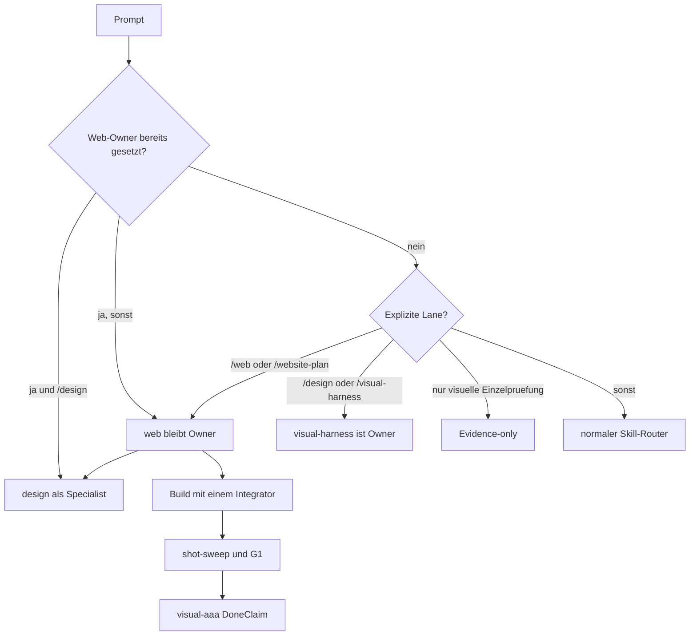
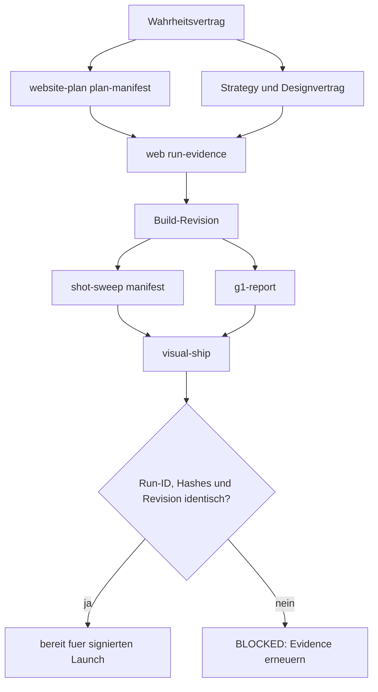
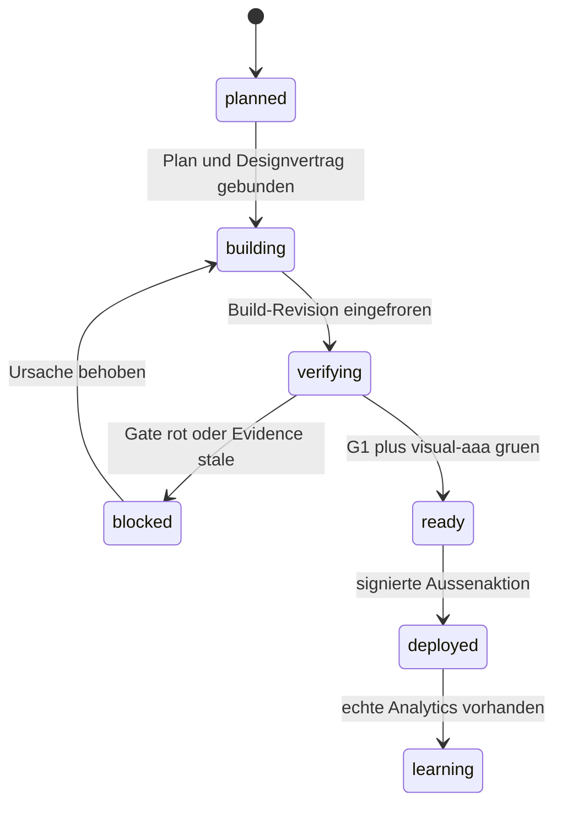

# Web-Workflow Evidenzvertrag - Plan

## Goal Capsule

- **Objective:** Website-Projekte laufen durch genau einen nachvollziehbaren Produktionsworkflow. Plan, Designvertrag, Build, Screenshots, QA und Freigabebeleg beziehen sich auf dieselbe Revision.
- **Means:** Zuerst werden die gebrochenen Owner-, Plan- und Evidence-Verträge repariert. Danach werden die belastbaren Lehren aus fünf Videos als geprüfte Kandidaten in den bestehenden spezialisierten Workflow integriert.
- **Authority:** Aktueller Nutzerauftrag → globaler Arbeitsvertrag → projektlokaler Wahrheits- und Designvertrag → dieser Plan → Skill- und Tool-Defaults.
- **Execution profile:** Contract-first und test-first. Jede Vertragsreparatur beginnt mit einer roten Fixture, die den heutigen Fehler reproduziert.
- **Stop conditions:** Kein P0-Vertragsbruch bleibt offen. Kein Video-Rat wird ohne Quellenabdeckung, Caveat und Gegencheck zur verbindlichen Regel. Kein Gate darf fehlende oder veraltete Evidence als PASS werten.
- **Tail ownership:** Der `web`-Skill besitzt den Website-Workflow. `design`, `copywriting` und `visual-aaa` bleiben spezialisierte Phasen beziehungsweise Gates.

---

## Product Contract

### Summary

Der globale Website-Workflow wird um einen eindeutigen Owner, einen validierbaren `website-plan`-v3-Handoff, revisionsgebundene Evidence und vollständige Zustandsprüfung ergänzt. Die fünf Videos liefern Kandidaten und Eval-Ideen, ersetzen aber weder lokale Belege noch Raphaels visuelle Abnahme.

### Problem Frame

Der bestehende `web`-Skill enthält bereits viele der stärksten Video-Lehren: Strategy vor Build, Landingpage- und Multi-Page-Routing, getrennte Copy- und Design-Gates, ein kanonischer Screenshot-Sweep, unabhängige Kritik, begrenzte Iteration und Analytics statt Agenten-Selbsturteil.

Der Ist-Audit zeigt jedoch Vertragsbrüche an den Übergängen. `visual-harness` kann einen expliziten `/web`-Aufruf in einen konkurrierenden Produktmodus ziehen und anschließend `web`, `design` und `website-plan` blockieren. `web` verlangt `PLAN_VERIFIED=YES`, während `website-plan` v3 ein neues Artefaktset beschreibt und der Validator weiterhin das alte 00–13-Paket prüft. `shot-sweep` dokumentiert vollständige Zustandsabdeckung, erzeugt unter `--states` aber nur Hover-Aufnahmen. `g1-gate` ruft den Sweep ohne `--static` und `--states` auf und besitzt weiterhin einen stillen Port-Default.

Neue Heuristiken würden diese Brüche nicht beheben. Der Plan stabilisiert deshalb zuerst Ownership, Handoffs und Evidence. Erst danach werden Video-Lehren als versionierte, überprüfbare Kandidaten aufgenommen und an einem eigenen Website-Eval-Korpus geprüft.

### Actors

- A1. **Website-Workflow-Owner:** `web`; hält Auftrag, Phasen, Integrationsgrenzen und Abschlussbeleg zusammen.
- A2. **Plan-Producer:** `website-plan`; erzeugt einen eingefrorenen, validierbaren Seiten- und Write-Scope-Vertrag, implementiert aber nicht.
- A3. **Spezialisten:** `design`, `copywriting`, `watch-video` und Tool-Primitives; liefern phasengebundene Artefakte, nicht konkurrierende Gesamtworkflows.
- A4. **Builder:** genau ein Integrator für gemeinsame UI-Flächen; disjunkte Pakete dürfen parallel entstehen.
- A5. **Verifier:** deterministische Gates sowie familienfremde visuelle und technische Kritiker.
- A6. **Raphael:** entscheidet subjektive Art Direction, Negativentscheidungen und Außenaktionen.

### Requirements

**Ownership und Handoff**

- R1. Ein Agency-Website-Auftrag besitzt genau einen Workflow-Owner: `web`.
- R2. `visual-harness` darf als explizite alternative Lane laufen, aber nie einen bereits gewählten `web`-Owner überschreiben. In der Web-Lane verlangt der Stop-Hook weder `claude-visual`-Captures noch `.claude/product-design.md`.
- R3. `visual-aaa` bleibt der terminale Pixel- und DoneClaim-Gate und wird nicht zum zweiten Workflow-Owner. `website-plan` ist plan-only und besitzt keine Capture-Pflicht.
- R4. `website-plan` v3 erzeugt einen maschinenlesbaren Planvertrag, den ein v3-Validator fail-closed prüft und den `web` direkt konsumiert.
- R5. Der aktuelle Workflow-Owner entscheidet die Ausführung. `website-plan` verweist nicht auf einen nicht vorhandenen `sequential-page-controller` und schreibt keine veraltete No-Agent-Policy fest.

**Evidence und QA**

- R6. Ein kleines Run-Evidence-Manifest bindet Wahrheitsvertrag, Plan, Designvertrag, Routen, Build-Revision, G1-Bericht, Screenshot-Manifest und `visual-ship.json` an dieselbe Run-ID und Revision.
- R7. Veraltete, fremde oder unvollständige Evidence blockiert die Freigabe statt auf den letzten vorhandenen PASS zurückzufallen.
- R8. Der kanonische Website-Capture bleibt `shot-sweep.mjs` und deckt Desktop, Mobile, Hover, Fokus, Open/Expanded sowie anwendbare Loading-, Empty-, Error- und Success-Zustände nachweisbar ab.
- R9. `g1-gate.mjs` verlangt eine explizite Basis-URL und führt den Kritik-Capture mit statischem, mobilen und zustandsbezogenem Profil aus.
- R10. Visuelle Qualität, funktionale Task Completion und Regressionstreue bleiben getrennte, nicht gegeneinander aufrechenbare Freigabedimensionen.

**Spezialisierung und Lernen**

- R11. Der Load-Graph lädt phasenspezifische Spezialisten. Er lädt keine Sammlung ähnlicher Design-, Motion- oder Anti-Slop-Skills auf Vorrat.
- R12. Motion-Polish beginnt erst nach einem stabilen statischen und funktionalen Basisstand und benötigt Reduced-Motion- sowie Lifecycle-Belege.
- R13. Externe Videos werden mit Transcript-Abdeckung, Zeitmarken, Frame-Belegen, Caveats und Promotion-Status aufgenommen. Sie werden nie direkt zu verbindlicher Doktrin.
- R14. Visuelle Referenzen werden als Case in der Musterbibliothek geführt. Workflow-Lehren laufen über die Brain-Kandidaten- und Skeptiker-Pipeline.
- R15. Der Webskill erhält einen kleinen repräsentativen Eval-Korpus mit festen Task-Flows und Änderungsanforderungen. Ein datierter, ausdrücklich gestarteter Benchmark misst Outcome, Defekte, Revisionstreue und Aufwand, ohne einen dauerhaften Modellsieger festzuschreiben.

**Deterministische Verträge**

- R16. Die Werkzeugtabelle besitzt einen eindeutigen Marker, einen expliziten Pfad und ein Projektprofil für Node, statisches HTML oder CMS-only.
- R17. Ein Tabellen- oder Projektprofil-Fehler ist ein Aufruffehler oder Qualitätsfehler mit klarer Ursache, nie ein stiller Fallback auf die erste Markdown-Tabelle.
- R18. Bestehende starke Regeln und Gates werden wiederverwendet. Dieser Umbau erstellt keinen neuen Mega-Skill und keine parallele Design-Wahrheit.

### Key Flows

- F1. **Website-Produktion:** Wahrheitsvertrag → optionaler validierter Website-Plan → Strategy/Sitemap/Copy/Art Direction → Build → zustandsvollständiger Capture → deterministische QA → unabhängige Kritik → `visual-ship.json` → signierter Launch.
- F2. **Externe Lernquelle:** Video/URL → vollständiges Transcript und Frames → Evidence-Kandidat → fremdfamiliärer Gegencheck → visuelles Case oder Brain-Kandidat → Regel-/Eval-Änderung → eigener Workflow-Benchmark.
- F3. **Routing-Benchmark:** eingefrorene Fixture → Erstbuild → konkrete Änderungsanforderung → Re-Run → funktionale, visuelle und revisionsbezogene Prüfung → datierte Routing-Empfehlung.

### Acceptance Examples

- AE1. **Web-Owner bleibt aktiv.** Gegeben ist ein expliziter `/web`-Auftrag. Wenn die `visual-harness`-Hooks laufen, dürfen sie `web`, `design` oder `website-plan` nicht blockieren, keinen zweiten Produktvertrag verlangen und den Abschluss nicht an `claude-visual`-Evidence binden. Web-Abschluss akzeptiert nur aktuelle `shot-sweep`-, G1- und `visual-aaa`-Receipts derselben Run-ID; ein reiner `website-plan`-Lauf verlangt keine Screenshots. Covers R1–R3.
- AE2. **V3-Plan wird kanonisch geprüft.** Gegeben ist ein vollständiger v3-Plan mit eindeutigen Routen, Owners und Write-Sets. Wenn der Validator läuft, erzeugt er einen revisionsgebundenen PASS-Receipt. Das alte 00–13-Paket allein besteht nicht mehr. Covers R4–R5.
- AE3. **Capture-Vertrag ist beweisbar.** Gegeben ist eine Route mit Hover-, Fokus-, Open-, Error- und Success-Zustand. Wenn G1 läuft, enthält das Manifest für jeden anwendbaren Zustand einen Shot oder einen expliziten, validierten Nicht-anwendbar-Grund. Covers R8–R10.
- AE4. **Stale Evidence fällt durch.** Gegeben ist ein grüner Screenshot- oder G1-Bericht von Commit A und ein Build auf Commit B. Wenn der Abschlussbeleg geprüft wird, ist der Lauf BLOCKED, bis Evidence für Commit B existiert. Covers R6–R7.
- AE5. **Video bleibt Kandidat.** Gegeben ist ein Video ohne vollständige Transcript-Abdeckung oder ohne Zeitbeleg. Wenn ein Agent daraus eine Regel ableiten will, bleibt der Eintrag unbestätigt und darf weder `stil-regeln.md` noch einen Default ändern. Covers R13–R14.
- AE6. **Revisionstreue wird gemessen.** Gegeben ist eine Fixture und die Anforderung, nur CTA und Proof-Reihenfolge zu ändern. Wenn der zweite Lauf zusätzlich Navigation oder Farbsystem verändert, verliert er den Revisionstreue-Check, auch wenn der neue Screenshot attraktiv wirkt. Covers R15.

### Success Criteria

| Kriterium | Messbarer Nachweis |
|---|---|
| Ein Workflow-Owner | Hook-Tests zeigen für `/web`, `/website-plan`, `/visual-harness` und generische Prompts genau eine Owner-Lane. |
| Gültiger Plan-Handoff | Eine echte v3-Fixture erzeugt `PLAN_VERIFIED=YES` und einen PASS-Receipt; Legacy-only und Blocker-Fixtures bleiben rot. |
| Revisionsgebundene Evidence | Gemischte Run-IDs, Hashes oder Build-Revisionen werden in Contract-Tests abgelehnt. |
| Vollständige State-QA | Automatische Hover/Fokus/Open-Fixtures und deklarierte Loading/Empty/Error/Success-Fixtures erscheinen im Screenshot-Manifest und G1-Bericht. |
| Kein Video-Doktrin-Sprung | Evidence-Validator verlangt Quelle, Abdeckung, Zeitmarke, Caveat, Status und Gegencheck vor Promotion. |
| Eigener Workflow-Prüfstand | Vier repräsentative Fixtures bestehen die deterministischen Contract-Checks und besitzen je einen festen Task-Flow für eine spätere Erstbuild- plus Änderungsrunde. |
| Bestehende Qualität bleibt | Alle bisherigen Web-, Design-, Website-Plan- und Visual-Harness-Evals bleiben grün oder werden bewusst auf den neuen Vertrag migriert. |

### Scope Boundaries

**In scope**

- Owner-Arbitration zwischen `web` und `visual-harness`.
- V3-Vertrag und Validator für `website-plan`.
- Kleines revisionsgebundenes Run-Evidence-Manifest.
- State-vollständiger `shot-sweep` und korrekte G1-Verdrahtung.
- Video-Evidence-Handoff und phasenspezifischer Load-Graph.
- Werkzeugtabellen-Vertrag und repräsentativer Workflow-Eval-Korpus.

#### Deferred to Follow-Up Work

- Vollständige Detektoren für alle offenen Stilregeln S3, S4, S7/S8, S10, S13 und S16. Dieser Plan schafft die Eval- und Evidence-Grundlage; die Regel-Detektoren können danach einzeln test-first landen.
- Eine universelle Browser-Aktionssprache für beliebig komplexe App-Zustände. V1 unterstützt nur die kleinste benötigte, deklarative State-Fixture.
- Der kostenpflichtige Erstbuild-plus-Änderungsrunde-Benchmark über reale Modelle/Harnesses. U7 baut Fixture, Task-Flow und Telemetrie; ein ausdrücklicher Folgeauftrag erzeugt die datierten Messwerte.
- Laufende Modell-Rankings oder automatische Produktions-Router. Ein späterer Benchmark erzeugt datierte Messwerte, keine dauerhafte Rangliste.

**Outside this product's identity**

- Umbau einer konkreten Kundenwebsite.
- Neuer Design-, Copy- oder Motion-Mega-Skill.
- Ersatz von `design`, `copywriting`, `visual-aaa` oder `shot-sweep` durch eine neue Parallelpipeline.
- Automatischer Push, Deploy, Publish oder Kundenkontakt.

### Sources / Research

**Vollständig gelesene Videoquellen**

| Quelle | Transcript-Abdeckung | Load-bearing Beitrag |
|---|---:|---|
| [WCrnS09vpfo](https://youtu.be/WCrnS09vpfo) | 00:00–21:15 | Journey-Planung, Product Judgment, getrennte Visual-/Functional-QA, begrenzte Agentenwellen, eigene Benchmarks. |
| [QUI6Ug4cHnE](https://youtu.be/QUI6Ug4cHnE) | 00:00–16:45 | Strategy-Interview, Asset-/Claim-Provenance, konkrete Diff-Feedbacks, Motion- und Reload-Lifecycle. |
| [bg0C-2iUUqM](https://youtu.be/bg0C-2iUUqM) | 00:00–20:35 | Identische Fixtures, mehrere Viewports, Revisionstreue, Build-Vertrag und Aufwandsmessung. |
| [VwGrXe2ricE](https://youtu.be/VwGrXe2ricE) | 00:00–22:19 | System statt Standardprompt, Referenz-/Originalitätsgrenze, Designsystem vor Skalierung, Asset-Pilot und wartbarer Handoff. |
| [Ysr7oNDajJI](https://youtu.be/Ysr7oNDajJI) | 00:00–12:55 | Phasenspezifische Skills, Basisdesign vor Motion, Before/After-Review, deterministische Referenzextraktion und selektive Loads. |

Die Videos sind Creator-Demos und teilweise Werbung. Sie enthalten keine belastbaren Conversion-Studien und begründen keine globale Modellrangfolge.

**Lokale Verträge und Belege**

- `raphael-skills/skills/eigene/web/SKILL.md` — aktueller Owner, Phasen, Gates und Completion Contract.
- `raphael-skills/skills/eigene/web/references/load-graph.md` — bestehende Progressive-Disclosure- und No-Duplicate-Regeln.
- `raphael-skills/skills/eigene/web/scripts/g1-gate.mjs` — fail-closed QA, aber stiller Basis-Default und unvollständiges Sweep-Profil.
- `raphael-skills/skills/eigene/web/scripts/shot-sweep.mjs` — kanonischer Capture mit Hover, jedoch ohne Fokus/Loading/Empty/Error/Success-Vertrag.
- `raphael-skills/skills/eigene/website-plan/SKILL.md` und `scripts/validate-plan.py` — v3-Artefakte und Legacy-Validator widersprechen sich.
- `.claude/skills/visual-harness/hooks/visual-prompt.mjs`, `visual-pre-tool.mjs`, `visual-stop.mjs` — konkurrierender Produktowner und zweiter Designvertrag.
- `raphael-skills/skills/eigene/visual-aaa/SKILL.md` — bestehender terminaler Pixel-Gate, der erhalten bleibt.
- `raphael-brain/wiki/craft/webdesign/website-truth-contract.md` — Originalauftrag, Assets, Repo/URL und Design-Lock einfrieren.
- `raphael-brain/wiki/craft/webdesign/design-system-workflow.md` — echte Quellen, repräsentativer Starter und vollständige Zustände.
- `raphael-brain/wiki/craft/webdesign/design-agent-arbeitet-am-echten-artefakt.md` — echte Artefakte statt Nachbildungen.

---

## Planning Contract

### Key Technical Decisions

- KTD1. **`web` bleibt einziger Agency-Website-Owner.** Explizite `/web`- und `/website-plan`-Aufträge setzen eine Web-Lane, die `visual-harness` nicht überschreibt. Ein späteres `/design` ist dort ein Specialist-Call und armt keinen neuen Owner. Ohne bestehenden Web-Owner bleibt `/design` eine explizite visuelle Harness-Lane. Die Web-Lane akzeptiert am Stop nur aktuelle Web-Receipts und verlangt kein `claude-visual`. Governs R1–R3.
- KTD2. **`website-plan` erhält einen einzigen v3-Vertrag.** Ein kleines `plan-manifest.json` referenziert die menschlichen Markdown-Artefakte, Route-Queue, Shared Owners, Write-Sets, Viewports und Blocker. Der Validator prüft nur v3; Legacy-only wird mit Migrationshinweis abgelehnt. Governs R4–R5.
- KTD3. **Ein Receipt, kein neuer Scheduler.** `<run-out>/run-evidence.json` indexiert Pfade, Hashes, Run-ID, Build-Revision und bestehende Evidence-Receipts. Es dupliziert weder Seiten noch Critic-Verdikte aus `visual-ship.json`. Geänderte Receipt-Schemas erhalten eine neue Versionsnummer; v1-Dateien werden nie still umgedeutet. Das Manifest orchestriert keine Agenten und speichert keinen Unit-Fortschritt. Governs R6–R7.
- KTD4. **`shot-sweep` bleibt der Capture-Kanon.** Automatische Zustände sind Hover, Fokus und Open/Expanded. Loading, Empty, Error und Success werden über eine kleine projektlokale State-Spec erreicht und als anwendbar oder nicht anwendbar deklariert. Governs R8–R10.
- KTD5. **Spezialisten werden zeitlich komponiert.** `design` besitzt visuelles System und Motion, `copywriting` die Copy-Gates, `watch-video` die Video-Beobachtung und `visual-aaa` den DoneClaim. Der Load-Graph beschreibt Übergaben statt zusätzliche Slash-Skills zu laden. Governs R11–R12, R18.
- KTD6. **Externe Lehren besitzen eine Promotion-Pipeline.** Prozesslehren gehen als belegter Brain-Kandidat durch einen fremdfamiliären Skeptiker. Visuelle Referenzen gehen als Case mit Raphael-Urteil in die Musterbibliothek. Erst bestätigte Kandidaten ändern Regeln oder Evals. Governs R13–R14.
- KTD7. **Routing-Entscheidungen bleiben empirisch und datiert.** Der Eval-Korpus friert Inputs ein, verlangt eine Änderungsrunde und misst Outcome, Revisionstreue, Defekte und Aufwand. Modell- oder Harness-Zuweisungen sind versionierte Hypothesen. Governs R15.
- KTD8. **Die Werkzeugtabelle wird strukturell adressiert.** Ein Marker und ein explizites Projektprofil ersetzen „erste Markdown-Tabelle“ und implizite Pfade. Governs R16–R17.

### Assumptions

- `/root` ist der gemeinsame Plan-Pfadanker. Deshalb sind alle Dateiangaben in diesem Plan relativ zu `/root`.
- Legacy-Website-Pläne sind gemäß `website-plan` v3 Archivmaterial. Es ist kein Dual-Validator für das alte 00–13-Schema nötig.
- `<run-out>/run-evidence.json` liegt in einem run-isolierten Output-Verzeichnis außerhalb des attestierten Git-Baums. Nur `web/state-spec.json` ist ein versioniertes Projekt-Input.
- Eine deklarative State-Spec mit wenigen Browseraktionen reicht für V1. Komplexe E2E-Logik bleibt in projektspezifischen Tests.

### High-Level Technical Design

#### Owner-Arbitration

#### Contract- und Evidence-Fluss

#### Evidence-Lifecycle

Das Lifecycle-Feld im Run-Evidence-Manifest dient nur der Konsistenzprüfung und dem Handoff. Es ersetzt weder Git noch ein Task-System.

### Sequencing

1. U1 beendet konkurrierende Owner, damit spätere Tests nicht in der falschen Lane laufen.
2. U2 schafft den kanonischen Planvertrag.
3. U3 bindet Plan-, Build- und Evidence-Receipts an eine Revision.
4. U4 erweitert Capture und G1 auf den dokumentierten State-Vertrag.
5. U5 integriert Video-Evidence und phasenspezifische Spezialisten ohne neue Dubletten.
6. U6 härtet die Werkzeugtabelle und Projektprofile.
7. U7 beweist den Gesamtworkflow auf repräsentativen Fixtures und aktualisiert die Migrationsdokumentation.

### Phased Delivery

- **Milestone A — Contract Repair:** U1–U4 sind gemeinsam freigabefähig, sobald Owner-Routing, v3-Plan-Handoff, run-isolierte Evidence und State-vollständige G1-Fixtures grün sind. Dieser Meilenstein repariert die aktuellen P0-Vertragsbrüche ohne auf die Lern- und Benchmark-Arbeit zu warten.
- **Milestone B — Learning and Tool Contracts:** U5–U6 integrieren Video-Evidence und Werkzeugprofile, ohne Milestone A wieder zu öffnen.
- **Milestone C — Global Activation:** U7 vergleicht die Baseline, führt den Shadow-Pilot aus und aktiviert die globalen Hooks erst nach aktuellen Receipts und Operator-Abnahme.

### System-Wide Impact

- Die Änderung betrifft globale Hooks, Agency-Skills, Website-Planung, QA, visuelle Evidence und alle künftigen Kundenwebsite-Projekte.
- Bestehende aktive Sessions dürfen ihren Owner nicht während des Laufs wechseln. Die Hook-Migration braucht daher einen Session-Neustart als dokumentierte Grenze.
- `visual-aaa`, `design` und `copywriting` bleiben fachliche Wahrheiten. Der Umbau ändert ihre Inhalte nur dort, wo Run-ID und Revision im Receipt ergänzt werden.
- Der neue Planvertrag wird zum externen Contract für `web`. Änderungen an seinem Schema benötigen Versionierung und Contract-Tests.

### Risks & Mitigations

| Risiko | Mitigation |
|---|---|
| Hook-Änderung blockiert weiterhin den richtigen Skill oder lässt zwei Owner zu. | Routing-Matrix vor Codeänderung als rote Hook-Fixtures festschreiben; exakt einen Owner assertieren. |
| V3-Migration macht bestehende Planordner unbrauchbar. | Legacy klar ablehnen, einen read-only Diagnosebericht liefern und aktive v3-Pläne einmalig neu manifestieren. Kein stiller Mischmodus. |
| Run-Evidence wird ein zweites Task-System. | Schema auf Identität, Hashes, Evidence und einen groben Phase-Wert begrenzen; keine Checklisten oder Unit-Progress-Felder. |
| State-Spec wächst zu einer eigenen Testframework-Sprache. | V1 auf wenige Aktionen und Assertions begrenzen; komplexe Szenarien verweisen auf bestehende Playwright-Tests. |
| Video-Lehren erzeugen neue Geschmacksdogmen. | Candidate-Status, Caveats, Gegencheck und eigener Eval-Korpus sind Pflicht vor Promotion. |
| Eval-Korpus wird teuer oder modellfixiert. | Kleine Fixtures, fixe Budgets, datierte Tool-/Modellversionen und keine automatische Dauerausführung. |

### Documentation / Operational Notes

- Hook- und State-Schema-Änderungen werden als eine atomare Migration ausgeliefert. Alte Sessions werden nicht live umgeroutet; die Release-Notiz verlangt einen Session-Neustart.
- `visual-aaa/ship/v1` und alte Website-Pläne bleiben lesbare Historie. Nur v2-Ship-Receipts beziehungsweise v3-Plan-Receipts gelten für neue Freigaben.
- Jede neue JSON-Vertragsversion erhält Schema-Dokumentation, positive und negative Fixtures sowie einen klaren Fehler für unbekannte Versionen.
- Der Rollback stellt die vorherigen Hook-Dateien gemeinsam wieder her. Ein Teilrollback einzelner Hooks ist verboten, weil er den Doppel-Owner erneut öffnen kann.
- Der datierte Workflow-Benchmark läuft manuell oder auf ausdrücklichen Auftrag. Er wird nicht als dauerhafter Hintergrundjob installiert.

---

## Implementation Units

### U1. Einen Website-Owner erzwingen

- **Goal:** `/web`, `/website-plan` und `/visual-harness` führen deterministisch in genau eine Owner-Lane.
- **Requirements:** R1–R3, R18; Covers AE1.
- **Dependencies:** Keine.
- **Files:**
  - `raphael-skills/skills/eigene/web/SKILL.md`
  - `raphael-skills/skills/eigene/web/references/load-graph.md`
  - `.claude/skills/visual-harness/README.md`
  - `.claude/skills/visual-harness/hooks/visual-prompt.mjs`
  - `.claude/skills/visual-harness/hooks/visual-pre-tool.mjs`
  - `.claude/skills/visual-harness/hooks/visual-stop.mjs`
  - `.claude/skills/visual-harness/test/hooks.test.mjs`
- **Approach:**
  1. Ein explizites Owner-Feld mit den Werten `web`, `visual-harness` oder `none` in den Harness-Zustand aufnehmen und das State-Schema versionieren.
  2. `/web` und `/website-plan` als Web-Lane behandeln. Die Hooks blockieren dort keine Web-Skills, verlangen kein `.claude/product-design.md` und akzeptieren am Stop nur Web-Receipts derselben Run-ID und Revision. Ein reiner Planlauf hat keine Capture-Pflicht.
  3. `/design` unter bestehendem Web-Owner als Specialist-Call behandeln. Ohne Web-Owner bleibt `/design` eine explizite visuelle Harness-Lane.
  4. Eine explizite `/visual-harness`-Lane beibehalten. Generische visuelle Reviews ohne Website-Build bleiben Evidence-only.
  5. Alte State-Dateien ohne Owner oder mit alter Schemaversion beim nächsten Prompt invalidieren. Eine laufende Session wechselt ihren Owner nicht nachträglich.
  6. `visual-aaa` im Webvertrag ausdrücklich als terminales Gate, nicht als Owner, beschreiben.
- **Execution note:** Zuerst Hook-Fixtures schreiben, die den aktuellen `/web`-Block reproduzieren.
- **Patterns to follow:** Fail-closed Owner-Klassifikation aus dem globalen Workflow-Vertrag; Progressive Disclosure aus `load-graph.md`.
- **Test scenarios:**
  - Covers AE1. Ein `/web`-Prompt erlaubt danach `Skill(web)`, `Skill(design)` und `Skill(website-plan)` ohne Harness-Deny und beendet mit aktuellen Web-Receipts statt `claude-visual`.
  - Ein reiner `/website-plan`-Prompt endet ohne Screenshot- oder Pixel-Gate.
  - Ein `/design`-Prompt unter bestehendem Web-Owner bleibt Specialist-Call; ohne Web-Owner aktiviert er die visuelle Harness-Lane.
  - Ein `/visual-harness`-Prompt aktiviert nur die Harness-Lane und verlangt deren Capture-Vertrag.
  - Ein `/web premium`-Prompt bleibt Web-owned und darf `visual-aaa` sowie zusätzliche Kritik aktivieren.
  - Ein alter Harness-State aus einem vorherigen Prompt oder aus State-Schema v1 darf einen neuen Web-Auftrag nicht übernehmen.
  - Eine laufende Web-Session behält ihren Owner auch dann, wenn ein späterer Prompt nur allgemein „visuell prüfen“ sagt.
  - Ein visueller Review ohne Implementierungsauftrag verlangt Evidence, aber keinen Produkt-Designvertrag.
- **Verification:** Die Routing-Matrix zeigt für jeden Prompt genau einen Owner und keinen widersprüchlichen Stop-Hook.

### U2. `website-plan` v3 zum kanonischen Planvertrag machen

- **Goal:** `website-plan` erzeugt einen ausführbaren v3-Vertrag, den `web` ohne Legacy-Artefakte oder fehlenden Controller konsumiert.
- **Requirements:** R4–R5; Covers AE2.
- **Dependencies:** U1.
- **Files:**
  - `raphael-skills/skills/eigene/website-plan/SKILL.md`
  - `raphael-skills/skills/eigene/website-plan/references/plan-manifest-v3.md` (new)
  - `raphael-skills/skills/eigene/website-plan/scripts/validate-plan.py`
  - `raphael-skills/skills/eigene/website-plan/tests/test_validate_plan.py`
  - `raphael-skills/skills/eigene/web/SKILL.md`
  - `raphael-skills/skills/eigene/web/references/loop2-ablauf.md`
  - `raphael-skills/skills/eigene/web/evals/run-site-build-load-path-check.mjs`
- **Approach:**
  1. `website-plan/plan-manifest.json` als maschinenlesbaren Index für `00-contract.md`, Route-Manifest, globales System, Page-Specs, Queue, Decision Log und Final Acceptance definieren.
  2. Pro Route eindeutigen Owner, Write-Set, Abhängigkeiten, Viewports, Zustände und Blocker referenzieren. Shared Files besitzen genau einen Owner.
  3. Den Validator auf v3 umstellen und einen `plan-verification.json`-Receipt mit Manifest-Hash erzeugen. Die CLI-Zeile `PLAN_VERIFIED=YES|NO` bleibt menschenlesbar.
  4. Legacy-only-Verzeichnisse mit einer klaren v3-Migrationsdiagnose ablehnen. Keine parallele Legacy-Validierung behalten.
  5. Den nicht vorhandenen `sequential-page-controller` und die veraltete No-Agent-Ausführung aus dem Handoff entfernen. `web` entscheidet anhand von Abhängigkeiten und Write-Sets über sequenzielle oder parallele Pakete.
- **Execution note:** Die heutige v3-Fixture muss zuerst am Legacy-Validator scheitern; danach wird nur der Validatorvertrag geändert.
- **Patterns to follow:** Ein Owner pro Shared Scope; BLOCKED statt PASS bei Provider-, Datei- oder Schemafehlern.
- **Test scenarios:**
  - Covers AE2. Vollständiger v3-Plan erzeugt PASS-Receipt und `PLAN_VERIFIED=YES`.
  - Doppelte Route, überlappendes Write-Set oder doppelter Shared Owner erzeugt `PLAN_VERIFIED=NO`.
  - `OWNER-BLOCKER` in einem ansonsten gültigen Plan bleibt rot.
  - Nichtleere Werte wie `meta=no` bestehen nicht, wenn der Vertrag `yes` oder `n/a` verlangt.
  - Fehlende Desktop- oder Mobile-Spezifikation einer P0-Route bleibt rot.
  - Das alte 00–13-Paket ohne v3-Manifest wird mit Migrationshinweis abgelehnt.
- **Verification:** `web` startet den Build nur, wenn Receipt, Plan-Manifest und aktuelle Hashes zusammenpassen.

### U3. Ein revisionsgebundenes Run-Evidence-Receipt einführen

- **Goal:** Alle Plan-, Build- und QA-Belege gehören nachweisbar zum selben Website-Lauf.
- **Requirements:** R6–R7; Covers AE4.
- **Dependencies:** U1, U2.
- **Files:**
  - `raphael-skills/skills/eigene/web/references/run-evidence-contract.md` (new)
  - `raphael-skills/skills/eigene/web/scripts/run-evidence.mjs` (new)
  - `raphael-skills/skills/eigene/web/evals/run-evidence-contract-check.mjs` (new)
  - `raphael-skills/skills/eigene/web/SKILL.md`
  - `raphael-skills/skills/eigene/web/references/loop2-ablauf.md`
  - `raphael-skills/skills/eigene/web/scripts/g1-gate.mjs`
  - `raphael-skills/skills/eigene/web/scripts/shot-sweep.mjs`
  - `raphael-skills/skills/eigene/visual-aaa/references/ship-manifest.md`
  - `raphael-skills/skills/eigene/visual-aaa/scripts/write-ship-manifest.py`
- **Approach:**
  1. `<run-out>/run-evidence.json` in einem run-isolierten Verzeichnis außerhalb des attestierten Git-Baums speichern und auf Run-ID, Ziel-Repo/Revision/Base-URL, Contract-Pfade mit SHA-256 und Verweise auf Evidence-Receipts begrenzen.
  2. Plan-Receipt, G1-Bericht und Screenshot-Manifest erhalten explizite Schemas sowie Run-ID und Build-Revision. `visual-ship.json` wird dafür als `visual-aaa/ship/v2` versioniert; sein bestehender Seiten-, Self-Read- und Critic-Vertrag bleibt unverändert.
  3. Evidence nur atomar anhängen, wenn Revision und Contract-Hashes passen. Ein neuer Build invalidiert ältere Capture- und QA-Receipts.
  4. V1-Receipts bleiben lesbare Historie, gelten aber ohne V2-Identitätsfelder nicht als aktueller Ship-Beleg.
  5. Einen groben Phase-Wert für Handoffs führen, aber keine Unit-Checklisten oder Fortschrittsverwaltung aufnehmen.
- **Execution note:** Zuerst Misch-Run- und Stale-Revision-Fixtures schreiben.
- **Patterns to follow:** Run-isolierte Output-Verzeichnisse aus `g1-gate.mjs`; gesiegelter Wahrheitsvertrag aus dem Brain-Wiki.
- **Test scenarios:**
  - Covers AE4. Evidence von Commit A wird gegen Commit B abgelehnt.
  - Zwei grüne Receipts mit unterschiedlichen Run-IDs ergeben keinen Gesamt-PASS.
  - Eine geänderte Plan- oder Design-Datei invalidiert den bisherigen Build-Receipt.
  - Ein grünes `visual-aaa/ship/v1` bleibt historisch lesbar, kann aber ohne Run-ID und Build-Revision keinen neuen Gesamt-PASS erzeugen.
  - Ein optionaler Website-Plan darf fehlen, wenn die Lane keinen `website-plan` als Baukanon nennt; genannte Pläne sind dagegen Pflicht.
  - Teilweise geschriebenes oder unbekannt versioniertes JSON wird als BLOCKED gemeldet.
- **Verification:** Ein Abschlusscheck kann aus einem Receipt nachvollziehen, welche Revision, Verträge und Belege tatsächlich freigegeben wurden.

### U4. Capture- und G1-Vertrag auf echte Zustände bringen

- **Goal:** Der dokumentierte Screenshot- und G1-Vertrag entspricht dem, was die Werkzeuge tatsächlich erfassen.
- **Requirements:** R8–R10; Covers AE3.
- **Dependencies:** U3.
- **Files:**
  - `raphael-skills/skills/eigene/web/references/state-capture-contract.md` (new)
  - `raphael-skills/skills/eigene/web/scripts/shot-sweep.mjs`
  - `raphael-skills/skills/eigene/web/scripts/g1-gate.mjs`
  - `raphael-skills/skills/eigene/web/references/screenshot-kritik-loop.md`
  - `raphael-skills/skills/eigene/web/references/qa-faecher.md`
  - `raphael-skills/skills/eigene/web/evals/run-sweep-check.mjs`
  - `raphael-skills/skills/eigene/web/evals/run-shot-stable-check.mjs`
  - `raphael-skills/skills/eigene/web/evals/run-state-coverage-check.mjs` (new)
  - `raphael-skills/skills/eigene/visual-aaa/SKILL.md`
- **Approach:**
  1. Den stillen Basis-URL-Default aus `g1-gate.mjs` entfernen.
  2. G1 ruft den kanonischen Sweep mit `--static`, `--states` und `--mobile` auf und prüft das zurückgegebene Capture-Profil.
  3. Hover, Fokus und Open/Expanded generisch erfassen. Jeder Receipt-Schlüssel besteht aus Route, Viewport, stabiler Target-ID oder semantischem Label und Zustand. Ein Shot eines Controls darf kein zweites Control desselben Typs abdecken.
  4. Eine kleine `web/state-spec.json` für anwendbare Loading-, Empty-, Error- und Success-Szenarien definieren. Formulare, asynchrone Loads, Listen und Submit-Aktionen machen ihre passenden Zustände automatisch erforderlich. `not_applicable` akzeptiert nur validatorgeprüfte Gründe wie `static-page`, `no-form` oder `no-async-data`.
  5. Loading deterministisch über einen Intercept-Hold erfassen: Request pausieren, Aktion auslösen, Loading assertieren und capturen, deklarierte Success- oder Error-Antwort freigeben, Terminalzustand assertieren und capturen, Route zurücksetzen.
  6. Jede interaktive State-Evidence enthält zusätzlich die echte Tastatursequenz, erwarteten Fokus, Rolle/Accessible Name, ARIA- oder Live-Region-Ergebnis, Escape-/Recovery-Pfad und einen Axe-Receipt auf dem übergegangenen DOM.
  7. Sobald ein Szenario Schleifen, komplexe Datenvorbereitung oder mehrstufige Geschäftslogik benötigt, verweist die State-Spec auf einen bestehenden projektspezifischen Playwright-Test und übernimmt dessen Screenshot- und A11y-Receipt. Die State-Spec wird nicht zum zweiten E2E-Framework.
  8. Das Manifest listet pro Target `required`, `captured`, `not_applicable` und `failed`. Freitext allein kann `not_applicable` nie begründen.
- **Execution note:** Mit einer Fixture starten, deren Hover heute grün ist, deren Fokus- und Error-State aber fehlen.
- **Patterns to follow:** Sequentielle Route-Captures, kein `fullPage`, frischer Reload vor Klick-Pass, `animations: disabled`, Reduced Motion und Manifest-Ehrlichkeit.
- **Test scenarios:**
  - G1 ohne `--base` endet als Aufruffehler und startet keinen Browser.
  - Covers AE3. Eine Fixture erzeugt Hover-, Fokus-, Open-, Loading-, Error- und Success-Shots mit eindeutigen Manifest-Einträgen und State-lokalen A11y-Receipts.
  - Zwei Buttons mit demselben Zustand benötigen zwei Target-Receipts; ein einzelner Shot kann die Matrix nicht erfüllen.
  - Ein pausierter Request hält Loading bis nach dem Shot und erzeugt danach getrennte Success- und Error-Terminalbelege.
  - Eine Route ohne anwendbare Empty-State-Funktion besteht nur mit einem erlaubten `not_applicable`-Grund; Freitext oder weggelassene Zeilen bleiben rot.
  - Ein expandiertes Menü mit falschem Fokus oder fehlendem ARIA-State bleibt trotz korrektem Screenshot rot.
  - Ein fehlgeschlagener Setup-Schritt erzeugt `failed`, nicht einen leeren Shot oder PASS.
  - Ein komplexer Buchungszustand wird über einen vorhandenen Playwright-Test referenziert; die State-Spec dupliziert dessen Geschäftslogik nicht.
  - Mobile wird für alle geänderten Routen erfasst; Fokus- und Open-Zustände bleiben nach Re-Sweep reproduzierbar.
  - Der G1-Bericht lehnt ein Manifest ab, das `states=true` meldet, aber nur Hover-Dateien enthält.
- **Verification:** Dokumentation, CLI-Aufruf, Manifest und G1-Urteil beschreiben denselben State- und Viewport-Vertrag.

### U5. Video-Evidence und Spezialisten als Phasenvertrag integrieren

- **Goal:** Externe Video-Lehren werden nachvollziehbar aufgenommen, ohne neue Skill-Dubletten oder Geschmacksdogmen zu erzeugen.
- **Requirements:** R11–R14, R18; Covers AE5.
- **Dependencies:** U1.
- **Files:**
  - `.claude/skills/watch-video/SKILL.md`
  - `raphael-skills/skills/eigene/web/references/video-evidence-contract.md` (new)
  - `raphael-skills/skills/eigene/web/references/load-graph.md`
  - `raphael-skills/skills/eigene/web/references/muster-bibliothek/_template.md`
  - `raphael-skills/skills/eigene/web/references/muster-bibliothek/INDEX.md`
  - `raphael-skills/skills/eigene/web/evals/run-video-evidence-check.mjs` (new)
  - `raphael-brain/raw/bookmark-2026-08-31-webskill-video-*.md` (new, via Brain-Broker)
  - `raphael-brain/wiki/_candidates/2026-08-31-webskill-workflow-lehren-aus-fuenf-videos.md` (new, via Brain-Broker)
- **Approach:**
  1. `watch-video` um einen optionalen Web-Evidence-Handoff ergänzen: Video-ID, Titel, Quelle, Transcript-Methode, Anfang/Ende, Frame-Belege, Zeitmarken, Lesson, betroffene Phase, Caveat und Confidence.
  2. Prozess- und Workflow-Lehren als Brain-Rawmaterial plus Kandidat persistieren. Vor Promotion prüft eine fremde Modellfamilie Fakten, Übertragbarkeit und Werbeinteressen.
  3. Visuelle Websites oder Frames über die bestehende Case-Vorlage führen. Ein Case bleibt ohne Raphael-Urteil und Belegschwelle Kandidat.
  4. Im Load-Graph die Reihenfolge klarziehen: Strategy/IA → Copy/Visual System → statischer Basisbuild → optionaler Motion-Polish → QA → `visual-aaa`. Benannte Skills aus dem fünften Video werden nur geladen, wenn sie eine noch offene Entscheidung ändern und nicht bereits in `design` oder `copywriting` fusioniert sind.
  5. Den eingefrorenen Fünf-Video-Nenner aus dem Appendix als Source-to-Decision Ledger validieren: 10/12/8/10 strukturierte Journal-Lessons plus acht abgegrenzte Source-5-Lessons. Jede Lesson besitzt genau eine Disposition, Timecode, Ziel, U/KTD-Verweis, Gate und Caveat oder Ablehnungsgrund.
- **Execution note:** Die fünf Quellen dieses Plans bilden die erste vollständige Evidence-Fixture.
- **Patterns to follow:** Kandidat/bestätigt/verbindlich aus `stil-regeln.md`; Skeptiker-Schritt aus der Brain-Pipeline; maximal drei Zusatz-Referenzen aus dem Web-Load-Graph.
- **Test scenarios:**
  - Covers AE5. Fehlende Transcript-Endzeit, Zeitmarke oder Caveat verhindert Promotion.
  - Ein rein transkriptbasierter visueller Claim verlangt einen Frame-Beleg oder bleibt unbestätigt.
  - Ein Creator-Score wie „perfect“ oder eine Modell-Rangfolge darf nicht als verbindliche Regel erscheinen.
  - Ein visueller Case ohne Raphael-Urteil bleibt `kandidat`.
  - Der Load-Graph lädt `design`, `copywriting` und `visual-aaa` phasenbezogen, aber keine Liste ähnlicher Einzel-Skills.
  - Die fünf aktuellen Videoquellen bestehen Coverage- und Quellenchecks und bleiben bis zum Skeptiker-Receipt Kandidaten.
  - Eine temporäre Plan-Kopie bleibt rot, wenn eine der fünf eingefrorenen Video-IDs fehlt.
  - Eine Ledger-Lesson ohne Timecode, exakten Zielpfad, U/KTD-Referenz oder messbares Gate bleibt rot.
  - Eine `REJECT`-Lesson ohne konkreten Ablehnungsgrund und eine `DEFER`-Lesson ohne Wiedereintrittsbedingung bleiben rot.
  - Die vier Journal-Nenner 10/12/8/10, der Source-5-Nenner 8 und die Disposition-Summe 48 müssen exakt reconciliieren; `unexplained_lessons` muss 0 sein.
- **Verification:** Jede aus einem Video stammende Regel- oder Eval-Änderung lässt sich zu Source, Zeitmarke, Caveat und Promotion-Receipt zurückverfolgen.

### U6. Werkzeugtabellen- und Projektprofile fail-closed machen

- **Goal:** Das Tool-Gate prüft genau die beabsichtigte Werkzeugtabelle und unterstützt die dokumentierten Projekttypen ohne widersprüchliche Defaults.
- **Requirements:** R16–R17.
- **Dependencies:** U1.
- **Files:**
  - `raphael-skills/skills/eigene/web/scripts/werkzeug-gate.mjs`
  - `raphael-skills/skills/eigene/web/references/tool-usecase-router.md`
  - `raphael-skills/skills/eigene/web/references/loop2-ablauf.md`
  - `raphael-skills/skills/eigene/web/references/radix-shadcn-tailwind-stack.md`
  - `raphael-skills/skills/eigene/web/evals/run-werkzeug-gate-check.mjs` (new)
  - `raphael-skills/skills/eigene/web/evals/eval-umfang.json`
  - `raphael-skills/skills/eigene/web/SKILL.md`
- **Approach:**
  1. Eine markierte Werkzeugtabelle statt des ersten Tabellenblocks parsen.
  2. `--tabelle` und `--profile node|static|cms` explizit machen. Fehlende Werte sind Aufruffehler, kein impliziter Nachbarpfad.
  3. Im Node-Profil Package- und Dependency-Vertrag prüfen. Static- und CMS-Profile verlangen keine `package.json`, behalten aber Icon-, Motion- und Quellenchecks, soweit anwendbar.
  4. Router-Bezeichnungen auf `motion`/`motion/react` vereinheitlichen und verbotene `framer-motion`-Imports weiter blockieren.
- **Execution note:** Charakterisierungs-Fixtures für eine frühere Token-Tabelle, Static-HTML ohne `package.json` und CMS-only zuerst hinzufügen.
- **Patterns to follow:** Eindeutige Router-Anker, unbekannte Flags als Exit 2, keine stille Skip-als-PASS-Semantik.
- **Test scenarios:**
  - Eine Token-Tabelle vor der Werkzeugtabelle wird ignoriert; nur der markierte Block zählt.
  - Ein Node-Projekt mit undokumentierter Dependency bleibt rot.
  - Eine statische HTML-Site ohne `package.json` besteht im Static-Profil, wenn keine undokumentierten Tools vorkommen.
  - CMS-only besteht ohne Custom-JavaScript, meldet aber eine vorhandene Custom-Dependency ohne Tabellenzeile.
  - Fehlendes `--tabelle`, unbekanntes Profil und unbekannter Router-Anker enden fail-closed.
  - `framer-motion` bleibt rot; `motion/react` mit Reduced-Motion-Behandlung kann bestehen.
- **Verification:** Kommentar, Hilfe, Skill-Dokumentation und Evals beschreiben dieselben drei Projektprofile und dieselbe Tabelle.

### U7. Den Gesamtworkflow auf vier Fixtures beweisen und migrieren

- **Goal:** Der neue Vertrag besteht repräsentative End-to-End-Szenarien und liefert datierte, reproduzierbare Routing-Evidence.
- **Requirements:** R10, R15, R18; Covers AE6.
- **Dependencies:** U2–U6.
- **Files:**
  - `raphael-skills/skills/eigene/web/references/workflow-eval-corpus.md` (new)
  - `raphael-skills/skills/eigene/web/evals/fixtures/ads-landing/` (new)
  - `raphael-skills/skills/eigene/web/evals/fixtures/local-multipage/` (new)
  - `raphael-skills/skills/eigene/web/evals/fixtures/interactive-product/` (new)
  - `raphael-skills/skills/eigene/web/evals/fixtures/reference-rebuild/` (new)
  - `raphael-skills/skills/eigene/web/evals/fixtures/*/task-flow.md` (new)
  - `raphael-skills/skills/eigene/web/evals/run-workflow-contract-check.mjs` (new)
  - `raphael-skills/skills/eigene/web/evals/eval-umfang.json`
  - `raphael-skills/skills/eigene/web/SKILL.md`
  - `raphael-skills/skills/eigene/website-plan/SKILL.md`
  - `.claude/skills/visual-harness/README.md`
- **Approach:**
  1. Vier kleine Fixtures abdecken: Ads-Landing mit Formular, lokale Multi-Page-Site, interaktives Produkt mit Zuständen und Reference-Rebuild mit Provenance.
  2. Pro Fixture Brief, Assets, Truth Contract, erwartete Routen, State-Spec und Akzeptanzkriterien versionieren.
  3. Pro Fixture einen festen Task-Flow definieren: Actor und Ziel, Start-URL und Ausgangszustand, geordnete Aktionen, Entscheidungspunkte, mindestens zwei erreichbare Edge Cases sowie beobachtbare Success- und Failure-Exits.
  4. Den heutigen Workflow auf denselben Contract-Fixtures als Baseline erfassen. Der neue Vertrag darf keine zuvor grüne Hard-Gate- oder Task-Success-Fixture regressieren und muss die bekannten Owner-, Plan- und State-Evidence-Fehler auf null reduzieren.
  5. Deterministische Contract-Checks ohne Modelllauf automatisieren. Ein separater, ausdrücklich gestarteter Benchmark führt Erstbuild und lokale Änderungsanforderung aus; unverlangte Änderungen an Navigation, Tokens oder anderen Routen zählen als Regression.
  6. Der optionale Benchmark erfasst Hard Metrics wie Task Success, Route-/State-Abdeckung, G1/Visual-AAA, A11y, Performance und Stale-Evidence-Schutz sowie Process Metrics wie Laufzeit, Tool Calls, Tokens/Kosten, Agentenzahl und Iterationen.
  7. Visuelle Qualität per anonymisiertem, paarweisem Blind-A/B und Rubrik erfassen. Das Urteil bleibt subjektiv und wird nicht mit technischen Gates verrechnet.
  8. Vor globaler Hook-Aktivierung einen Shadow-Pilot auf genau einem aktiven Kundenwebsite-Projekt durchführen. Aktivierung verlangt aktuelle Receipts, keine Hard-Gate-Regression und eine dokumentierte Operator-Abnahme des gemessenen Overheads.
  9. Migrationshinweise, entfernte Legacy-Verträge und neue Receipt-Pfade dokumentieren. Alte tote Anweisungen und Tests löschen statt parallel stehen lassen.
- **Execution note:** Zuerst Contract-Checks ohne Modelllauf bauen. Datierten Modell-/Harness-Benchmark erst starten, wenn alle deterministischen Fixtures grün sind.
- **Patterns to follow:** Identische Fixture aus den Videos, Positions-Tausch im Blind-A/B, max. drei visuelle Zyklen und run-isolierte Outputs.
- **Test scenarios:**
  - Jeder Fixture-Task-Flow startet aus demselben Zustand und bewertet dieselben Success-, Failure- und Edge-Case-Exits.
  - Covers AE6. Eine absichtlich zu breite Änderungsrunde verliert den Regressionstreue-Check.
  - Ein attraktiver Build mit kaputtem Formular verliert Task Success unabhängig vom Visual-Score.
  - Ein technisch grüner, aber visuell klar unterlegener Build bleibt technisch grün und visuell rot; die Dimensionen werden nicht verrechnet.
  - Ein zweiter Lauf mit anderer Tool- oder Modellversion wird als eigener datierter Benchmark gespeichert.
  - Ein Fixture-Lauf mit fehlender Kosten- oder Agenten-Telemetrie bleibt als teilweise gemessen markiert und erzeugt keine Effizienzbehauptung.
  - Der Shadow-Pilot blockiert globale Aktivierung bei stale Evidence, Hard-Gate-Regression oder fehlender Operator-Abnahme.
  - Alte `sequential-page-controller`-, Legacy-Validator- und Doppel-Owner-Verweise sind nach Migration nicht mehr aktive Vertragsbestandteile.
- **Verification:** Der Korpus beweist den neuen Ablauf vom Planvertrag bis zum revisionsgebundenen Ship-Receipt und erzeugt eine nachvollziehbare, nicht universalisierte Routing-Empfehlung.

---

## Verification Contract

| Bereich | Verifikation | Erwartung |
|---|---|---|
| Skill-Struktur | `python3 raphael-skills/tools/validate-skill.py raphael-skills/skills/eigene/web` und analog für `website-plan`/`visual-aaa` | Alle Skill-Verträge strukturell gültig. |
| Owner-Routing | `.claude/skills/visual-harness/test/hooks.test.mjs` | Jede Prompt-Klasse besitzt genau einen Owner; `/web` wird nie geblockt. |
| Website-Plan v3 | `python3 -m unittest raphael-skills/skills/eigene/website-plan/tests/test_validate_plan.py` | V3-PASS, Blocker-/Overlap-/Legacy-Fixtures rot. |
| Run-Evidence | `run-evidence-contract-check.mjs` | Stale Revision, Misch-Run und Hash-Drift rot; aktueller Lauf grün. |
| Screenshot-Vertrag | `run-sweep-check.mjs`, `run-shot-stable-check.mjs`, `run-state-coverage-check.mjs` | Viewports, Static-Profil und alle anwendbaren Zustände belegt. |
| Web-G1 | `run-exit-vertrag-check.mjs`, `run-routen-check.mjs`, `run-kaputte-ausgaben.mjs` | Fehlende Basis, Tools oder Felder werden nie zu PASS. |
| Werkzeug-Gate | `run-werkzeug-gate-check.mjs` | Node-, Static- und CMS-Profile sowie markierte Tabelle korrekt. |
| Video-Evidence | `run-video-evidence-check.mjs` | Fünf eingefrorene IDs, Nenner 10/12/8/10/8, genau eine Disposition je Lesson, Timecode, Ziel, U/KTD, Gate und Caveat/Grund; `unexplained_lessons=0`. |
| Gesamtworkflow | `run-workflow-contract-check.mjs` | Vier Fixtures und ihre festen Task-Flows bestehen die deterministischen Contract-Gates; der Shadow-Pilot liefert aktuelle Receipts. |
| Referenzen und Umfang | `run-verweise-alle.mjs`, `run-site-build-load-path-check.mjs`, `run-eval-umfang.mjs` | Keine toten Verweise; Eval-Inventar und Load-Graph stimmen. |
| Plan-Provenance | Semantischer Check der Appendix-Sektion „Runtime Provenance and Limitations" plus Temp-Kopie-Negativtest | Jedes Tupel aus Workflow-ID, Worker-ID, tatsächlichem Modell und Disposition ist gebunden; recovered/unstructured und die drei FAILED-Reviewer sind ausgewiesen; Mutation der Temp-Kopie macht das Gate rot. |

Die Befehle sind Zielverträge für die Umsetzung. In diesem Planungsrun wurden keine Produktions- oder Testdateien verändert und keine Tests ausgeführt.

---

## Definition of Done

### Global

- `web` ist der einzige Agency-Website-Workflow-Owner.
- `visual-harness` besitzt eine klar abgegrenzte explizite oder Evidence-Lane und blockiert keine Web-Lane.
- `website-plan` v3, Validator, Receipt und `web`-Handoff verwenden dasselbe Schema.
- Plan-, Design-, Build- und QA-Belege tragen dieselbe Run-ID und Revision.
- G1 verlangt eine explizite Basis-URL und beweist Static-, Mobile- und State-Abdeckung.
- Die fünf Videoquellen sind mit vollständiger Coverage, Zeitbelegen und Caveats als Kandidaten persistiert und gegengeprüft.
- Der Load-Graph zeigt phasenspezifische Spezialisten und keine Vorratsloads.
- Der Werkzeug-Gate-Vertrag unterstützt Node, Static und CMS fail-closed.
- Vier Workflow-Fixtures bestehen die deterministischen Contract-Checks und definieren feste Task-Flows; ein kostenpflichtiger Erstbuild-plus-Änderungsrunde-Benchmark bleibt ein ausdrücklicher Folgeauftrag.
- Alle geänderten Skill-, Hook-, Validator-, Script- und Eval-Tests sind grün.
- Die Appendix-Sektion „Runtime Provenance and Limitations" bleibt vollständig und widerspruchsfrei: alle neun Worker-Tupel (Workflow-ID, Worker-ID, tatsächliches Modell, Disposition) bestehen das semantische Provenance-Gate samt Temp-Kopie-Negativtest.
- Legacy- und Dead-End-Code aus verworfenen Owner-, Validator- oder Controller-Pfaden ist entfernt.

### Per Unit

- **U1:** Routing-Matrix grün; kein Doppel-Owner.
- **U2:** V3-Planvertrag und echte Blocker-Fixtures grün; Legacy-only rot.
- **U3:** Stale- und Misch-Evidence wird zuverlässig abgelehnt.
- **U4:** Manifest und G1 belegen alle anwendbaren Zustände auf Desktop und Mobile.
- **U5:** Alle 48 eingefrorenen Lessons stehen genau einmal im Source-to-Decision Ledger; Source-, Skeptiker- und Promotion-Receipts bleiben nachvollziehbar.
- **U6:** Werkzeugtabelle und Projektprofile sind eindeutig und getestet.
- **U7:** End-to-End-Korpus und Shadow-Pilot beweisen Contract- und Task-Success ohne Hard-Gate-Regression; optionale Benchmark-Metriken bleiben datiert und ausdrücklich gestartet.

---

## Appendix

### Runtime Provenance and Limitations

Dieser Abschnitt dokumentiert, welche Modelle die Research- und Review-Evidence dieses Plans tatsächlich erzeugt haben. Maßgeblich sind ausschließlich die `model`-Felder der Worker-JSONLs unter `.claude/projects/-root/2e41da50-aa53-41aa-84e2-1f14ff799a17/subagents/workflows/`. Modell-Labels in Workflow-Metadaten (`workflowProgress`, z. B. `claude-opus-5[1m]`, `claude-fable-5[1m]`) sind angeforderte Routen und kein Runtime-Beweis.

**Research-Workflow `wf_ef2e1083-612`** — die beabsichtigten Fable-/Opus-Routen sind per Failover auf `gpt-5.6-sol` umgeschaltet worden:

| Worker | Rolle | Tatsächliches Modell (JSONL) | Ergebnis-Disposition |
|---|---|---|---|
| agent-a8b91d246a573f5f2 | Videos 1–2 Transcript-Analyse | gpt-5.6-sol | Strukturiertes Ergebnis geliefert (StructuredOutput). |
| agent-ad5324d3618bef292 | Videos 3–4 Transcript-Analyse | gpt-5.6-sol | Strukturiertes Ergebnis geliefert (StructuredOutput). |
| agent-a0f692fd1c978c66b | Webskill-Ecosystem-Audit | gpt-5.6-sol | KEIN strukturiertes Ergebnis im Workflow angekommen (Watchdog verweigerte die StructuredOutput-Ausführung; Journal: `failed`). Die Audit-Befunde wurden aus dem Transkript geborgen und gelten als **recovered/unstructured**, nie als strukturiertes PASS. |

**Dokumentreview-Workflow `wf_761399ea-c3b`:**

| Worker | Lens | Tatsächliches Modell (JSONL) | Ergebnis-Disposition |
|---|---|---|---|
| agent-ae8e9a017673f0bb2 | design-lens | gpt-5.6-sol | Gültige strukturierte Findings. |
| agent-aa6ab63865550766a | product-lens | gpt-5.6-sol | Gültige strukturierte Findings. |
| agent-a66ae599436d3aca4 | adversarial | grok-4.6-build | Gültige strukturierte Findings. Der Adversarial-Reviewer lief nachweislich **nicht** auf Fable. |
| agent-ad206c2886324c5d3 | coherence | gpt-5.6-sol | FAILED — kein gültiger strukturierter Rücklauf im Workflow (Ergebnis `null`); zählt nicht als Coverage. |
| agent-a101c6f19bfe874d8 | feasibility | grok-4.6-build | FAILED — kein gültiger strukturierter Rücklauf im Workflow (Ergebnis `null`); zählt nicht als Coverage. |
| agent-a6d1dbfc228770c3d | scope-guardian | gpt-5.6-sol | FAILED — kein gültiger strukturierter Rücklauf im Workflow (Ergebnis `null`); zählt nicht als Coverage. |

**Limitationen (bindend):**

- Diese Failovers und die drei fehlgeschlagenen Review-Routen sind Limitationen dieses Plans. Sie sind kein Produkt-PASS und kein Beleg, dafür dass alle beabsichtigten Modellfamilien (Fable, Opus, Kimi) den Plan geprüft haben. Coherence-, Feasibility- und Scope-Coverage aus fremden Familien fehlt.
- Die Ecosystem-Audit-Evidence trägt die Disposition recovered/unstructured; jede darauf gestützte Aussage erbt diese Einschränkung.
- Kein Claude-PASS-Prosa-Satz und kein Metadata-Label ersetzt diese Tabelle; bei Widerspruch gewinnen die zitierten Worker-JSONL-Modellfelder.

**Deterministisches Provenance-Gate:** Ein semantischer Check parst beide Tabellen dieser Sektion und bindet jede Zeile als Tupel `(Workflow-ID, Worker-ID, tatsächliches Modell, Disposition)`. Er ist grep-insuffizient definiert: Existenz eines Strings genügt nicht; die Modell- und Outcome-Bindung je Worker muss exakt stimmen. Pflichtbindungen: die drei Research-Worker auf `gpt-5.6-sol` mit Failover-Hinweis, die recovered/unstructured-Disposition des Ecosystem-Workers, design/product auf `gpt-5.6-sol`, adversarial auf `grok-4.6-build`, die drei FAILED-Reviewer ohne Coverage sowie die Aussage, dass Metadaten-Labels kein Runtime-Beweis sind. Ein Negativtest mutiert eine temporäre Kopie des Plans (nie das Original) — fehlende Workflow-ID, fehlender Worker, falsches Modell, gelöschte FAILED- oder recovered/unstructured-Disposition oder ein Fable-Runtime-Claim für den Adversarial-Reviewer müssen das Gate rot machen.

### Source-to-Decision Ledger

Der Nenner ist eingefroren. Jede Lesson erscheint genau einmal. `ADOPT` ändert diesen Plan, `CONFIRM_EXISTING` bindet einen bereits vorhandenen Vertrag, `REJECT` verhindert eine Übernahme und `DEFER` hält die Lesson außerhalb des aktiven Scopes.

#### WCrnS09vpfo

| Lesson | Timecode(s) | Disposition | Evidence claim | Current state → expected benefit | Exact target path(s) + owner | Measurable gate / safe negative test | Caveat or rejection reason |
|---|---|---|---|---|---|---|---|
| WCrnS09vpfo-L01 | 00:37–01:10 | CONFIRM_EXISTING | Research braucht vor Build eine Journey-/Planungsstufe. | Meaning, Sitemap und v3-Plan trennen diese Stufe bereits. → Kein Build vor geklärtem Nutzerpfad. | `raphael-skills/skills/eigene/web/references/loop2-ablauf.md`; `raphael-skills/skills/eigene/website-plan/references/plan-manifest-v3.md` (new); KTD2 / U2 | Plan ohne Journey, Route oder Acceptance bleibt `PLAN_VERIFIED=NO`. | Bestätigt die vorhandene Trennung; keine neue Interview-Schicht. |
| WCrnS09vpfo-L02 | 01:00–01:27; 03:38–05:40; 06:55–11:30 | CONFIRM_EXISTING | „Production-ready“ braucht beobachtbare Done-Gates. | G1 und `visual-aaa` besitzen bereits externe Belege. → Kein Agenten-Selbsturteil als Freigabe. | `raphael-skills/skills/eigene/web/SKILL.md`; `raphael-skills/skills/eigene/visual-aaa/SKILL.md`; KTD3–KTD4 / U3–U4 | Fehlender G1- oder Ship-Receipt blockiert den Abschluss. | Video zeigt sichtbare Restfehler; konkrete Produktreife bleibt unbewiesen. |
| WCrnS09vpfo-L03 | 03:08–05:17; 06:44–11:44; 17:10–17:50 | CONFIRM_EXISTING | Primary Journey schlägt Featuremenge. | Landing/Multi-Page-XOR und Strategy fokussieren bereits den Seitenjob. → Weniger Scope-Drift und klarere Conversion. | `raphael-skills/skills/eigene/web/references/landingpage-struktur.md`; `raphael-skills/skills/eigene/web/references/sitemap-section-planung.md`; KTD5 / U5 | Landing-Fixture mit konkurrierender Hauptaktion verliert Task Success. | Kein pauschales „weniger Features“ für komplexe Produkte. |
| WCrnS09vpfo-L04 | 01:42–02:36; 11:28–12:32 | CONFIRM_EXISTING | Visuelle und funktionale Qualität müssen getrennt bestehen. | QA-Fächer und Screenshot-Loop trennen beide Achsen bereits. → Schöne, aber kaputte Flows können nicht bestehen. | `raphael-skills/skills/eigene/web/references/qa-faecher.md`; `raphael-skills/skills/eigene/web/references/screenshot-kritik-loop.md`; KTD4 / U4, U7 | Fixture: Visual PASS plus kaputtes Formular ergibt Gesamt-FAIL. | Einzelner Creator-Judge ersetzt keine Nutzer- oder Funktionsmessung. |
| WCrnS09vpfo-L05 | 06:55–11:30; 14:55–15:25; 18:20–18:52 | ADOPT | E2E-QA braucht feste zustandsbehaftete Nutzeraufgaben. | Dem Plan fehlten zunächst kanonische Task-Flows je Fixture. → Reproduzierbarer Task-Success statt Testanzahl. | `raphael-skills/skills/eigene/web/references/workflow-eval-corpus.md` (new); `raphael-skills/skills/eigene/web/evals/run-workflow-contract-check.mjs` (new); KTD7 / U7 | Fehlender Startzustand, Edge Case oder Success-/Failure-Exit macht die Fixture rot. | Journeys werden auf vier repräsentative Fixtures begrenzt. |
| WCrnS09vpfo-L06 | 14:20–15:00; 17:40–18:08 | ADOPT | Agentenwellen brauchen Verträge und Aufwandstelemetrie. | Rollen existieren, aber der Vergleich erfasst Aufwand noch nicht systematisch. → Fan-out wird nach Beitrag statt Anzahl bewertet. | `raphael-skills/skills/eigene/web/references/workflow-eval-corpus.md` (new); `raphael-skills/skills/eigene/web/evals/run-workflow-contract-check.mjs` (new); KTD7 / U7 | Benchmark ohne Laufzeit, Tool Calls, Tokens/Kosten oder Agentenzahl erzeugt keine Effizienzbehauptung. | Die im Video genannten Counts und Kosten sind nicht unabhängig verifiziert. |
| WCrnS09vpfo-L07 | 15:20–16:18; 17:50–18:52 | CONFIRM_EXISTING | Kreative Planung und adversariale Verifikation brauchen getrennte Rollen. | Builder-/Reviewer-Trennung ist bereits hart geregelt. → Weniger Self-Preference und verifizierte Fixlisten. | `raphael-skills/skills/eigene/web/references/agent-roster.md`; `raphael-skills/skills/eigene/web/references/screenshot-kritik-loop.md`; KTD5 / U5 | Gleiche Builder- und Critic-Familie bleibt FAIL. | Bestätigt Rollen, nicht die behauptete Überlegenheit eines Modells. |
| WCrnS09vpfo-L08 | 19:35–20:20; 20:20–20:55 | ADOPT | Eigene Fixtures sind belastbarer als allgemeine Modellratschläge. | Ein Web-spezifischer Korpus fehlte. → Datierte, lokale Routing-Evidence. | `raphael-skills/skills/eigene/web/references/workflow-eval-corpus.md` (new); `raphael-skills/skills/eigene/web/evals/run-workflow-contract-check.mjs` (new); KTD7 / U7 | Vergleich ohne identische Fixture-Hashes oder Änderungsrunde darf kein Routing ändern. | Ein einzelner Benchmark erzeugt keine dauerhafte Rangliste. |
| WCrnS09vpfo-L09 | 15:20–16:18 | REJECT | Claude brauche Zielbilder, Codex feste Schritte. | Dafür gibt es keinen replizierten lokalen Beleg. → Verhindert modellmythische Prompt-Defaults. | `raphael-skills/skills/eigene/web/references/video-evidence-contract.md` (new); `raphael-skills/skills/eigene/web/evals/run-video-evidence-check.mjs` (new); KTD6 / U5 | Mutation: Modellfamilien-Regel ohne Benchmark-Receipt muss fehlschlagen. | Sprecherpräferenz, niedrige Confidence und schnell alternde Modelle. |
| WCrnS09vpfo-L10 | 01:00–01:27; 12:42–15:00 | CONFIRM_EXISTING | Unbeschränktes „arbeite weiter“ bläht Kosten ohne Qualitätsgarantie. | Web-Review besitzt bereits Acceptance-Gates und ein Drei-Zyklen-Limit. → Begrenzte autonome Iteration mit Eskalation. | `raphael-skills/skills/eigene/web/references/screenshot-kritik-loop.md`; `raphael-skills/skills/eigene/web/SKILL.md`; KTD7 / U7 | Vierter visueller Zyklus ohne Richtungsentscheid wird abgelehnt. | Offene Endzustände sind nur mit explizitem Budget und Stop-Kriterium zulässig. |

#### QUI6Ug4cHnE

| Lesson | Timecode(s) | Disposition | Evidence claim | Current state → expected benefit | Exact target path(s) + owner | Measurable gate / safe negative test | Caveat or rejection reason |
|---|---|---|---|---|---|---|---|
| QUI6Ug4cHnE-L01 | 00:50–01:38; 03:38–04:40 | CONFIRM_EXISTING | Strategy und Art Direction beginnen mit strukturierten Fragen. | Meaning A–D und Sektor-Dials decken das bereits ab. → Weniger Template-Mittelwert. | `raphael-skills/skills/eigene/web/references/loop2-ablauf.md`; `raphael-skills/skills/eigene/web/references/stil-regeln.md`; KTD5 / U5 | Fehlende Meaning-Antwort oder Sektorwahl blockiert Art Direction. | Adjektive wie „premium“ bleiben ohne Referenz kein Gate. |
| QUI6Ug4cHnE-L02 | 05:20–05:58 | CONFIRM_EXISTING | IA und Copy folgen einer Überzeugungs- und Aktionsreise. | Landing- und Sitemap-Verträge ordnen bereits Seitenjob, Sektionen und CTA. → Jede Sektion trägt zum Outcome bei. | `raphael-skills/skills/eigene/web/references/landingpage-struktur.md`; `raphael-skills/skills/eigene/web/references/sitemap-section-planung.md`; KTD5 / U5, U7 | Task-Flow ohne eindeutige Hauptaktion oder Section-Rolle bleibt rot. | „Ein Gedanke pro Screen“ ist keine Pflicht für komplexe Informationsseiten. |
| QUI6Ug4cHnE-L03 | 05:53–07:06; 10:40–11:32 | CONFIRM_EXISTING | Assets brauchen Herkunft, Recht und beabsichtigte Rolle. | Wahrheitsvertrag und Plan-Handoff verlangen reale Quellen. → Weniger falsche Zuordnung und Rechte-Risiko. | `raphael-brain/wiki/craft/webdesign/website-truth-contract.md`; `raphael-skills/skills/eigene/website-plan/references/plan-manifest-v3.md` (new); KTD2 / U2 | Asset ohne Quelle, Rechte-/Owner-Status oder Zielsektion blockiert Plan/Ship. | Autonom gefundene Medien bleiben untrusted bis zur Prüfung. |
| QUI6Ug4cHnE-L04 | 07:00–07:20; 07:40–08:11 | CONFIRM_EXISTING | Signature Motion braucht Funktion und Nutzerkontrolle. | Motion-Doktrin und State-QA verlangen Reduced Motion und Tastaturpfad. → Markenwirkung ohne Kontrollverlust. | `raphael-skills/skills/eigene/web/references/motion-doktrin.md`; `raphael-skills/skills/eigene/web/references/state-capture-contract.md` (new); KTD4–KTD5 / U4–U5 | Motion ohne Keyboard-/Touch-Alternative oder Reduced-Motion-Receipt bleibt FAIL. | Eine Signature-Mechanik ist optional, kein globales Seitenmuss. |
| QUI6Ug4cHnE-L05 | 08:08–08:35 | DEFER | Emotionale Journey-Momente können Art Direction schärfen. | Es fehlt ein lokaler Beleg, dass ein zusätzliches Emotionsraster bessere Outcomes bringt. → Spätere Case-basierte Präzisierung ohne neue Pflichtschicht. | `raphael-skills/skills/eigene/web/references/video-evidence-contract.md` (new); `raphael-skills/skills/eigene/web/references/muster-bibliothek/_template.md`; KTD6 / U5 | Bleibt Kandidat, bis drei konkordante Cases oder ein Raphael-Lock vorliegen. | Subjektive Sprache und keine Conversion-/Usability-Messung. |
| QUI6Ug4cHnE-L06 | 08:40–09:22; 10:05–10:25; 14:40–15:00 | ADOPT | Motion-QA braucht Keyframes und reale Bediengeschwindigkeit. | Statische Shots allein beweisen Timing und Steuerbarkeit nicht. → Reproduzierbare Motion-Lesbarkeit. | `raphael-skills/skills/eigene/web/references/state-capture-contract.md` (new); `raphael-skills/skills/eigene/web/references/screenshot-kritik-loop.md`; KTD4 / U4 | Motion-Fixture braucht Static-Shots plus realen Input-, Timing- und Lifecycle-Receipt. | Nur anwendbar, wenn echte Motion gebaut wird. |
| QUI6Ug4cHnE-L07 | 12:18–14:17; 14:18–15:44 | CONFIRM_EXISTING | Feedback soll ortsbezogen sein und auch Subtraktion erlauben. | Screenshot-Fixliste und Vorher/Nachher tun dies bereits. → Kleine, belegte Änderungen statt „mach besser“. | `raphael-skills/skills/eigene/web/references/screenshot-kritik-loop.md`; KTD4 / U4 | Jeder Fix braucht Ort, Befund, Nachher-Shot und Retest; unbelegte Adds bleiben offen. | Creator-Geschmack entscheidet nicht allein, was entfernt wird. |
| QUI6Ug4cHnE-L08 | 09:35–10:05; 10:40–11:32; 13:20–14:05 | CONFIRM_EXISTING | Claims, Copy, Quellen und CTA-Ziele brauchen eigenen Review. | Trust-Fach und Copy-G0/G1/G2 decken dies ab. → Keine schöne Seite mit falschen Fakten oder Links. | `raphael-skills/skills/eigene/web/references/qa-faecher.md`; `raphael-skills/skills/eigene/copywriting/SKILL.md`; KTD5 / U5 | Unbelegte Zahl, falsche Bildunterschrift oder tote CTA-URL blockiert Ship. | Aktuelle Zahlen brauchen Abrufdatum und Fallback. |
| QUI6Ug4cHnE-L09 | 16:00–16:24 | ADOPT | Nach visuellen Änderungen müssen Fresh Load und Lifecycle erneut laufen. | Reload-, Back/Forward- und Interrupt-Zustände waren nicht vollständig im Capture-Vertrag. → Weniger Motion- und Hydration-Regressionen. | `raphael-skills/skills/eigene/web/references/state-capture-contract.md` (new); `raphael-skills/skills/eigene/web/evals/run-workflow-contract-check.mjs` (new); KTD4 / U4 | Fixture prüft Fresh Load, Hard Reload, Back/Forward, Resize, Unterbrechung und Reduced Motion. | Gilt für betroffene Motion-/State-Flächen, nicht pauschal jede statische Seite. |
| QUI6Ug4cHnE-L10 | 00:40–01:38; 09:20–09:47 und 12:20–12:43 | REJECT | „Premium/editorial/scroll-tief“ sei ein global guter Stil. | Der bestehende Sektorvertrag verbietet universelle Geschmacksvorgaben. → Schützt Marken- und Seitentyp-Passung. | `raphael-skills/skills/eigene/web/references/video-evidence-contract.md` (new); `raphael-skills/skills/eigene/web/evals/run-video-evidence-check.mjs` (new); KTD6 / U5 | Mutation: ein Single-Source-Stilprofil darf keinen Default-Dial ändern. | Promotionaler Creator-Geschmack ohne Nutzer- oder Conversion-Beleg. |
| QUI6Ug4cHnE-L11 | 04:40–05:27; 10:40–11:32 | REJECT | Agenten dürfen Medien autonom generieren, finden und zusammenbauen. | Bestehende Provenance- und Truth-Gates verlangen Prüfung. → Verhindert Rechte-, Kosten- und Faktizitätsfehler. | `raphael-brain/wiki/craft/webdesign/website-truth-contract.md`; `raphael-skills/skills/eigene/web/references/qa-faecher.md`; KTD5–KTD6 / U5 | Externes Asset ohne Quelle, Lizenz, Zuordnung und Freigabe bleibt FAIL. | Im Video ist mindestens eine sachlich falsche Zuordnung sichtbar. |
| QUI6Ug4cHnE-L12 | 01:20–02:32; 10:05–10:25 und 13:20–13:45 | REJECT | Mehr Scrollbewegung mache eine Seite automatisch hochwertiger. | Motion braucht im bestehenden Vertrag einen Nutzwert und harte Fallbacks. → Keine dekorative Motion-Schuld. | `raphael-skills/skills/eigene/web/references/motion-doktrin.md`; `raphael-skills/skills/eigene/web/references/state-capture-contract.md` (new); KTD4–KTD5 / U4–U5 | Motion ohne Verständnisgewinn, A11y-, Mobile-, Performance- und Reduced-Motion-PASS wird entfernt. | Causal claim ist ungemessen; Demo musste Motion selbst verlangsamen. |

#### bg0C-2iUUqM

| Lesson | Timecode(s) | Disposition | Evidence claim | Current state → expected benefit | Exact target path(s) + owner | Measurable gate / safe negative test | Caveat or rejection reason |
|---|---|---|---|---|---|---|---|
| bg0C-2iUUqM-L01 | 0:00–0:43; 19:49–20:14 | ADOPT | Vergleiche brauchen identische eingefrorene Inputs und mehrere Metriken. | Dem Webskill fehlte ein eigener versionierter Vergleichskorpus. → Reproduzierbare Routing-Entscheidungen. | `raphael-skills/skills/eigene/web/references/workflow-eval-corpus.md` (new); `raphael-skills/skills/eigene/web/evals/run-workflow-contract-check.mjs` (new); KTD7 / U7 | Abweichender Brief-, Asset- oder Acceptance-Hash invalidiert den Vergleich. | Die Video-Benchmarks sind nicht repliziert; nur die Methodik wird übernommen. |
| bg0C-2iUUqM-L02 | 4:35–5:05; 6:40–7:06; 12:20–12:36 | CONFIRM_EXISTING | Informationshierarchie und Conversion gehen vor visueller Fülle. | Landing-/Copy-Verträge besitzen bereits eine Hauptaktion und klare Section-Rollen. → Weniger Dashboard-Soup auf Landingpages. | `raphael-skills/skills/eigene/web/references/landingpage-struktur.md`; `raphael-skills/skills/eigene/copywriting/SKILL.md`; KTD5 / U5 | Landing-Fixture ohne sofort erfassbares Angebot oder mit konkurrierenden CTAs verliert Task Success. | Nicht als generelles Kürzungsgebot für komplexe B2B-Seiten lesen. |
| bg0C-2iUUqM-L03 | 9:55–10:32; 13:43–15:08; 16:54–17:39 | CONFIRM_EXISTING | Visuelle Abwechslung braucht einen Blick- und Erzählpfad. | Pattern-IDs und Screenshot-Kritik verlangen bereits einen Section-Job. → Dekoration trägt Information oder fällt weg. | `raphael-skills/skills/eigene/web/references/stil-regeln.md`; `raphael-skills/skills/eigene/web/references/screenshot-kritik-loop.md`; KTD5 / U5 | Section ohne Pattern-ID oder belegte Informations-/Markenfunktion bleibt rot. | Farbwechsel und Tiefe sind Mittel, keine Pflicht. |
| bg0C-2iUUqM-L04 | 2:01–2:25; 7:46–7:55 | CONFIRM_EXISTING | Responsive Verhalten muss separat geprüft werden. | Shot-Sweep hat feste Desktop- und Mobile-Viewports. → Keine Desktop-only Freigabe. | `raphael-skills/skills/eigene/web/references/screenshot-kritik-loop.md`; `raphael-skills/skills/eigene/web/references/state-capture-contract.md` (new); KTD4 / U4 | Fehlender Mobile- oder schmaler Viewport-Receipt blockiert. | Split-Window-Beobachtungen sind Stichproben, nicht vollständige QA. |
| bg0C-2iUUqM-L05 | 2:43–3:07; 6:27–6:41; 7:09–7:24 | ADOPT | Visuelle Abnahme braucht ausführbare Zustands- und Interaktionschecks. | Der heutige `--states`-Pfad deckt nicht alle Targets und Terminalzustände. → Schöne Screens verdecken keine kaputte Logik. | `raphael-skills/skills/eigene/web/references/state-capture-contract.md` (new); `raphael-skills/skills/eigene/web/evals/run-workflow-contract-check.mjs` (new); KTD4 / U4 | Route×Viewport×Target×State-Matrix und Task-Flow müssen gemeinsam grün sein. | Nur sicht- und erreichbare Zustände werden verlangt. |
| bg0C-2iUUqM-L06 | 11:41–12:11; 19:37–19:49 | ADOPT | Revisionstreue ist eine eigene Qualitätsdimension. | Vorher/Nachher existiert, aber der feste Änderungsauftrag im Korpus fehlte. → Lokale Änderungen ohne Nebenregression. | `raphael-skills/skills/eigene/web/references/workflow-eval-corpus.md` (new); `raphael-skills/skills/eigene/web/evals/run-workflow-contract-check.mjs` (new); KTD7 / U7 | Unverlangte Änderung an Navigation, Tokens oder anderen Routen macht die Änderungsrunde rot. | Kein globaler Modellsieger aus einem Lauf. |
| bg0C-2iUUqM-L07 | 18:03–18:42; 18:42–19:14 | ADOPT | Ein detaillierter Build-Vertrag reduziert ungewollte Modellvarianz. | `website-plan` v3 und Validator waren inkonsistent. → Ein ausführbarer, eindeutiger Plan-Handoff. | `raphael-skills/skills/eigene/website-plan/references/plan-manifest-v3.md` (new); `raphael-skills/skills/eigene/website-plan/SKILL.md`; KTD2 / U2 | Fehlende Copy-, Component-, State- oder Acceptance-Referenz hält `PLAN_VERIFIED=NO`. | Kreativer Spielraum bleibt explizit statt vollständig zugeschraubt. |
| bg0C-2iUUqM-L08 | 3:18–3:36; 11:11–11:29 und 19:49–20:14 | DEFER | Mehr Agenten müssen einen messbaren Qualitätsgewinn liefern. | Kosten-/Agentenzahlen sind durch unterschiedliche Harnesses und Budgets konfundiert. → Spätere Effizienzentscheidung auf lokalen Wiederholungen. | `raphael-skills/skills/eigene/web/references/workflow-eval-corpus.md` (new); `raphael-skills/skills/eigene/web/evals/run-workflow-contract-check.mjs` (new); KTD7 / U7 | Telemetrie wird gesammelt; Routing ändert sich erst nach wiederholten identischen Fixtures. | Keine wiederholten Runs, starke Orchestrierungs-Confounds und hypothetische Kosten. |

#### VwGrXe2ricE

| Lesson | Timecode(s) | Disposition | Evidence claim | Current state → expected benefit | Exact target path(s) + owner | Measurable gate / safe negative test | Caveat or rejection reason |
|---|---|---|---|---|---|---|---|
| VwGrXe2ricE-L01 | 0:28–1:42; 1:39–2:18 | CONFIRM_EXISTING | Ein explizites System steuert besser als ein generischer Prompt. | Strategy, Designvertrag und Load-Graph bilden bereits das System. → Weniger Modell-Defaults und konsistente Seiten. | `raphael-skills/skills/eigene/web/references/loop2-ablauf.md`; `raphael-skills/skills/eigene/web/references/load-graph.md`; KTD5 / U5 | Build ohne Strategy-, Design- und Load-Contract bleibt BLOCKED. | Kein Anspruch, dass ein bestimmtes Tool dadurch „$10k“-Qualität garantiert. |
| VwGrXe2ricE-L02 | 2:39–4:04; 4:04–5:09; 21:23–21:42 | CONFIRM_EXISTING | Referenzen brauchen Kuratierung und Originalitätsgrenzen. | Musterbibliothek und Clone-Playbook besitzen Quelle und Do-not-copy-Felder. → Inspiration ohne Kopie. | `raphael-skills/skills/eigene/web/references/muster-bibliothek/_template.md`; `raphael-skills/skills/eigene/web/references/web-clone-playbook.md`; KTD6 / U5 | Case ohne URL, Auswahlgrund, Do-not-copy und Lizenzstatus bleibt Kandidat. | Eine Goldstandard-Referenz allein kann den Stil verengen. |
| VwGrXe2ricE-L03 | 5:45–6:38; 6:38–7:03; 20:26–20:47 | CONFIRM_EXISTING | Designsystem vor Seiten-Skalierung. | `website-plan` globales System und Designvertrag besitzen Tokens, Components und Zustände. → Folgepages erfinden Regeln nicht neu. | `raphael-skills/skills/eigene/website-plan/references/plan-manifest-v3.md` (new); `raphael-skills/skills/eigene/web/SKILL.md`; KTD2 / U2 | Shared Tokens/Components ohne einen Owner oder State-Vertrag halten den Plan rot. | Kein neues Designsystem, wenn das Projekt bereits ein belegtes besitzt. |
| VwGrXe2ricE-L04 | 8:50–10:16; 10:16–10:51 | CONFIRM_EXISTING | Visuelle Iteration braucht Rubrik, Evidence und Stop-Kriterium. | Screenshot-Loop besitzt Belege, Gegencheck und max. drei Zyklen. → Konvergente statt endlose Politur. | `raphael-skills/skills/eigene/web/references/screenshot-kritik-loop.md`; KTD4 / U4 | Unbelegter „improve“-Loop oder vierter Zyklus ohne Richtungsentscheid wird abgelehnt. | Automatische Judges messen keine Nutzerwahrheit. |
| VwGrXe2ricE-L05 | 7:02–7:54; 10:49–11:05 | DEFER | Serielle Asset-Produktion sollte erst einen Pilot beweisen. | Der Nutzen hängt von Asset-Menge und Projektart ab. → Optionaler Risikostopp bei teuren Serien. | `raphael-skills/skills/eigene/web/references/video-evidence-contract.md` (new); `raphael-skills/skills/eigene/web/references/load-graph.md`; KTD6 / U5 | Nur Asset-heavy-Projekte dürfen daraus einen Pilot-Gate ableiten; sonst keine neue Pflicht. | Nicht jede Website braucht generierte Charaktere, Bilder oder Motion. |
| VwGrXe2ricE-L06 | 11:17–11:53; 11:53–12:10 | CONFIRM_EXISTING | KI automatisiert Wiederholung, nicht die kreative Richtungsentscheidung. | Raphael-Locks und DESIGN/DECISIONS besitzen die Richtung. → Keine stille Markenverschiebung durch Agenten. | `raphael-skills/skills/eigene/web/SKILL.md`; `raphael-brain/wiki/craft/webdesign/website-truth-contract.md`; KTD5 / U5 | Agentenvariante ohne menschlichen Pick/Reject-Receipt bleibt Kandidat. | Creator-Aussage ist Erfahrungsregel, keine Wirksamkeitsstudie. |
| VwGrXe2ricE-L07 | 13:09–13:40; 14:09–15:12; 15:12–15:29 und 21:14–21:25 | CONFIRM_EXISTING | Typografie ist System plus Lizenznachweis. | Web-Font- und Werkzeugverträge verlangen begründete Quelle. → Konsistente, rechtssichere Typografie. | `raphael-skills/skills/eigene/web/SKILL.md`; `raphael-skills/skills/eigene/web/references/tool-usecase-router.md`; KTD5 / U5 | Font ohne Rollen, reale Textprobe, Fallback und Lizenzstatus bleibt offen. | Die konkrete Fontästhetik des Videos ist nicht übertragbar. |
| VwGrXe2ricE-L08 | 16:09–16:16; 16:56–18:17; 18:17–19:28 | CONFIRM_EXISTING | Copy braucht einen eigenen Research-, Anti-Slop- und Conversion-Pass. | Copywriting besitzt G0/G1/G2 und fremdfamiliären Judge. → Design kann falsche oder generische Copy nicht überdecken. | `raphael-skills/skills/eigene/copywriting/SKILL.md`; `raphael-skills/skills/eigene/web/references/qa-faecher.md`; KTD5 / U5 | Ship-Copy ohne Forbidden-, G1- und G2-PASS bleibt rot. | Pain-first und ein Ask pro Screen sind Landing-Heuristiken, keine Universalregel. |
| VwGrXe2ricE-L09 | 19:28–20:21 | CONFIRM_EXISTING | Konkrete CTA-Sprache schlägt abstrakte Standardverben. | CTA-Framework und Voice-Gates verlangen konkrete nächste Handlung. → Mehr Vorstellbarkeit ohne erfundene Claims. | `raphael-skills/skills/eigene/copywriting/references/cta-framework.md`; `raphael-skills/skills/eigene/copywriting/SKILL.md`; KTD5 / U5 | Generischer CTA ohne konkreten Handlungskontext fällt im Copy-G2 auf. | Nur übernehmen, wenn Produktfunktion und Proof die Konkretisierung tragen. |
| VwGrXe2ricE-L10 | 14:09–14:45; 20:26–20:47 | ADOPT | Handoff muss Regeln und Inventar statt nur Screens binden. | Plan-, Design- und Evidence-Flächen waren fragmentiert. → Wartbarer, revisionsgebundener Handoff. | `raphael-skills/skills/eigene/website-plan/references/plan-manifest-v3.md` (new); `raphael-skills/skills/eigene/web/SKILL.md`; KTD2–KTD3 / U2–U3 | Fehlender Contract-Hash, Asset-Inventar-Ref oder stale Evidence blockiert den Receipt. | Das Run-Receipt dupliziert keine Seiten oder Critic-Verdikte aus `visual-ship`. |

#### Ysr7oNDajJI

| Lesson | Timecode(s) | Disposition | Evidence claim | Current state → expected benefit | Exact target path(s) + owner | Measurable gate / safe negative test | Caveat or rejection reason |
|---|---|---|---|---|---|---|---|
| Ysr7oNDajJI-L01 | 00:51–01:07 | REJECT | Ein Skill liefere über Claude Code, Codex und andere Agents dasselbe Ergebnis. | Kein kontrollierter Cross-Harness-Beleg vorhanden. → Verhindert unbelegte Portabilitätsversprechen. | `raphael-skills/skills/eigene/web/references/video-evidence-contract.md` (new); `raphael-skills/skills/eigene/web/evals/run-video-evidence-check.mjs` (new); KTD6 / U5 | Mutation: Cross-Agent-Gleichheitsclaim ohne identischen Benchmark-Receipt muss fehlschlagen. | Unsupported marketing claim; Modelle und Harnesses haben eigene Defaults. |
| Ysr7oNDajJI-L02 | 01:13–02:42 | CONFIRM_EXISTING | Spezialisten phasenweise einsetzen; Basisdesign vor Motion-Polish. | KTD5 und Load-Graph trennen Design, Copy, Motion und QA bereits. → Weniger Kontextlast und spätere Motion auf stabilem Fundament. | `raphael-skills/skills/eigene/web/references/load-graph.md`; `raphael-skills/skills/eigene/web/references/motion-doktrin.md`; KTD5 / U5 | Motion-Phase vor statischem Basis- und Funktions-PASS bleibt BLOCKED. | Die beworbenen Einzel-Skills werden nicht automatisch installiert oder geladen. |
| Ysr7oNDajJI-L03 | 04:18–04:44 | CONFIRM_EXISTING | Gute Gestaltung startet mit realen Referenzen. | Case- und Clone-Verträge verlangen reale Quelle und Originalitätsgrenze. → Belegtes Vokabular ohne Kopie. | `raphael-skills/skills/eigene/web/references/muster-bibliothek/_template.md`; `raphael-skills/skills/eigene/web/references/web-clone-playbook.md`; KTD6 / U5 | Referenz ohne Source, extrahierte Regel, Do-not-copy und Lizenzstatus bleibt Kandidat. | Reale Pixel sind Inspiration, keine Erlaubnis zum Nachbau. |
| Ysr7oNDajJI-L04 | 05:03–05:12 | REJECT | Review wiederholen, bis ein „perfect score“ erreicht ist. | Web-Review nutzt Evidence, fremde Kritiker und ein Zykluslimit statt Self-Score. → Verhindert gamebare Endlosschleifen. | `raphael-skills/skills/eigene/web/references/screenshot-kritik-loop.md`; `raphael-skills/skills/eigene/web/evals/run-video-evidence-check.mjs` (new); KTD4 / U4–U5 | Self-Score allein kann nie PASS erzeugen; nach drei Zyklen folgt Eskalation. | Unvalidierter Eigen-Score ohne Nutzer- oder Outcome-Beleg. |
| Ysr7oNDajJI-L05 | 05:47–06:08 | CONFIRM_EXISTING | Landingpage und Homepage haben unterschiedliche Jobs. | Landing/Multi-Page-XOR ist bereits bindend. → Richtige IA und CTA-Dichte je Seitentyp. | `raphael-skills/skills/eigene/web/references/landingpage-struktur.md`; `raphael-skills/skills/eigene/web/references/sitemap-section-planung.md`; KTD5 / U5 | `run-site-build-load-path-check.mjs` lehnt Doppel-Load oder falschen Seitentyp-Pfad ab. | Eine Aktion gilt für Landingpages, nicht automatisch für Homepages. |
| Ysr7oNDajJI-L06 | 08:58–10:12 | ADOPT | Typography-, A11y-, Layout- und Responsive-Reviews brauchen Before/After-Regression. | State- und Workflow-Fixtures waren nicht target- und task-vollständig. → Spezialisten prüfen dieselbe Revision ohne Nebenregression. | `raphael-skills/skills/eigene/web/references/state-capture-contract.md` (new); `raphael-skills/skills/eigene/web/references/workflow-eval-corpus.md` (new); KTD4, KTD7 / U4, U7 | Target-State-A11y plus Vorher/Nachher-Task-Flow müssen grün sein. | Review-Scores bleiben getrennt; kein „fix all flags“ ohne Befundprüfung. |
| Ysr7oNDajJI-L07 | 10:23–10:50 | DEFER | Deterministische Pixel-/Token-Extraktion vor Textzusammenfassung. | Bestehende Case-Tools reichen, solange kein belegter Informationsverlust vorliegt. → Optional präzisere Referenzaufnahme ohne neue Kopierpipeline. | `raphael-skills/skills/eigene/web/references/video-evidence-contract.md` (new); `raphael-skills/skills/eigene/web/references/muster-bibliothek/_template.md`; KTD6 / U5 | Kein neuer Extractor, bis drei Cases einen entscheidungsrelevanten Textverlust belegen; Output braucht Do-not-copy und Lizenz-Gate. | Pixelkopie erhöht IP-, Markenverwechslungs- und Overfitting-Risiko. |
| Ysr7oNDajJI-L08 | 11:39–11:43 | CONFIRM_EXISTING | Nur Skills laden, die die aktuelle Entscheidung ändern. | Progressive-Disclosure-Load-Graph stellt bereits drei Prüffragen. → Weniger Kontextverbrauch und Skill-Dubletten. | `raphael-skills/skills/eigene/web/references/load-graph.md`; KTD5 / U5 | Zusatzload mit einem Nein in den drei Load-Graph-Fragen fällt im Load-Path-Eval durch. | Skill-Katalog im Video ist Promotion, nicht unser Default-Stack. |

### Ledger Denominator Summary

| Video ID | Considered | ADOPT | CONFIRM_EXISTING | REJECT | DEFER | Unexplained |
|---|---:|---:|---:|---:|---:|---:|
| WCrnS09vpfo | 10 | 3 | 6 | 1 | 0 | 0 |
| QUI6Ug4cHnE | 12 | 2 | 6 | 3 | 1 | 0 |
| bg0C-2iUUqM | 8 | 4 | 3 | 0 | 1 | 0 |
| VwGrXe2ricE | 10 | 1 | 8 | 0 | 1 | 0 |
| Ysr7oNDajJI | 8 | 1 | 4 | 2 | 1 | 0 |
| **Total** | **48** | **11** | **27** | **6** | **4** | **0** |

`unexplained_lessons=0`
